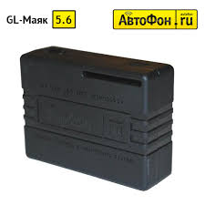

# AutoFon - GL-Маяк

El AutoFon GL-Beacon \(АвтоФон GL-Маяк\) es un rastreador GPS compacto, compatible con Plaspy, diseñado para una operación autónoma prolongada y un reporte de ubicación fiable. Construido sobre la plataforma v.5.x, este rastreador GPS/GLONASS ofrece posicionamiento preciso, reporte de alarmas y canales de control remoto flexibles, lo que lo convierte en una opción práctica para la protección de activos, seguimiento encubierto de vehículos y seguridad en sitios remotos donde se requieren las funciones de monitoreo y gestión de flotas de Plaspy.

Diseñado para funcionar con Plaspy mediante informes estándar por GPRS y SMS, el GL-Beacon combina un módulo de navegación GLONASS+GPS integrado, detección de eventos robusta \(movimiento, impacto, vuelco\) y una memoria intermedia tipo "caja negra" para retención de datos fuera de línea. Los usuarios de Plaspy obtienen seguimiento en tiempo real, telemetría y gestión de alarmas desde un dispositivo de formato compacto que prioriza la duración de la batería y la entrega fiable de telemetría.

## Puntos clave

- Operación autónoma prolongada: funciona con dos baterías de litio CR123A de 3.0V \(1500 mAh\) con hasta 2 años de autonomía, según la configuración; ideal para despliegues de activos a largo plazo.
- Posicionamiento de alta precisión: navegación GPS+GLONASS combinada \(chipset MGGS2217\) para datos de ubicación fiables en entornos mixtos.
- Buffer offline robusto: almacenamiento interno para hasta 98,000 paquetes GPRS mantiene la telemetría cuando se pierde la conexión y reintenta la entrega automáticamente.
- Alarma y detección integrales: acelerómetro digital incorporado para movimiento, impacto/accidente, vuelco y detección de caída con sensibilidad ajustable.
- SOS y monitoreo de audio: botón SOS integrado para alarmas inmediatas y micrófono a bordo para comprobaciones de audio a distancia.
- Canal de control auxiliar: salida auxiliar universal admite control remoto de corte de motor, activación de arranque, sirenas o calefactores, permitiendo intervenciones tipo inmovilizador.
- Forma compacta y discreta: carcasa de 69×51×22 mm y antena separada de 25×25×4 mm facilitan una instalación discreta en vehículos, contenedores y activos.
- Conectividad segura y gestionada: informes por GPRS y SMS, señal de vida configurable y supervisión del saldo de la SIM, protección por contraseña y control de números autorizados.

## Cómo funciona con Plaspy

Cuando se integra con Plaspy, el GL-Beacon transmite datos de posición y de eventos a su servidor de monitoreo de Plaspy a través de GPRS y también puede enviar alertas por SMS. Plaspy utiliza estos datos para proporcionar seguimiento en tiempo real, flujos de alarmas, reproducción histórica y paneles de telemetría. El almacenamiento en búfer de paquetes del GL-Beacon y su lógica de reintento aseguran que Plaspy reciba un registro continuo de ubicación y eventos incluso ante interrupciones temporales de la conectividad.

- Actualizaciones de ubicación y telemetría en tiempo real a través de GPRS a los servidores de Plaspy; opción de SMS como respaldo para alertas críticas.
- Eventos de alarma: pulsaciones del botón SOS, disparos de entrada de alarma externa, detección de movimiento, impacto, vuelco y caída reportados de inmediato a Plaspy para notificación instantánea.
- Monitoreo de audio: el acceso al micrófono remoto puede usarse dentro de flujos de trabajo de Plaspy donde se admiten verificaciones de audio.
- Control remoto: el canal auxiliar permite acciones activadas por Plaspy \(corte de motor/imovilizador o control de arranque\) cuando se configura en el cableado del vehículo.
- Resiliencia offline: hasta 98,000 paquetes GPRS se almacenan localmente y se envían a Plaspy cuando la cobertura de red vuelve; la reserva LBS proporciona una posición aproximada cuando GNSS no está disponible.

## Visión técnica

| Conectividad | GSM/GPRS \(módulo QUECTEL M12\); informes por SMS y subida de datos GPRS soportados |
| --- | --- |
| Bandas | GSM a través del módulo QUECTEL M12 \(las bandas de frecuencia específicas dependen de la variante del módulo\) |
| Potencia y Batería | Dos baterías de litio CR123A de 3.0V \(1500 mAh\); hasta 2 años de autonomía según la configuración; admite alimentación externa |
| Interfaces | 1 entrada de alarma, 1 canal auxiliar \(control remoto de dispositivos externos\), micro botón SOS, micrófono integrado para monitoreo de audio |
| GNSS | GPS+GLONASS combinados \(chipset MGGS2217\); antena externa de 25×25×4 mm |
| Bluetooth | No especificado / no se reporta Bluetooth integrado |
| Gestión remota | Actualizaciones de firmware por GPRS; parámetros configurables y monitorización remota vía GPRS/SMS |
| Forma | Carcasa compacta 69×51×22 mm; diseñada para instalación encubierta en vehículos y activos |

## Casos de uso

- Seguimiento encubierto de vehículos para coches, motocicletas y embarcaciones: instalación discreta con larga duración de la batería para monitoreo encubierto.
- Protección de mercancías y contenedores valiosos: informes de alarmas en tiempo real y un buffering de paquetes robusto mantienen la telemetría del envío para revisión en Plaspy.
- Monitoreo de personas y animales: rastreo compacto y autónomo con botón SOS y monitoreo de audio para la seguridad de niños, personas mayores o mascotas.
- Protección de instalaciones remotas y estáticas: modos activos continuos o de beacon, además de soporte de energía externa para garajes, casas de verano y quioscos.
- Telemetría de flotas pequeñas y activos: intégralo con Plaspy para gestión centralizada de la flota y flujos de trabajo basados en incidentes, utilizando las alarmas y controles auxiliares del GL-Beacon.

## Por qué elegir este rastreador con Plaspy

Emparejar el AutoFon GL-Beacon con Plaspy ofrece una solución de rastreo GPS resistente y de bajo mantenimiento, centrada en la fiabilidad, la duración de la batería y alarmas accionables. La posición GPS+GLONASS combinada y el amplio búfer de paquetes GPRS reducen la pérdida de datos durante interrupciones de cobertura, mientras que el botón SOS, la detección de eventos impulsada por el acelerómetro y el canal de control auxiliar amplían la utilidad más allá de un simple reporte de ubicación. Para organizaciones que necesiten un rastreador GPS compacto compatible con Plaspy para anti-robo, telemetría y protección de sitios remotos, el GL-Beacon ofrece un equilibrio entre autonomía, informes seguros y gestión remota, sin la complejidad innecesaria de Bluetooth integrado si la prioridad es una larga vida de la batería y una instalación encubierta.

