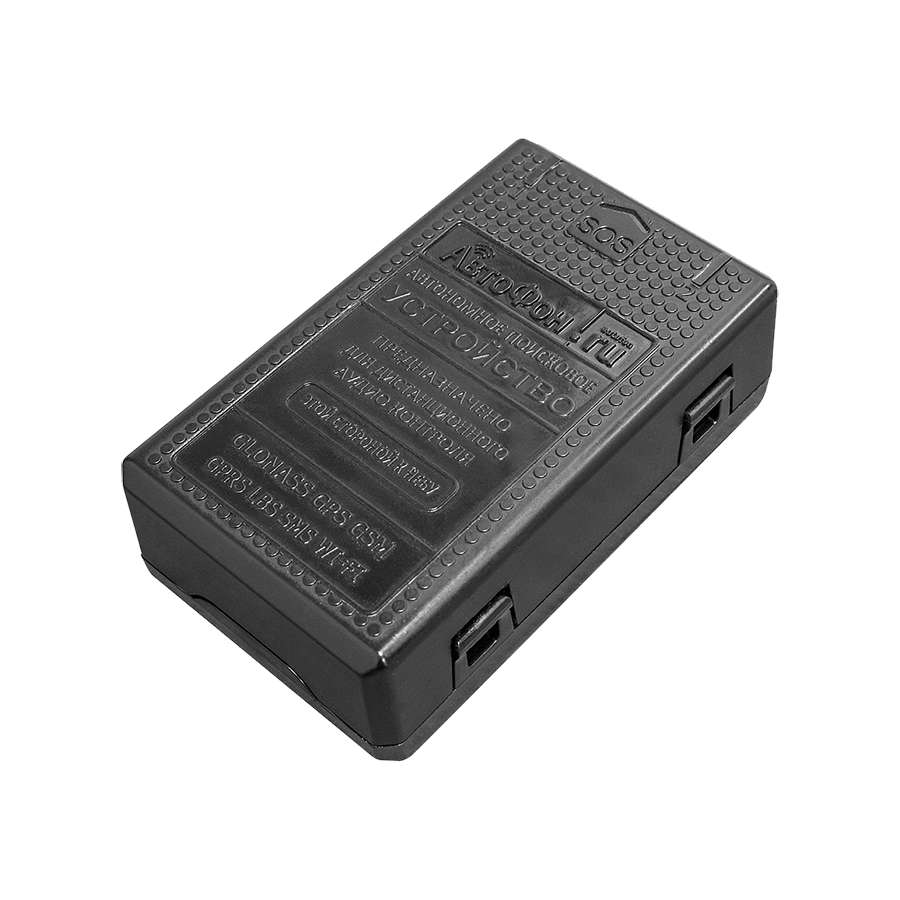

# AutoFon - Мега-Маяк+

El AutoFon Мега-Маяк+ es un rastreador GPS compacto diseñado para determinar y transmitir la posición precisa de un objeto protegido mediante los sistemas satelitales GLONASS y GPS. Permite enviar coordenadas por SMS a través de la red GSM y también puede reenviar datos a un servidor de monitoreo utilizando GPRS. Sus funciones integradas —como posicionamiento asistido A-GPS, múltiples sensores de movimiento e impacto y una carcasa resistente con grado IP67— lo hacen apto para una amplia variedad de tareas de seguimiento tanto móviles como estacionarias.

Como dispositivo compatible con Plaspy, el Мега-Маяк+ puede entregar actualizaciones de ubicación y notificaciones de eventos que los responsables de flotas y activos esperan de una plataforma de monitoreo. Plaspy puede recibir los reportes de posición y los eventos de estado del dispositivo para ofrecer visibilidad en mapas, alertas e informes históricos, lo que convierte al rastreador en una opción práctica para organizaciones que desean combinar el hardware de AutoFon con la supervisión y operaciones centralizadas de Plaspy.

## Características principales

- Módulo de navegación combinado GLONASS y GPS con soporte A-GPS para mayor sensibilidad de localización
- Sensores de movimiento e impacto configurables para detectar arranque de movimiento, choques, accidentes, vuelcos y caídas
- Soporte para doble SIM para redundancia y una "caja negra" capaz de almacenar hasta 15.000 paquetes GPRS para buffering sin conexión
- Carcasa sellada IP67 que protege contra polvo y agua, con un factor de forma compacto para una instalación discreta
- Micrófono integrado y botón SOS para escucha remota y notificaciones de emergencia
- Asistencia de ubicación por Wi‑Fi y funcionalidades BLE para mejorar la localización local y la detección de presencia
- Batería interna de larga duración y capacidad de actualizar firmware de forma remota vía GPRS para facilitar el mantenimiento

## Cómo funciona con Plaspy

El Мега-Маяк+ envía actualizaciones periódicas de posición y mensajes de evento a un endpoint de monitoreo elegido, que Plaspy puede recibir y procesar. Una vez que los datos del dispositivo llegan a Plaspy, la plataforma puede mostrar ubicaciones en tiempo real, destacar eventos e incorporar la telemetría almacenada en informes y flujos operativos.

- Seguimiento de ubicación en vivo mostrado en los mapas de Plaspy para visibility de vehículos y activos
- Gestión de eventos y alertas por arranques de movimiento, impactos, pulsaciones del SOS y notificaciones de manipulación
- Datos históricos de ubicación y de la caja negra disponibles para la revisión de rutas y el análisis de incidentes
- Alertas y geocercas configurables para soportar notificaciones operacionales y flujos de trabajo automatizados
- Gestión centralizada de dispositivos e informes para supervisar tendencias de batería y conectividad a lo largo del tiempo

## Casos de uso típicos

- Seguimiento y supervisión de flotas para operadores de transporte comercial
- Monitoreo de activos móviles valiosos como motocicletas, embarcaciones y remolques
- Protección de bienes remotos o estacionarios como cocheras, cabañas y puestos de venta
- Seguimiento de carga valiosa y contenedores durante el transporte y el almacenamiento
- Monitoreo de seguridad personal para personal seleccionado, niños o animales de compañía

## Por qué elegir este rastreador con Plaspy

El AutoFon Мега-Маяк+ combina un conjunto versátil de sensores y capacidades de posicionamiento con características de resiliencia como el soporte de doble SIM y un importante buffer de datos en dispositivo. Para las organizaciones que usan Plaspy, esta combinación ayuda a mantener la visibilidad incluso cuando la conectividad es intermitente, mientras que los sensores de eventos proporcionan alertas accionables que Plaspy puede dirigir a los operadores o utilizar para activar flujos de trabajo.

Elegir el Мега-Маяк+ para integrarlo con Plaspy tiene sentido cuando necesita un rastreador compacto y resistente que entregue actualizaciones de ubicación y notificaciones de eventos en un único entorno de monitoreo. Plaspy aporta vistas centralizadas en mapa, alertas e informes para que los equipos conviertan los datos del rastreador en información operativa sin gestionar sistemas separados.

Para conocer más sobre cómo Plaspy soporta dispositivos como el AutoFon Мега-Маяк+ visite https://www.plaspy.com. Las especificaciones del producto y su disponibilidad pueden cambiar con el tiempo, por lo que le recomendamos verificar los detalles técnicos actuales y la información del fabricante en el sitio oficial de AutoFon https://www.autofon.ru/ antes de tomar decisiones de compra finales.
