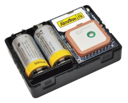

# AutoFon - SE+ Beacon

El AutoFon SE+ Beacon es un rastreador GPS compacto compatible con Plaspy, diseñado para el monitoreo discreto a largo plazo de vehículos y otros activos móviles o estacionarios. Combina posicionamiento por GPS y GLONASS con canales de reporte basados en GSM para ofrecer telemetría de ubicación y alertas de eventos confiables, al tiempo que optimiza la duración de la batería. Su reducido tamaño de 69 × 51 × 22 mm y su orientación hacia largos intervalos de servicio lo hacen idóneo para despliegues donde la baja detectabilidad y el mantenimiento mínimo son prioridades.

Como dispositivo que puede enviar posiciones y datos de eventos a plataformas de terceros, el SE+ Beacon es relevante para los usuarios de Plaspy que requieren hardware de rastreo ligero y resistente. El equipo soporta reportes por GPRS con SMS como respaldo y ofrece alertas por movimiento, inclinación e impactos, además de entrada SOS y un canal auxiliar de control. Estas capacidades se integran directamente en los flujos de trabajo de Plaspy para mapas en tiempo real, alertas y reproducción histórica, ayudando a los equipos a mantener supervisión con un rastreador de baja visibilidad.

## Puntos clave

- Factor de forma compacto y discreto, ideal para instalaciones encubiertas o con espacio limitado.
- Posicionamiento por GPS y GLONASS para datos de ubicación confiables.
- Rutas de reporte duales: GPRS para telemetría habitual y SMS como alternativa de respaldo.
- Diseño orientado a larga duración de batería, adecuado para despliegues prolongados con mantenimiento esporádico.
- Detección de movimiento, inclinación e impactos, y alertas SOS para notificaciones basadas en eventos.
- Canal auxiliar y entrada de alarma para acciones de control remoto y control de dispositivos externos.
- Amplio búfer offline para almacenar paquetes de ubicación no enviados y garantizar resiliencia de datos.

## Cómo funciona con Plaspy

Cuando se utiliza con Plaspy, el SE+ Beacon entrega posiciones GNSS y mensajes de eventos a los servidores de Plaspy para que las ubicaciones, alertas e historial estén disponibles en los paneles de Plaspy. Plaspy procesa los datos del dispositivo para mostrar seguimiento en vivo, generar notificaciones y crear trazas de reproducción, adaptándose al comportamiento de latido y al almacenamiento en búfer offline del dispositivo.

- Actualizaciones de ubicación y telemetría en tiempo real mostradas en los mapas de Plaspy para visibilidad operativa.
- Reenvío de eventos como inicio y parada de movimiento, alertas por inclinación e impacto, y disparos SOS para que los equipos reciban notificaciones útiles.
- Las señales del canal auxiliar y la entrada de alarma pueden reflejarse en los flujos de trabajo de Plaspy para acciones remotas autorizadas o procedimientos de respuesta.
- El modo de respaldo por SMS y las notificaciones basadas en SMS ofrecen una vía alternativa de entrega de alertas donde la cobertura de datos es limitada.
- El comportamiento del búfer offline permite que Plaspy recupere la telemetría histórica tras interrupciones temporales de conectividad.

## Casos de uso típicos

- Monitoreo encubierto a largo plazo de vehículos como automóviles, motocicletas y embarcaciones pequeñas.
- Rastreo de activos como contenedores, remolques y cargas valiosas con alertas por movimiento e impacto.
- Vigilancia remota de sitios estacionarios como cabañas, cocheras o recintos de equipos con registros de consulta poco frecuentes.
- Localización personal o de mascotas donde el factor de forma discreto y las alertas SOS son importantes.
- Supervisión de pequeñas flotas de equipos y remolques cuando se requieren dispositivos compactos y notificaciones por eventos.

## Por qué elegir este rastreador con Plaspy

El AutoFon SE+ Beacon es una opción práctica para organizaciones que usan Plaspy cuando las prioridades son la instalación discreta, largos intervalos de servicio y telemetría fiable basada en eventos más que telemática vehicular completa. Su combinación de posicionamiento GNSS, rutas de reporte duales, detección de eventos y un considerable búfer offline ayuda a reducir brechas de datos y apoya flujos de trabajo orientados a antirrobo y seguridad gestionados a través de Plaspy.

Para operaciones que requieren señales adicionales como métricas detalladas del motor o consumo de combustible, el SE+ Beacon puede integrarse en un despliegue Plaspy más amplio junto a otros sensores o integraciones para cubrir esas necesidades. La configuración remota y la gestión de firmware por aire facilitan el manejo de dispositivos a escala mientras Plaspy proporciona la visibilidad, las alertas y los informes necesarios para convertir eventos de dispositivo en información operativa.

Para obtener más información sobre el uso de Plaspy con hardware compatible visite https://www.plaspy.com. Las especificaciones del producto, la disponibilidad y los detalles del fabricante pueden cambiar con el tiempo, por lo que verifique la información técnica actual en el sitio del fabricante https://www.autofon.ru/.
