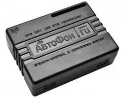

# AutoFon - SE+ Маяк

El AutoFon SE+ Маяк es un dispositivo de rastreo GPS compacto diseñado para determinar y transmitir la ubicación de un objeto a su propietario mediante la red GSM. Admite el envío de coordenadas por SMS y el reenvío de datos de posición a un servidor de monitoreo seleccionado a través de GPRS. El modelo está basado en la plataforma de hardware v.6.x e incorpora funciones destinadas a ampliar su utilidad y mejorar el rendimiento en diversas tareas de rastreo.

Como dispositivo compatible con Plaspy, el SE+ Маяк puede enviar su información de posición y eventos a la plataforma Plaspy para visualización, alertas e informes. Su tamaño reducido y su conjunto de características lo hacen adecuado para integrarse en los flujos de monitoreo gestionados con Plaspy cuando se requieren instalaciones discretas, notificaciones por eventos y reproducción histórica.

## Aspectos destacados

- Factor de forma compacto, ideal para instalación discreta en vehículos, cargas y activos portátiles
- Navegación combinada GLONASS+GPS para mayor precisión en la ubicación
- Envía actualizaciones de posición por SMS o a un servidor de monitoreo mediante GPRS
- Micrófono incorporado para escucha remota en despliegues donde esté soportado
- Detección de movimiento, impactos y accidentes con sensibilidad ajustable
- Botón SOS micro para señalización de emergencia
- Memoria tipo black box capaz de almacenar un gran número de paquetes GPRS para recuperación posterior

## Cómo funciona con Plaspy

Cuando lo configure para reportar a Plaspy, el SE+ Маяк puede alimentar la plataforma con datos de ubicación y eventos, de modo que su equipo pueda monitorear los activos desde una interfaz central. Plaspy puede mostrar la información del dispositivo junto con otros datos de flota y activos para apoyar la supervisión operativa y la respuesta ante incidentes.

- Actualizaciones de posición en tiempo real y periódicas mostradas en los mapas de Plaspy para mayor conciencia situacional
- Alertas de eventos por movimiento, impactos, accidentes y señales SOS integradas en los canales de notificación de Plaspy
- Reproducción histórica de rutas e informes basados en los registros de posición almacenados
- Visibilidad de eventos y registros de mensajes guardados en el dispositivo para facilitar investigaciones y auditorías
- Uso del canal adicional del dispositivo, cuando esté soportado, para reflejar acciones de control remoto en los paneles de Plaspy

## Casos de uso típicos

- Rastreo de autos de empresa, vehículos de reparto, motocicletas y embarcaciones
- Monitoreo de carga valiosa y contenedores durante el transporte
- Protección y supervisión remota de objetos estacionarios como cocheras y kioscos
- Rastreo personal para niños, cuidado y monitoreo asistido de personas y animales
- Supervisión de flotas en entornos donde la instalación discreta y las alertas por eventos son importantes

## Por qué elegir este rastreador con Plaspy

El AutoFon SE+ Маяк combina características de hardware prácticas con opciones de reporte flexibles, lo que lo convierte en una elección sensata para organizaciones que usan Plaspy. Su posicionamiento GNSS combinado, capacidades de detección de eventos, almacenamiento a bordo y función SOS ofrecen componentes relevantes para el seguimiento de activos, la vigilancia de seguridad y los flujos de respuesta ante incidentes en Plaspy.

Al soportar el envío de datos a un servidor de monitoreo y también permitir actualizaciones por SMS, el dispositivo se adapta bien a entornos donde conviene disponer de múltiples métodos de reporte. Para equipos que requieren rastreadores compactos con una mezcla de funciones de monitoreo, alertas y escucha de audio, el SE+ Маяк ofrece un conjunto equilibrado de prestaciones que pueden integrarse en operaciones gestionadas con Plaspy.

Para obtener más información sobre cómo Plaspy puede trabajar con dispositivos compatibles como el AutoFon SE+ Маяк, visite https://www.plaspy.com. Las especificaciones del producto, la disponibilidad y las funciones del fabricante pueden cambiar con el tiempo, por lo que le recomendamos verificar los detalles actuales en el sitio oficial de AutoFon https://www.autofon.ru/.
