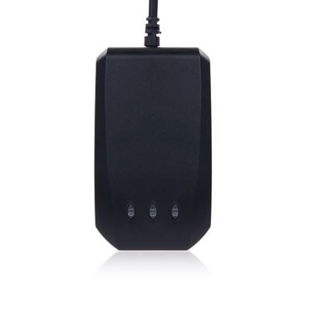

# Autoseeker - AT-12

El Autoseeker AT-12 es un rastreador GPS compacto para vehículos, diseñado para monitoreo de ubicación confiable y despliegues de corto plazo. Combina conectividad GSM GPRS multibanda con reportes por SMS y GPS para ofrecer actualizaciones de posición en tiempo real y registro de historial. Con antenas integradas y batería interna, el AT-12 destaca por su formato compacto, bajo consumo energético y funciones como ajuste automático de zona horaria, reportes diarios y alerta de batería baja.

Como dispositivo compatible con Plaspy, el AT-12 puede enviar información de ubicación y estado del vehículo a Plaspy para visibilidad centralizada y supervisión operativa. Sus capacidades de reporte e historial lo hacen adecuado tanto para el monitoreo de vehículos individuales como para su uso en flotas dentro de Plaspy, permitiendo líneas de tiempo consistentes, resúmenes diarios y alertas básicas, manteniéndose lo bastante compacto para instalaciones discretas.

## Aspectos clave

- Conectividad GSM GPRS cuatribanda para cobertura regional amplia y reportes periódicos
- Seguimiento en tiempo real y opciones de reporte por SMS para actualizaciones flexibles de posición
- Ajuste automático de zona horaria para mantener timestamps precisos entre regiones
- Reportes diarios y historial de localizaciones almacenado para revisión y análisis de rutas
- Antenas internas y diseño compacto apto para colocaciones discretas
- Bajo consumo con larga autonomía en espera y alarma de batería baja para despliegues prolongados
- Detección de movimiento y gestión de energía que facilitan el uso a corto plazo o encubierto

## Cómo funciona con Plaspy

El AT-12 puede integrarse en Plaspy para proporcionar visibilidad continua de ubicaciones y registros históricos de movimientos del vehículo. Plaspy recibe los mensajes de posición y estado del dispositivo y los muestra junto con otros datos de la flota para monitoreo e informes.

- Visualización en vivo de la ubicación en los mapas de Plaspy para conciencia operativa en tiempo real
- Reproducción de rutas históricas y archivo de reportes diarios dentro de Plaspy para análisis
- Reenvío de estados y alarmas para que notificaciones de batería baja y detección de movimiento sean visibles para los operadores
- Herramientas de supervisión a nivel de flota que combinan las señales del AT-12 con otros activos para programación y despacho
- Notificaciones y reportes configurables para ajustarse a necesidades operativas sin modificar el hardware del equipo

## Casos de uso típicos

- Seguimientos temporales donde se requiere equipo compacto y discreto
- Monitoreo de flotas pequeñas o medianas que necesitan reportes periódicos e historial
- Supervisión de vehículos de alquiler y registro de movimientos con resúmenes diarios
- Localización y recuperación de activos cuando se precisa un rastreo portátil
- Monitoreo de un solo vehículo cuando la larga autonomía en espera y el bajo consumo son prioritarios

## Por qué elegir este rastreador con Plaspy

El Autoseeker AT-12 es una opción práctica para organizaciones que requieren un rastreador pequeño y orientado a funciones, capaz de entregar actualizaciones de ubicación fiables y reportes históricos. Su ajuste automático de zona horaria y funciones internas de reporte reducen la carga administrativa al rastrear vehículos entre regiones, y su perfil de bajo consumo facilita despliegues con larga autonomía.

Al integrarlo con Plaspy, el AT-12 ofrece una manera directa de incorporar posiciones de vehículo y alertas dentro de una plataforma centralizada de seguimiento. Plaspy puede aprovechar las capacidades de reporte e historial del dispositivo para mejorar la visibilidad, apoyar alertas básicas y generar resúmenes regulares para la revisión operativa. Para especificaciones detalladas y la información de fabricante más reciente, verifique los datos actuales con Autoseeker.

Para obtener más información sobre cómo Plaspy puede trabajar con rastreadores compatibles como el Autoseeker AT-12 visite https://www.plaspy.com. Las especificaciones de producto, disponibilidad y detalles del fabricante pueden cambiar con el tiempo, por favor confirme la información actual en el sitio oficial del fabricante https://autoseekergps.com/.
