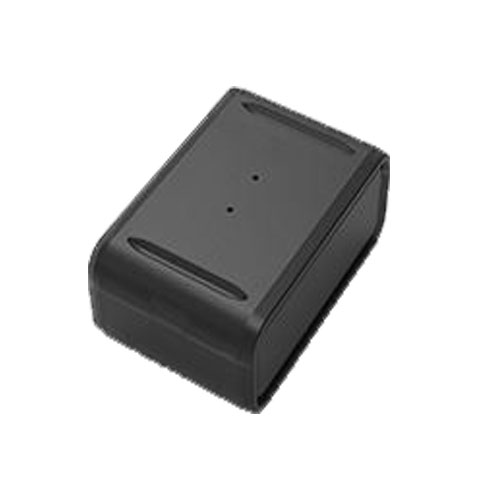

# Autoseeker - AT-13

El Autoseeker AT-13 es un rastreador GPS magnético y compacto diseñado para el seguimiento y la localización en tiempo real de vehículos. Su tamaño reducido y su sujeción magnética permiten colocarlo con rapidez en cualquier superficie metálica del automóvil, lo que lo convierte en una opción práctica para despliegues breves o cuando se necesita una instalación discreta. El equipo ofrece capacidad de monitoreo remoto para que usted pueda consultar la ubicación y los movimientos desde un teléfono inteligente o una computadora.

Este modelo es compatible con Plaspy, lo que le permite integrar las actualizaciones de ubicación del AT-13 en la plataforma de rastreo de flotas de Plaspy y supervisar vehículos junto con otros activos. Al usar Plaspy con el AT-13, particulares y gestores de flota pueden centralizar la visibilidad, ver posiciones actuales en un mapa e incluir el rastreador en flujos operativos administrados desde Plaspy.

## Características principales

- Diseño magnético y compacto para colocación fácil en superficies metálicas de vehículos
- Rastreo en tiempo real adecuado para automóviles y activos de flota ligera
- Larga autonomía soportada por una batería de respaldo de 1500 mAh
- Acceso de monitoreo remoto desde smartphone o computadora
- Discreto y portátil para despliegues temporales o encubiertos
- Útil tanto para uso en un solo vehículo como para supervisión de flotas con múltiples unidades

## Cómo funciona con Plaspy

Al integrarse con Plaspy, el Autoseeker AT-13 envía actualizaciones de ubicación que Plaspy presenta junto con sus otros dispositivos rastreados para ofrecer una vista consolidada de las operaciones. Plaspy procesa los datos de ubicación entrantes para habilitar monitoreo, análisis histórico y alertas operativas.

- Visualice posiciones de vehículos en tiempo real en los mapas de Plaspy para mayor conciencia situacional
- Supervise múltiples unidades AT-13 de forma conjunta para gestionar movimientos y asignaciones de la flota
- Acceda a recorridos históricos e informes para analizar viajes y tendencias de uso
- Configure alertas y notificaciones en Plaspy por movimiento, reportes programados o cambios de ubicación
- Incluya datos del AT-13 en paneles e exportes de Plaspy para informes operativos

## Casos de uso típicos

- Monitoreo de vehículos por periodos cortos durante viajes largos o entregas
- Rastreo discreto para recuperación y verificación de ubicación
- Supervisión de flotas pequeñas o grupos de activos mixtos
- Seguimiento de vehículos de alquiler o compartidos para verificaciones periódicas
- Vigilancia y monitoreo remoto cuando se requiere una colocación compacta

## Por qué elegir este rastreador con Plaspy

El AT-13 combina un formato magnético y compacto con capacidad de larga autonomía, lo que lo hace conveniente cuando necesita un rastreador poco visible que pueda permanecer desplegado por períodos prolongados. Para organizaciones e individuos que buscan un equipo sencillo y portátil, el AT-13 se puede redeployar entre vehículos sin instalaciones complejas.

En conjunto con Plaspy, el AT-13 forma parte de un entorno de rastreo centralizado donde los operadores pueden monitorizar ubicaciones en vivo, generar informes y configurar notificaciones según las necesidades operativas. Dado que el dispositivo está pensado para uso vehicular y es de pequeño tamaño, se adapta bien a flujos de trabajo que requieren despliegues flexibles y acceso remoto confiable.

Para saber más sobre cómo Plaspy puede trabajar con dispositivos como el Autoseeker AT-13 visite https://www.plaspy.com. Las especificaciones y la disponibilidad del producto pueden cambiar con el tiempo, por lo que le recomendamos verificar los detalles actuales en el sitio del fabricante https://autoseekergps.com/.
