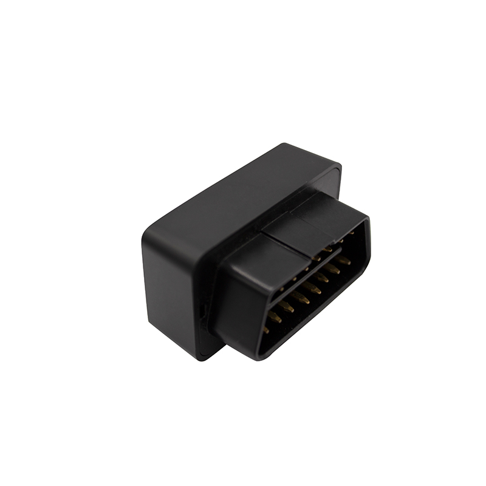

# Autoseeker - AT-16

El AT-16 OBD GPS Tracker es un rastreador de vehículos compacto y listo para usar, diseñado para una instalación sencilla y supervisión continua. Compatible con Plaspy desde el primer momento, el AT-16 se conecta al puerto OBD estándar de un vehículo para ofrecer capacidades fiables de rastreo GPS: seguimiento en tiempo real, historial de viajes y alertas de seguridad, sin necesidad de cableado ni instalación profesional.

El AT-16 está diseñado para gestión de flotas, coches de alquiler, taxis y vehículos personales que requieren una protección antirrobo discreta y telemetría continua. Con soporte para SMS, una plataforma web para PC y una app móvil, el AT-16 se integra sin problemas con Plaspy para proporcionar a operadores y gestores la conciencia situacional que necesitan para reducir el tiempo de inactividad, disuadir robos y optimizar operaciones.

## Aspectos clave

- Rastreador GPS OBD-II compatible con Plaspy para instalación plug-and-play y despliegue rápido.
- Rastreo en tiempo real e historial de viajes accesibles por SMS, plataforma web o app móvil.
- Funciones de seguridad que incluyen monitoreo de voz remota, detección de ignición ilegal, alertas de desconexión, notificaciones de geocerca, alarmas de remolque/movimiento y reporte de exceso de velocidad.
- Bajo consumo de energía con modos de ahorro de energía/suave y consumo en espera promedio &lt; 10 mA para proteger la vida de la batería del vehículo.
- Formato compacto y discreto \(29×48×28 mm\) que facilita su ocultamiento y es ideal para flotas de alquiler, taxis y vehículos corporativos.
- Rendimiento GNSS robusto con un chipset GPS sensible para una localización fiable en entornos de vehículos típicos.
- Amplio rango de voltaje de operación \(9V–45V\) para soportar una variedad de sistemas eléctricos de vehículos.

## Cómo funciona con Plaspy

Cuando se integra con Plaspy, el AT-16 transmite puntos de ubicación y telemetría del vehículo a la plataforma en tiempo real, para que los gestores de flotas y los propietarios de vehículos puedan supervisar los activos desde una única interfaz. El dispositivo utiliza su conexión OBD para leer los estados de encendido y movimiento, y reporta eventos y alarmas directamente a Plaspy para una acción inmediata y registros listos para auditoría.

- Actualizaciones en tiempo real de ubicación y telemetría a Plaspy para seguimiento en vivo y reproducción de rutas.
- Detección de encendido y arranque no autorizado reportada como eventos para activar alertas y registros.
- Alertas de desconexión y manipulación para notificar a los gestores de la retirada o interferencia del dispositivo.
- Notificaciones de entrada/salida en geocerca y alarmas de exceso de velocidad entregadas a Plaspy para gestión automática de reglas.
- Detección de remolque/movimiento y monitoreo de voz remoto \(escucha remota\) disponible como telemetría de seguridad.
- Historial de viajes y registros de eventos sincronizados con Plaspy para informes y auditorías de cumplimiento.

## Visión técnica

| Conectividad | 2G GSM \(MC25program module\) |
| --- | --- |
| Bandas | GSM 850 / 900 / 1800 / 1900 \(2G\) |
| Alimentación y batería | Batería interna de respaldo 60 mAh; rango de voltaje de entrada 9V–45V; consumo en espera medio &lt;10 mA |
| Interfaces | Conexión OBD-II plug-and-play; detección de ignición; alertas de desconexión/manipulación |
| GNSS | Chipset GPS ZKW, sensibilidad -162 dB; arranque en caliente típico ~1 s, arranque en caliente ~30 s, arranque en frío ~35 s; altitud operativa hasta 18,000 m |
| Bluetooth | No especificado / no incluido |
| Gestión remota | Actualizaciones en tiempo real vía SMS, plataforma web para PC y app móvil \(no se especifica FOTA\) |
| Formato | Plug OBD compacto \(29 × 48 × 28 mm\), instalación discreta para uso vehicular |
| Condiciones de operación | Temperatura -20°C a 65°C; humedad 5%–95% sin condensación |

## Casos de uso

- Gestión de flotas: desplegar AT-16 en una flota mixta para seguimiento centralizado con Plaspy, historial de rutas y supervisión operativa.
- Protección antirrobo: detectar ignición no autorizada, recibir alertas de desconexión y usar monitoreo de voz remoto para evaluar eventos sospechosos en tiempo real.
- Monitorización de alquiler y taxis: verificar historial de viajes, aplicar geocercas y capturar eventos de exceso de velocidad para mejorar la seguridad y el cumplimiento.
- Supervisión de vehículos corporativos: vigilar el uso de vehículos por parte de empleados, mantener registros de millaje precisos y generar informes para auditorías internas.
- Telemática basada en eventos: activar alertas y flujos de trabajo automáticos en Plaspy para detección de remolque, exceso de velocidad y violaciones de geocerca.

## Por qué elegir este Rastreador con Plaspy

El AT-16 ofrece una forma directa y rentable de añadir rastreo GPS y telemetría compatibles con Plaspy a prácticamente cualquier vehículo compatible sin una instalación compleja. Su diseño plug-and-play de OBD minimiza el tiempo de inactividad durante el despliegue, al tiempo que ofrece funciones esenciales de gestión de flotas y anti-robos. Los operadores se benefician de fijaciones de posición fiables \(sensibilidad del chipset ZKW -162 dB\), amplia tolerancia de voltaje para diversos tipos de vehículos y un bajo consumo en reposo para evitar el drenaje de la batería. Al combinarse con Plaspy, el AT-16 se convierte en parte de una solución de rastreo escalable que admite rastreo en tiempo real, alertas basadas en eventos y generación de informes históricos, lo que facilita mejores decisiones, respuestas más rápidas a incidentes y una mayor eficiencia operativa.

