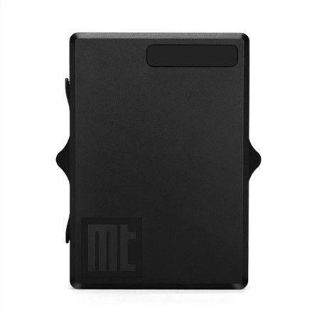

# Autoseeker - AT- 17F

El rastreador GPS Autoseeker AT-17F es una opción confiable y versátil para el seguimiento de vehículos y activos. Con soporte para las redes Cat M1, NB-IoT y GSM, este dispositivo ofrece una conectividad confiable en una amplia gama de ubicaciones. Además, cuenta con GPS, Glonass, Galileo y el sistema Beidou para una precisión de posicionamiento óptima.

Una de las características destacadas del AT-17F es su impresionante duración de batería de hasta 8 años en modo de espera. Esto lo convierte en una opción ideal para aplicaciones de larga duración donde la autonomía es crucial. Además, este rastreador cuenta con una clasificación de resistencia al agua y al polvo IP68, lo que garantiza su funcionamiento en condiciones adversas.

El AT-17F también ofrece una serie de características adicionales que lo hacen aún más atractivo. Con una carga rápida de 2A a 5V, este dispositivo se puede recargar rápidamente para minimizar el tiempo de inactividad. Además, cuenta con una gestión dinámica de la ruta de alimentación y un consumo de energía ultrabajo de menos de 1,5 uA.

Otras características notables incluyen una fácil instalación, un potente soporte magnético, alarmas de geocerca y baja potencia, detección de movimiento inteligente y un informe de tiempo programado. Además, el AT-17F es compatible con baterías recargables o no recargables y se puede programar a través de Web, USB o SMS.

En resumen, el rastreador GPS Autoseeker AT-17F es una opción confiable y versátil para el seguimiento de vehículos y activos. Con una amplia gama de características y una duración de batería impresionante, este dispositivo ofrece un rendimiento excepcional en una variedad de aplicaciones.

