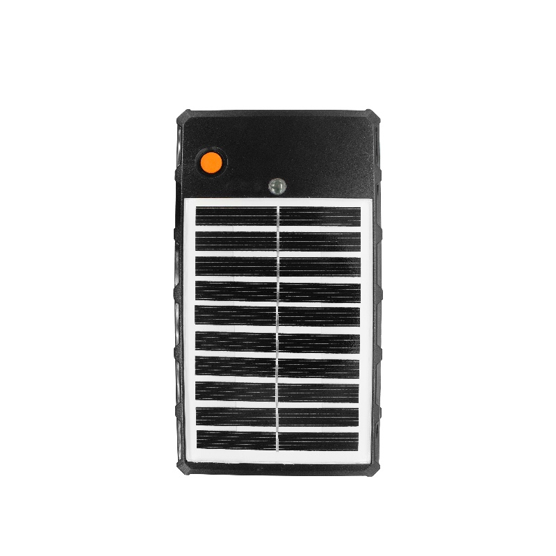

# Autoseeker - AT-17K

El AT-17K 4G Solar Wireless Magnetic GPS Tracker es un rastreador GPS compatible con Plaspy, diseñado para el monitoreo de activos y vehículos a largo plazo con bajo mantenimiento. Diseñado para condiciones marinas y terrestres exigentes, el AT-17K combina una carcasa impermeable IP68 y un montaje magnético de ~300 lb con una batería de alta capacidad de 10000 mAh y recarga solar para ofrecer rastreo y telemetría en tiempo real confiables para flotas, contenedores, embarcaciones y maquinaria pesada.

Como dispositivo compatible con Plaspy, el AT-17K transmite la ubicación y datos de telemetría a través de redes 4G LTE y GSM para que puedas ver rutas en vivo, historial de rutas y alertas de eventos en tu panel de Plaspy. Su combinación de tiempo de espera prolongado, bajo consumo de energía y alarmas de impacto/manipulación hace que el AT-17K sea ideal para telemática de seguros, flotas de alquiler, maquinaria de construcción y aplicaciones marinas que requieren un seguimiento continuo y seguro.

## Puntos clave

- Rastreador GPS compatible con Plaspy que ofrece seguimiento en tiempo real y reproducción de historial para la gestión de flotas y la protección de activos.
- Carcasa robusta impermeable con IP68 y rango amplio de temperatura de operación \(-20°C a 65°C\) para despliegues marinos y al aire libre.
- Batería interna de 10000 mAh con recarga solar \(5V / 2.5W\) para extender el tiempo de espera y reducir los intervalos de mantenimiento.
- Montaje magnético fuerte \(~300 lb de tracción\) y opción de montaje por tornillo para una instalación rápida y segura en vehículos, contenedores y equipos.
- Alarmas y telemetría completas: alarma de vibración, anti-manipulación por detección de luz, alarma de caída/impacto y alertas de batería baja.
- Conectividad celular preparada para uso global en múltiples bandas 4G LTE FDD y GSM para mantener un enlace ascendente fiable hacia la integración con Plaspy.
- Bajo consumo de energía promedio \(aprox. 68 mA a 5V\) y recarga flexible vía Micro-USB \(DC 5V/1000 mA\).

## Cómo funciona con Plaspy

El AT-17K transmite la posición GPS y la telemetría a bordo a Plaspy a través de redes celulares, de modo que puedas ver la ubicación en tiempo real, rutas históricas y alertas de eventos en un único lugar. Plaspy ingiere la telemetría del rastreador y la expone mediante mapas, informes, reglas de geocerca y flujos de notificación para un uso operativo inmediato y un análisis a largo plazo.

- Actualizaciones de ubicación y telemetría en tiempo real enviadas a Plaspy para despacho y monitoreo en vivo.
- Geocercas y reproducción de historial para verificación de rutas, cumplimiento y revisión de incidentes.
- Alarmas de batería baja, vibración, manipulación por detección de luz y caídas/impactos que activan notificaciones y flujos de trabajo en Plaspy.
- Telemetría de energía flexible: estado de la batería interna y métricas de recarga solar disponibles para Plaspy en la planificación de mantenimiento.
- Se integra con los modelos de datos de Plaspy y puede combinarse con señales procedentes de vehículos —como encendido, monitoreo de combustible o entradas del inmovilizador— cuando esos flujos de datos estén disponibles en tu entorno de flota.

## Resumen técnico

| Conectividad | Red 4G LTE FDD y GSM \(enlace ascendente del dispositivo hacia Plaspy vía LTE/GSM\) |
| --- | --- |
| Bandas | 4G LTE FDD: B1/B2/B3/B4/B5/B7/B8/B28/B66; GSM: B2/B3/B5/B8 \(850/900/1800/1900 MHz\) |
| Batería y Carga | Batería interna de 10000 mAh; recarga DC vía Micro-USB 5V/1000 mA |
| Solar | Soporte de recarga solar integrada; salida del panel solar 5V / 2.5W |
| Consumo de Energía | Corriente de funcionamiento típica ≈ 68 mA a 5V |
| GNSS | Chipset GPS: ZKW AT6558R; adquisición rápida \(hot start ≈ 1 s, warm ≈ 30 s, cold ≈ 35 s\) |
| Montaje y Formato | Montaje magnético \(~300 lb de tracción\) y opción de montaje por tornillo; carcasa compacta ~150 × 40 mm; peso ~500 g |
| Entorno | Calificación IP68 a prueba de agua; rango de temperatura de funcionamiento -20°C a 65°C |
| Alarmas y Sensores | Alarma de vibración, anti-manipulación por detección de luz, alarma de caída/impacto y alerta de batería baja |

## Casos de uso

- Gestión de flotas: seguimiento en tiempo real continuo y reproducción de historial para camiones y flotas corporativas compatibles con Plaspy.
- Prevención de robo para activos de alto valor: montaje magnético y alertas de manipulación/vibración que ayudan a proteger contenedores, remolques y equipos.
- Embarcaciones marinas y de pesca: impermeabilidad IP68, recarga solar y larga autonomía de batería para facilitar el seguimiento y la telemetría remotos.
- Construcción y maquinaria pesada: factor de forma robusto y montaje magnético/por tornillo para un seguimiento fiable en obras.
- Telemática de seguros y flotas de alquiler: despliegues a largo plazo con bajo mantenimiento para monitoreo de uso y soporte de reclamaciones.

## Por qué elegir este rastreador con Plaspy

El AT-17K ofrece un equilibrio práctico entre autonomía, durabilidad y conectividad compatible con Plaspy para equipos que requieren un seguimiento en tiempo real confiable y telemetría en entornos exigentes. Su amplia batería interna, sumada a la recarga solar, reduce el tiempo de inactividad y las visitas de mantenimiento, mientras la retención IP68 y un montaje magnético de ~300 lb facilitan una instalación rápida y segura en vehículos, embarcaciones y activos expuestos a condiciones climáticas y manejo rudo. Cuando se integra con Plaspy, el AT-17K suministra datos de ubicación, alertas y estado de energía a tus flujos de trabajo de gestión de flotas para que puedas actuar ante eventos de robo, optimizar rutas y programar el mantenimiento con confianza. Para organizaciones que requieren un seguimiento robusto a largo plazo, especialmente en entornos marinos, de uso intensivo o remotos, el AT-17K es una solución duradera, compatible con Plaspy, que enfatiza la confiabilidad y un bajo costo total de propiedad.

