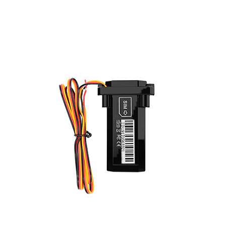

# Autoseeker - AT-18

El AT-18 es un rastreador GPS compacto e impermeable diseñado para instalaciones permanentes y discretas en vehículos y activos móviles. Su tamaño reducido y carcasa robusta permiten ubicarlo bajo tableros, debajo de asientos o dentro de compartimentos donde la exposición prolongada a la intemperie es una preocupación. El dispositivo ofrece seguimiento en tiempo real confiable y telemetría básica para flotas, vehículos particulares, motocicletas, camiones y embarcaciones.

Compatible con Plaspy desde su configuración inicial, el AT-18 se integra fácilmente para brindar visibilidad centralizada y gestión de alertas. Con soporte para reportes por paquetes y conmutación a SMS como respaldo, además de alarmas configurables por eventos de encendido, exceso de velocidad, batería baja y violaciones de geocerca, el AT-18 proporciona señales de ubicación y estado que Plaspy utiliza para la supervisión de flotas, la seguridad de activos y la generación de historiales.

## Características principales

- Compatible con Plaspy para seguimiento en tiempo real centralizado y paneles de gestión de flotas
- Diseño compacto e impermeable que facilita instalaciones permanentes y discretas en vehículos y embarcaciones
- Reporte primario por GPRS con respaldo por SMS para mantener alertas cuando los datos por paquete son limitados
- Detección ACC de encendido y apagado para capturar eventos de ignición y soportar flujos de trabajo de viajes y uso
- Alarmas configurables de geocerca, exceso de velocidad y batería baja para prevención de robo y monitoreo de cumplimiento
- Carcasa resistente y factor de forma reducido apto para motocicletas, camiones, remolques y botes
- Alta sensibilidad GNSS para fijaciones de posición consistentes en entornos móviles

## Cómo funciona con Plaspy

Cuando se usa con Plaspy, el AT-18 envía paquetes periódicos de posición y estado que Plaspy consume para mostrar la ubicación, generar alertas y almacenar el historial para análisis posteriores. Plaspy traduce la salida del rastreador en visualizaciones de mapa, reglas de notificación e informes operativos para que los equipos puedan monitorear activos casi en tiempo real y responder a eventos de forma eficiente.

- Actualizaciones de ubicación en tiempo real y telemetría básica entregadas a Plaspy para su visualización en mapas
- Reporte de estado ACC e ignición utilizado por Plaspy para detección de viajes y seguimiento de utilización
- Alertas de geocerca y exceso de velocidad reenviadas a Plaspy para notificaciones inmediatas y registro
- Alarmas de batería baja y otras señales configurables visibles en Plaspy para acciones de mantenimiento proactivo
- Respaldo por SMS para preservar alertas críticas cuando la conectividad por paquetes es intermitente

## Casos de uso típicos

- Gestión de flotas con seguimiento continuo de ubicación y telemetría de ignición para enrutamiento y aprovechamiento
- Implementaciones antirrobo mediante montaje discreto y notificaciones rápidas de geocerca o exceso de velocidad
- Protección de motocicletas y vehículos pequeños donde se requiere hardware compacto para una colocación discreta
- Rastreo de activos marinos donde una carcasa impermeable soporta alertas perimetrales e historial
- Monitoreo permanente de activos como remolques, equipos e infraestructura móvil con instalaciones cableadas

## Por qué elegir este rastreador con Plaspy

El AT-18 ofrece una combinación práctica de hardware discreto y comunicaciones robustas para organizaciones que usan Plaspy. Su carcasa impermeable y tamaño compacto facilitan la instalación a largo plazo, mientras que el reporte por paquetes con respaldo SMS ayuda a mantener la visibilidad y las alertas en condiciones variables de conectividad. La detección ACC y las alarmas configurables proporcionan la telemetría básica necesaria para el análisis de viajes, los flujos de seguridad y la planificación de mantenimiento.

En conjunto con Plaspy, el AT-18 forma parte de una solución de monitoreo escalable: Plaspy agrega las fuentes de ubicación, activa notificaciones por violaciones de geocerca y eventos de exceso de velocidad, y conserva el historial para informes y análisis. Para conocer más sobre cómo Plaspy puede utilizar fuentes de dispositivos como el AT-18 para mejorar la visibilidad de la flota y la seguridad de activos, visite https://www.plaspy.com. Las especificaciones del producto, la disponibilidad y los datos del fabricante pueden cambiar con el tiempo, por lo que le recomendamos verificar las especificaciones actuales en el sitio del fabricante https://autoseekergps.com/ antes de la compra o el despliegue.
