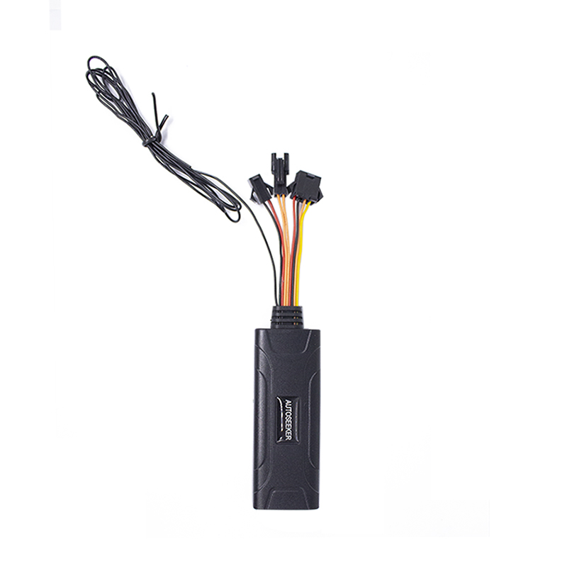

# Autoseeker - AT-19

El Autoseeker AT-19 es un rastreador GPS mini 2G compacto diseñado para una instalación discreta en vehículos. Pensado para automóviles, motocicletas, autobuses, camiones y camionetas, el AT-19 ofrece reporte de posición en tiempo real y telemetría esencial del vehículo mediante canales GSM y GPRS. Su tamaño reducido y su conjunto de funciones orientadas al uso vehicular lo hacen idóneo para el monitoreo de flotas, la prevención de robos y la supervisión básica de rutas.

Como dispositivo compatible con Plaspy, el AT-19 puede enviar ubicación, velocidad y eventos de alarma a la plataforma Plaspy para monitoreo en vivo y revisión histórica. El soporte para reporte de datos por GPRS y alertas por SMS, junto con entradas y salidas comunes en vehículos, permite que el AT-19 alimente los paneles de Plaspy con la información clave que los responsables de flota necesitan para visibilidad, alertas y control operativo.

## Características principales

- Seguimiento en tiempo real compatible con Plaspy, con posición e historial de rutas visibles en los paneles de Plaspy
- Formato compacto y discreto, adecuado para instalaciones temporales o ocultas en el vehículo
- Conectividad 2G GSM GPRS con reporte por TCP y SMS para telemetría y alertas
- Funciones de telemetría vehicular como estado de ignición, alertas por exceso de velocidad, alarmas de puertas y notificaciones de geocerca
- Soporte para inmovilizador remoto con corte de combustible para asistir en flujos de trabajo antirrobo cuando se integra con Plaspy
- Monitorización de voz remota y alertas SOS opcionales para una respuesta de seguridad mejorada
- Opciones de personalización empresarial y acceso a la plataforma sujetas a los términos del proveedor

## Cómo funciona con Plaspy

Al conectarse, el AT-19 transmite la posición GNSS y el estado del vehículo a Plaspy mediante datos GPRS o SMS. Plaspy procesa esas actualizaciones para mostrar ubicación en vivo, velocidad e información de eventos, y para desencadenar alertas o informes según lo configuren los administradores de flota. Los comandos remotos iniciados desde Plaspy pueden accionar salidas compatibles cuando el hardware del dispositivo y los permisos lo permitan.

- Actualizaciones de ubicación y telemetría en tiempo real entregadas a Plaspy para mapeo y monitoreo en vivo
- Reporte de estado de ignición y alarmas, incluyendo detección de ACC encendido/apagado y alertas de puertas abiertas
- Soporte para acciones remotas de inmovilizador para ayudar en la respuesta ante robos cuando esté autorizado y cableado
- Notificaciones de entrada y salida de geocercas que alimentan los canales de alerta y los registros de eventos en Plaspy
- SOS opcional y monitorización de voz remota disponibles para escalar emergencias a través de Plaspy
- Historial de rutas y reporte de eventos para revisión operativa y cumplimiento

## Casos de uso habituales

- Gestión de flotas y optimización de rutas para flotas de vehículos ligeros y medianos
- Monitoreo antirrobo e inmovilización como parte de procesos de recuperación de vehículos
- Seguimiento de entregas y logística para mejorar la precisión de ETA y la verificación de rutas
- Seguridad de vehículos particulares con capacidad opcional de alertas de emergencia
- Monitoreo encubierto de corto plazo para investigaciones o necesidades temporales de rastreo

## Por qué elegir este rastreador con Plaspy

El AT-19 combina un diseño discreto con las funciones telemétricas básicas que los equipos de flota esperan. Su soporte para reportes por GPRS y SMS, junto con entradas de ignición y alarmas, facilita la integración con Plaspy para obtener visibilidad continua, alertas y control remoto básico. Para organizaciones que requieren un rastreador práctico y de perfil bajo que alimente a Plaspy con datos de ubicación y eventos, el AT-19 representa una opción equilibrada.

Learn more about Plaspy on the main website https://www.plaspy.com. Product specifications, availability and manufacturer details can change over time, so verify current specifications and options on the official Autoseeker website https://autoseekergps.com/.
