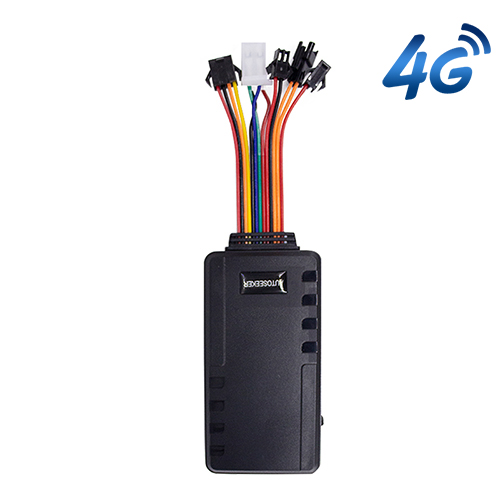

# Autoseeker - AT-20

El rastreador GPS AT-20 es un rastreador vehicular profesional de 4G diseñado para un seguimiento en tiempo real fiable y compatible con Plaspy, así como para la gestión de flotas. Optimizado para aplicaciones en vehículos, el AT-20 ofrece actualizaciones de ubicación instantáneas, reproducción de rutas históricas, geocercas, alertas de velocidad, detección ACC \(encendido\), informes de emergencia SOS y gestión avanzada de movimiento y energía —todo un conjunto de telemetría esencial para operaciones modernas de flota y flujos anti-robo.

Con un diseño flexible para instalaciones en vehículos con diferentes rangos de tensión, el AT-20 soporta comunicaciones globales 4G LTE y cuadribanda GSM/GPRS a través de TCP/GPRS y SMS para integrarse de forma transparente con Plaspy. Con batería interna de respaldo y opciones para accesorios externos, como un botón SOS, una cámara o un sensor de combustible, el AT-20 ofrece las fuentes de datos fiables que los responsables de la flota requieren para el monitoreo de combustible, la seguridad del vehículo y la telemetría de extremo a extremo.

## Aspectos clave

- Rastreador GPS 4G compatible con Plaspy para seguimiento en tiempo real preciso y reproducción histórica.
- Conectividad global: LTE FDD y cuadribanda GSM/GPRS para una comunicación fiable y cobertura de respaldo.
- I/O orientado al vehículo: detección de ACC \(encendido\) y apagado, entrada SOS, soporte para corte remoto de combustible e interfaces para accesorios.
- Alertas listas para la flota: entrada/salida de geocerca, avisos de velocidad, detección de movimiento e informes SOS de emergencia.
- Diseño de bajo consumo con modo de espera de bajo consumo, batería interna de respaldo de 180 mAh y entrada amplia de 9–95 V para coches, camiones y autobuses.
- Monitoreo de voz remoto mediante micrófono integrado para la conciencia situacional y verificaciones de seguridad.
- Firmware personalizable y soporte OEM/ODM para la integración de protocolos o accesorios a medida.

## Cómo funciona con Plaspy

El AT-20 transmite la ubicación y la telemetría del vehículo a Plaspy mediante sus enlaces LTE y GSM/GPRS, a través de TCP/GPRS y SMS. Plaspy procesa esas señales para el seguimiento en tiempo real, alertas y reproducción de rutas históricas. La integración es sencilla: las posiciones GPS, telemetría con marcas de tiempo, eventos de alarma y estados de entrada llegan en formatos telemáticos estándar y se muestran en los tableros, mapas e informes de Plaspy.

- Actualizaciones de ubicación y telemetría en tiempo real entregadas a Plaspy mediante 4G/LTE o cuadribanda GPRS.
- Estado del vehículo: detección de ACC \(encendido\) y eventos de movimiento reportados para flujos de trabajo de la flota.
- Alertas de eventos: entrada/salida de geocerca, velocidad, mensajes SOS de emergencia y alarmas de movimiento aparecen como notificaciones de Plaspy.
- Monitoreo de combustible: corte remoto de combustible soportado e integración opcional de sensor de combustible reportan telemetría de combustible a Plaspy.
- Reproducción de rutas históricas disponible para Plaspy para análisis de trayectos y generación de informes de cumplimiento.

## Resumen técnico

| Conectividad | 4G LTE FDD y cuadribanda GSM/GPRS con transporte TCP/GPRS y SMS |
| --- | --- |
| Bandas | LTE FDD: B1/B2/B3/B4/B5/B7/B8/B28/B66; 2G: 850/900/1800/1900 MHz |
| Módulo de Comunicación | SIMCOM 7670SA |
| GNSS | Conjunto de chips ZKW; sensibilidad hasta −162 dB; inicio en frío/templado/caliente ≈ 35 s / 30 s / 1 s |
| Entrada de voltaje | Rango amplio 9–95 VDC, apto para coches, camiones y autobuses |
| Energía y batería | Batería interna de respaldo 180 mAh; corriente de espera típica \< 50 mA; gestión avanzada de energía |
| Interfaces | Detección de ACC \(encendido\), entrada SOS, soporte para corte remoto de combustible, accesorios externos \(cámara opcional, sensor de combustible\) |
| Ambiental | Temperatura de operación −20°C a 65°C; humedad del 5% al 95% sin condensación; altitud de operación hasta 18,000 m |
| Dimensiones | 87 × 50 × 12 mm \(form factor compacto para vehículo\) |
| Firmware y Personalización | Firmware personalizable; desarrollo OEM/ODM y personalización de protocolos soportados |

## Casos de uso

- Gestión de flotas: seguimiento en tiempo real, historial de rutas y telemetría para optimizar la asignación de trabajos, reducir tiempos de inactividad y monitorear el comportamiento del conductor.
- Seguridad de vehículos y anti-robos: alertas de geocerca, informes SOS de emergencia y corte remoto de combustible reducen el riesgo de robo y facilitan una respuesta rápida.
- Logística y monitorización de carga: informes de posición precisos y detección de movimiento ayudan a proteger las mercancías y a mejorar la precisión del ETA.
- Monitoreo y optimización de combustible: integración opcional de sensor de combustible y soporte para corte remoto de combustible facilitan los flujos de gestión de combustible y reducen pérdidas.
- Flotas pesadas y mixtas: entrada amplia 9–95 V y rango operativo robusto para coches, camiones, autobuses y vehículos especializados.

## Por qué elegir el AT-20 con Plaspy

El AT-20 combina conectividad robusta, entradas enfocadas al vehículo y operación de bajo consumo para brindar rastreo GPS y telemetría confiables para los usuarios de Plaspy. Sus comunicaciones LTE con respaldo cuád-banda aseguran continuidad en las zonas de cobertura, mientras que la detección de ACC, SOS y el corte remoto de combustible abordan los casos de uso clave de anti-robos y seguridad de la flota. Los flujos de datos compatibles con Plaspy desde el AT-20 permiten rastreo en tiempo real, alertas e informes históricos, de modo que los operadores obtienen información accionable para la gestión de la flota, el monitoreo de combustible y el cumplimiento. Si el proyecto requiere un comportamiento a medida o soporte adicional de sensores, la personalización del firmware y las opciones OEM/ODM del AT-20 facilitan la integración con Plaspy y herramientas telemáticas de terceros.

