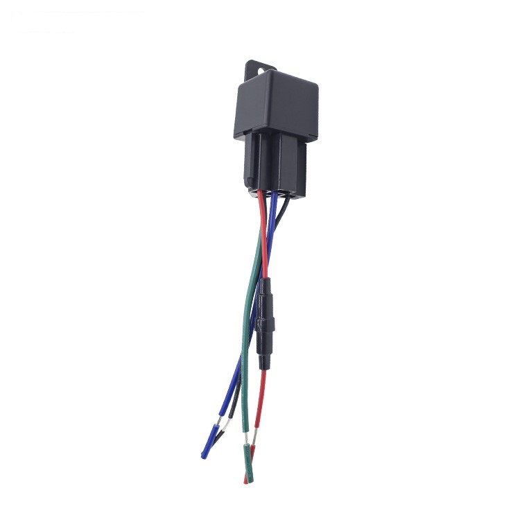

# Autoseeker - AT-23

El AT-23 2G Relay GPS Tracker, perteneciente a una familia de terminales vehiculares compactos, ofrece seguimiento en tiempo real confiable compatible con Plaspy y un relé integrado para el corte remoto de combustible o energía. Diseñado para instalación permanente en coches, camiones, motocicletas, barcos y otros activos móviles, el AT-23 combina un posicionamiento GNSS preciso \(GPS + Beidou\) con una gestión de energía de grado vehicular para apoyar flujos de trabajo de inmovilización anti-robos y telemetría de flotas.

Como dispositivo compatible con Plaspy, el AT-23 proporciona ubicación en tiempo real, telemetría y datos de eventos a tableros de Plaspy para geocercas, reproducción de historial y alertas automáticas. Su pequeño formato y cableado modular facilitan la instalación, mientras que la funcionalidad de corte y reanudación basada en el relé ofrece una opción de inmovilizador práctica para operadores de flotas, propietarios de vehículos y gestores de activos que requieren medidas anti-robos rápidas y ejecutables.

## Principales características

- Dispositivo GPS compatible con Plaspy que ofrece seguimiento en tiempo real e historial de rutas para gestión de flotas y monitorización de activos.
- Relé integrado para corte remoto de combustible o energía y reanudación—capacidad eficaz de inmovilización y protección anti-robos.
- Posicionamiento GNSS en modo dual \(GPS + Beidou\) con precisión típica &lt;10 m \(1σ\).
- Operación de bajo consumo: rango de entrada DC 9–35 V; corriente de trabajo media ~40 mA a 12 V; consumo en reposo &lt;10 mA; batería de respaldo de polímero opcional de 80 mAh \(3.7 V\) para operación ante pérdidas de energía a corto plazo.
- Alertas de eventos que incluyen entradas/salidas de geocerca, velocidad excesiva, detección de vibraciones, batería baja y notificaciones de corte de energía principal.
- Carcasa de ABS pequeña y discreta \(32.5 × 32.5 × 31 mm\) para instalación oculta en el vehículo.
- Soporta tarjeta SIM estándar en redes 2G \(850/900/1800/1900 MHz\) y antenas internas para recepción celular y GNSS.

## Cómo funciona con Plaspy

El AT-23 transmite ubicación, estado y mensajes de eventos a través de 2G hacia servidores compatibles con Plaspy, para que los operadores obtengan visibilidad en tiempo real y telemetría histórica dentro de los paneles de Plaspy. La integración es sencilla para plataformas que aceptan rastreadores 2G estándar: el dispositivo reporta la posición y un conjunto enriquecido de alertas que Plaspy puede usar para activar notificaciones, generar informes y automatizar flujos de trabajo de la flota.

- Actualizaciones de ubicación y telemetría en tiempo real enviadas a Plaspy para mapeo en vivo y reproducción de rutas.
- Alertas de entrada/salida de geocerca y avisos de velocidad excesiva aparecen en Plaspy junto con el historial de ubicaciones para una investigación rápida.
- Estado del relé y control remoto del inmovilizador: Plaspy puede mostrar el estado del relé y registrar eventos de corte/reanudación \(acción remota realizada a través de flujos de trabajo autenticados en el backend\).
- Eventos de energía y batería: alertas de corte de energía principal y notificaciones de batería de respaldo baja ayudan a los operadores a detectar manipulación o pérdidas de energía.
- Detección de vibración y movimiento para alarmas de manipulación o estacionamiento: los eventos se registran y se muestran en las líneas de tiempo de incidentes de Plaspy.
- Convivencia con sensores Bluetooth y otros periféricos en el mismo despliegue de Plaspy: si bien el AT-23 utiliza antenas internas y 2G, Plaspy puede correlacionar su telemetría con feeds de sensores BLE de otros gateways si se utiliza en el mismo sistema.

## Resumen técnico

| Modelo | AT-23 2G Relay GPS Tracker |
| --- | --- |
| Conectividad | 2G GSM \(850 / 900 / 1800 / 1900 MHz\); tarjeta SIM estándar |
| Chipsets | Chipsets MT2503 para comunicaciones; MC25 para GNSS |
| GNSS / Posicionamiento | GPS + Beidou en modo dual; precisión &lt;10 m \(1σ\); arranque en frío ~32 s; arranque en caliente ~1 s; sensibilidad de seguimiento -162 dBm; sensibilidad de captura -148 dBm |
| Alimentación y Batería | Rango de operación DC 9–35 V; corriente de trabajo media ~40 mA @ 12 V; reposo &lt;10 mA; batería de respaldo de polímero de 80 mAh opcional \(3.7 V\) |
| Interfaces | Módulo de relé integrado para corte y reanudación remotos de combustible o energía; ranura SIM estándar; antenas internas celulares y GNSS |
| Alertas y Eventos | Entrada/salida de geocerca, velocidad excesiva, detección de vibraciones, batería baja, alertas de corte de energía principal, reproducción de ruta histórica |
| Físico | 32.5 × 32.5 × 31 mm; peso 68 g; carcasa de plástico ABS |
| Ambiental | Temperatura de operación -20°C a 75°C; almacenamiento -30°C a 80°C; humedad 10%–85% de humedad relativa |
| Límites de rendimiento | Aceleración máxima de hasta 4 g; velocidad máxima de hasta 515 m/s; altitud máxima de hasta 18,000 m |
| Gestión remota | Diseñado para su uso con plataformas de seguimiento compatibles con 2G \(incluido Plaspy\) para monitoreo remoto y recopilación de telemetría |
| Formato | Terminal compacto montado en vehículo para instalación oculta en coches, camiones, motocicletas, barcos y otros activos móviles |

## Casos de uso

- Antirrobo e inmovilización de flotas: corte remoto de combustible/energía para detener movimientos no autorizados del vehículo y registrar eventos de inmovilización en Plaspy.
- Gestión de flotas y telemetría: seguimiento en tiempo real, alertas de velocidad excesiva y historial de rutas para mejorar la planificación de tareas y el cumplimiento del conductor.
- Seguimiento de motocicletas y vehículos pequeños: tamaño compacto e instalación discreta para la protección de activos vulnerables.
- Protección de activos para barcos y equipos móviles: seguimiento GNSS más alertas de manipulación y pérdida de energía para una respuesta rápida.
- Instalaciones modulares de vehículos que requieren un inmovilizador basado en relé combinado con paneles de Plaspy para monitorización centralizada.

## Por qué elegir este rastreador con Plaspy

El AT-23 es una opción práctica cuando necesita un rastreador GPS compatible con Plaspy que equilibre un formato compacto, bajo consumo de energía y capacidad de inmovilización basada en relé. Su posicionamiento GNSS en modo dual, la confiable conectividad celular 2G y el relé integrado lo hacen especialmente adecuado para la gestión de flotas, la protección anti-robos y tareas de telemetría habituales. Los operadores se benefician de una integración rápida en Plaspy para geocercas, reproducción de historial y alertas automáticas, proporcionando la conciencia situacional que exigen los gestores de flotas sin una carga de instalación compleja.

Opte por el AT-23 si necesita un rastreador GPS probado y discreto que soporte seguimiento en tiempo real, inmovilización por relé y una robusta generación de informes de eventos para monitoreo y operaciones basados en Plaspy. Su batería de respaldo opcional y su amplio rango de tensión de operación ayudan a mantener la continuidad entre distintos tipos de vehículos, mientras que la integración con Plaspy consolida esos datos de rastreo y telemetría en una visión operativa única para un control de la flota más seguro y eficiente.

