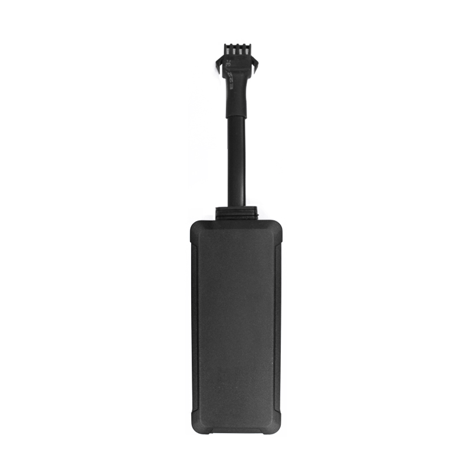

# Autoseeker - AT-24

El AT-24 es un compacto rastreador GPS 4G diseñado para un seguimiento en tiempo real fiable y compatible con Plaspy de vehículos y activos móviles. Diseñado para instalación permanente en áreas protegidas del vehículo — debajo del tablero o bajo los asientos — el AT-24 combina conectividad celular robusta con un amplio rango de tensión de funcionamiento para servir automóviles, camiones, motocicletas, embarcaciones y otros activos de flota y logística. Su pequeño factor de forma y cableado modular permiten una instalación rápida y discreta mientras habilitan la gestión completa de la flota y flujos de trabajo de antirrobo cuando se empareja con Plaspy.

Con reportes telemétricos integrados, detección ACC \(encendido\), geocercas y capacidad de corte remoto de combustible \(immobilizer\), el AT-24 admite los controles operativos que requieren las flotas y las funciones de seguridad que esperan los propietarios. Una batería de respaldo interna de 300 mAh mantiene al rastreador enviando datos ante pérdidas de energía o manipulación, mejorando la protección antirrobo y las actualizaciones de posición ininterrumpidas para alertas basadas en eventos y reportes históricos en la plataforma Plaspy.

## Aspectos clave

- Rastreador GPS 4G compatible con Plaspy para seguimiento en tiempo real y gestión de flotas en vehículos y activos móviles.
- Amplio rango de tensión de funcionamiento 9–95V que admite automóviles, camiones comerciales, motocicletas e instalaciones marinas.
- Batería de respaldo interna de 300 mAh proporciona continuidad de informes durante pérdidas de energía o manipulación para mejorar la protección antirrobo.
- Corte remoto de combustible \(immobilizer\) y detección de ACC encendido/apagado permiten un inmovilización remota segura y generación de informes basados en el encendido.
- Admite reportes por SMS/GPS/GPRS \(TCP\) además de geocercas, alertas de sobrevelocidad y de baja batería para la seguridad operativa y el cumplimiento.
- Factor de forma compacto y discreto \(79 × 33 × 16 mm\) con cableado modular para instalaciones rápidas y fiables.
- Funciones opcionales incluyen monitoreo de voz remoto y un botón de emergencia SOS para mejorar los procesos de seguridad cuando sea necesario.

## Cómo funciona con Plaspy

El AT-24 transmite datos de posición y de eventos a la plataforma Plaspy mediante su conectividad de datos móviles y protocolos de reporte estándar. Plaspy ingiere la telemetría del rastreador y presenta la ubicación en tiempo real, eventos de geocerca, alarmas de sobrevelocidad y cambios de estado a través de paneles, alertas e informes adaptados a operaciones de flota y respuesta ante robo.

- Actualizaciones de ubicación y telemetría en tiempo real mediante 4G/LTE y reporte GSM de respaldo.
- Detección de ACC \(encendido\) on/off y alarmas alimentan informes basados en el encendido y el registro de conductores/eventos en Plaspy.
- La capacidad de inmovilizador remoto \(corte de combustible\) proporciona acción antirobo inmediata y puede ser controlada a través de Plaspy donde la política y la normativa local lo permitan.
- Alertas de geocerca y de sobrevelocidad activan notificaciones en Plaspy y registros de auditoría para cumplimiento y supervisión operativa.
- Informes de baja batería y pérdida de energía \(respaldados por la batería interna de 300 mAh\) mejoran la continuidad de los datos durante manipulación o desconexión accidental.

## Resumen técnico

| Modelo | AT-24 |
| --- | --- |
| Conectividad | 4G LTE-FDD \(SIMCOM 7670SA\) con reporte GSM/GPRS \(TCP\) y soporte de SMS |
| Bandas | LTE-FDD B1/B2/B3/B4/B5/B7/B8/B28/B66; GSM B2/B3/B5/B8; 2G: 850/900/1800/1900 MHz |
| Potencia y Batería | Tensión de funcionamiento 9–95V; batería de respaldo interna 300 mAh; corriente en modo de espera media &lt;35 mA |
| Interfaces | Entrada y detección ACC \(encendido\); control de corte remoto de combustible \(immobilizer\); entradas de alarma; SOS opcional y monitoreo de voz remoto \(si está instalado\) |
| GNSS | Chipset GPS ZKW; sensibilidad -162 dB; TTFF caliente ~1 s, tibio ~30 s, frío ~35 s; límite de altitud hasta 18,000 m \(60,000 ft\) |
| Bluetooth | No especificado en las especificaciones del dispositivo |
| Gestión remota | Informes vía SMS/GPS/GPRS \(TCP\); FOTA/gestión remota no especificadas |
| Forma | Rastreador interno compacto para instalación encubierta — 79 × 33 × 16 mm |
| Ambiente | Temperatura de operación -20°C a 65°C; humedad 5%–95% sin condensación |

## Casos de uso

- Gestión de vehículos de flota — seguimiento en tiempo real continuo, auditorías de rutas, alertas de sobrevelocidad e informes de trayectos basados en el encendido para flotas comerciales.
- Protección antirrobo para automóviles personales y activos comerciales — instalación encubierta con batería de respaldo y corte remoto de combustible para un inmovilizado rápido.
- Rastreo de motocicletas y activos marinos — el amplio rango de tensión y su tamaño compacto lo hacen adecuado para motocicletas y embarcaciones pequeñas donde el espacio y la energía varían.
- Monitoreo de logística y carga — geocercas, alertas de baja batería y telemetría histórica ayudan a optimizar rutas y mejorar la responsabilidad de entregas.

## Por qué elegir este rastreador con Plaspy

Cuando se integra con Plaspy, el AT-24 se convierte en un bloque de construcción confiable para una solución escalable de gestión de flotas y seguridad. Su conectividad 4G y su amplio rango de tensión de entrada reducen las limitaciones de instalación, mientras que la batería de respaldo y el diseño resistente a manipulaciones mantienen la telemetría durante eventos críticos. Plaspy convierte ese flujo continuo de datos de ubicación, encendido, corte de combustible y alarmas en información accionable — alertas en tiempo real, informes históricos y controles de comandos — permitiendo una rápida respuesta ante el robo, una mejor supervisión operativa y una gestión remota simplificada.

Para operadores que requieren instalaciones discretas y permanentes y telemetría probada para la gestión de flotas, el AT-24 ofrece una plataforma compacta y robusta que se integra sin problemas con los paneles e indicadores de Plaspy y su flujo de alertas. Ya sea que su prioridad sea el seguimiento en tiempo real, la inmovilización antirobo o la telemetría y los informes rutinarios, el AT-24 ofrece la base técnica comprobada para entregar datos confiables al ecosistema de Plaspy.

