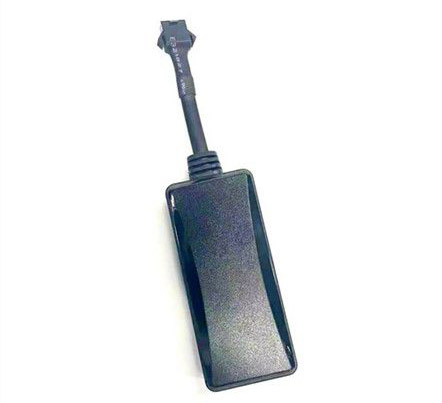

# Autoseeker - AT-25

El rastreador GPS Autoseeker AT-25 es una solución confiable y eficiente para el seguimiento de vehículos. Con funciones avanzadas y un diseño compacto, este dispositivo ofrece una amplia gama de características para satisfacer las necesidades de seguimiento de cualquier usuario.

Una de las principales características del AT-25 es su capacidad de seguimiento por SMS / GPRS \(TCP\), lo que permite obtener la ubicación en tiempo real del vehículo a través de la plataforma web. Además, este rastreador es compatible con la tecnología 4G, lo que garantiza una conexión rápida y estable a Internet.

Otra función destacada del AT-25 es el seguimiento por intervalo de tiempo, que permite programar el rastreador para que envíe actualizaciones de ubicación en intervalos predefinidos. Esto es especialmente útil para monitorear la ruta de un vehículo durante un viaje largo o para realizar un seguimiento de la flota de una empresa.

El AT-25 también cuenta con una batería de respaldo incorporada de 100 mAh, lo que garantiza que el dispositivo siga funcionando incluso en caso de corte de energía. Además, este rastreador ofrece la función de motor remoto cortado, que permite detener el automóvil de forma remota en situaciones de emergencia o para evitar robos.

Otras características notables del AT-25 incluyen alertas de exceso de velocidad, alertas de geocerca y alertas cuando se apaga el vehículo. Además, este rastreador ofrece la función de seguimiento del historial, que permite revisar las rutas y ubicaciones anteriores del vehículo.

En resumen, el rastreador GPS Autoseeker AT-25 es una opción confiable y versátil para el seguimiento de vehículos. Con su amplia gama de funciones y su diseño compacto, este dispositivo ofrece una solución completa para cualquier necesidad de seguimiento.

