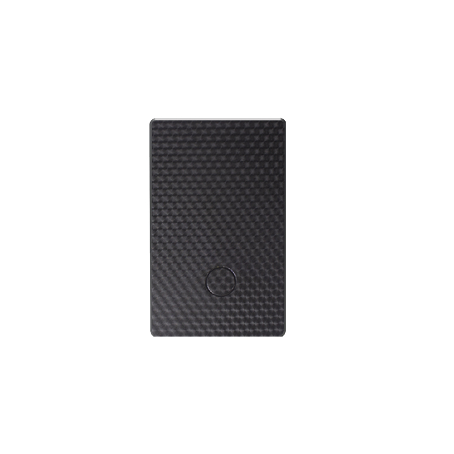

# Autoseeker - AT-7

# AT-7 4G Card GPS Tracker

El AT-7 4G Card GPS Tracker es un rastreador GPS compacto, de formato tarjeta, diseñado para implementaciones compatibles con Plaspy centradas en la seguridad de estudiantes, el cuidado de personas mayores y la monitorización de mascotas. Su posicionamiento de múltiples constelaciones \(GPS + BDS + AGPS + LBS\) y su hardware GNSS de alta sensibilidad proporcionan un seguimiento en tiempo real fiable, incluso en cañones urbanos y entornos mixtos interiores/exteriores, mientras el soporte 4G LTE y GSM heredado garantiza una amplia cobertura celular para una conectividad continua.

Diseñado para un portability diario sencillo—aproximadamente 40 g y del tamaño de una tarjeta de crédito—el AT-7 integra geocercas, alarmas de emergencia y vibración, detección de movimiento, caché de datos offline y actualización de firmware a distancia para proporcionar telemetría y alertas prácticas a través de la plataforma Plaspy. Organizaciones y familias que utilizan rastreadores compatibles con Plaspy pueden desplegar el AT-7 para obtener fijaciones de ubicación rápidas, alertas de zona instantáneas y un historial de rutas de hasta 180 días.

## Aspectos Destacados

- Rastreador GPS compatible con Plaspy en un factor de forma delgado y estilo tarjeta: fácil de llevar en una cartera o montar en el collar de una mascota.
- Posicionamiento multi-constelación \(GPS + BDS + AGPS + LBS\) con una antena cerámica de alta sensibilidad para una adquisición satelital más rápida y mayor precisión.
- 4G LTE \(FDD y TDD\) con GSM de respaldo y datos optimizados CAT-1 para un seguimiento en tiempo real eficiente y de bajo consumo.
- Geocercas y alertas instantáneas de entrada/salida, además de alarmas SOS y de vibración que notifican a los números de monitoreo y suben los eventos a los servidores de Plaspy.
- Acelerómetro de 3 ejes integrado para detección de movimiento y postura que respalda telemetría, alertas de actividad y ahorro de energía inteligente.
- Almacenamiento FLASH offline que guarda puntos de ubicación en zonas sin cobertura y sube automáticamente los datos faltantes cuando se restablece la conectividad; el historial de seguimiento se conserva en la plataforma durante hasta 180 días.
- Carcasa con clasificación IP65 para resistencia diaria a salpicaduras y polvo—apta para aplicaciones de seguimiento personal, familiar y de mascotas.

## Cómo Funciona con Plaspy

El AT-7 suministra a Plaspy datos continuos de ubicación y eventos mediante conexiones TCP/IP \(dominio/IP\) a través de redes celulares. Una vez que el dispositivo se registra en Plaspy, la plataforma recibe actualizaciones de seguimiento en tiempo real, notificaciones de alertas y un historial de trayectos. La integración compatible con Plaspy facilita configurar geocercas, definir destinatarios de alarma y ver telemetría en tableros y aplicaciones móviles.

- Actualizaciones de ubicación y telemetría en tiempo real \(GNSS de múltiples constelaciones y posicionamiento celular\).
- Alertas de entrada/salida de geocerca y avisos instantáneos de SOS y alarma de vibración reportados a los tableros de Plaspy y a números de teléfono designados.
- Caché de datos offline con subida suplementaria automática cuando se restaura la conectividad celular; garantiza un historial de seguimiento continuo en Plaspy.
- Configuración remota y actualización de firmware en línea \(FOTA\) a través de la plataforma para la gestión centralizada del dispositivo.
- Conserva los datos de seguimiento histórico en la plataforma de servicio durante hasta 180 días para facilitar la revisión e informes.

## Visión Técnica

| Conectividad | 4G LTE \(FDD/TDD\) con GSM heredado; transmisión de datos CAT-1 y conexión al servidor TCP/IP \(dominio/IP\) |
| --- | --- |
| Bandas | LTE-FDD B1/B3/B5/B8; LTE-TDD B34/B38/B39/B40/B41; GSM 850/900/1800/1900 MHz |
| Energía y batería | Batería interna recargable de respaldo — 700mAh \(3.7V, polímero\) según especificación; voltaje de operación DC 3.4–4.5 V; corriente de funcionamiento ~60 mA \(promedio 4V\); modo de espera ~5 mA \(promedio 4V\) |
| Interfaces | I/O a nivel de dispositivo no especificado en la descripción proporcionada; la operación principal se realiza vía celular/GNSS y sensores a bordo |
| GNSS | GPS + BDS + AGPS + LBS; chipset GPS ZKW; antena cerámica; arranques en caliente/término/frío ~1s / ~30s / ~35s \(promedio\) |
| Bluetooth | No especificado para AT-7 en los materiales proporcionados |
| Gestión remota | Gestión remota y actualización de firmware en línea \(FOTA\) soportadas |
| Factor de forma | Rastreador compacto de estilo tarjeta, aprox. 81.2 × 54.2 × 6.5 mm; peso ~40 g; clasificación IP65 a prueba de polvo y agua |

## Casos de Uso

- Seguridad infantil y localización para control de asistencia de estudiantes — padres e instituciones pueden recibir ubicación en tiempo real y alertas de zona a través de Plaspy.
- Cuidado de personas mayores y monitoreo de personas vulnerables — detección de movimiento, alertas de postura y reporte SOS que facilitan una ayuda oportuna.
- Rastreo de mascotas — diseño ligero y carcasa resistente hacen que el AT-7 sea adecuado para collares y monitoreo de actividades al aire libre.
- Rastreo de objetos pequeños o activos personales — formato tipo tarjeta cabe en carteras, bolsos o equipos para proporcionar rastreo básico anti-robo y rutas históricas.

## Por Qué Elegir Este Rastreador con Plaspy

El AT-7 ofrece un equilibrio entre un diseño compacto, posicionamiento de múltiples constelaciones y una conectividad celular fiable que se integra de forma limpia con plataformas compatibles con Plaspy. Para organizaciones y familias que priorizan el seguimiento en tiempo real, alertas de geocercas y notificaciones SOS que pueden salvar vidas, el AT-7 ofrece telemetría consistente y manejo de datos offline para conservar los registros ante interrupciones de conectividad. Los paneles de control y las aplicaciones móviles de Plaspy traducen la ubicación del dispositivo, los eventos del acelerómetro y los mensajes de alarma en alertas e informes accionables.

Los usuarios de Plaspy que requieran funciones avanzadas de gestión de flotas o funciones específicas para vehículos deben señalar que las características de la plataforma, como encendido, control de inmovilizador, monitorización de combustible o sensores Bluetooth, están disponibles a nivel de plataforma Plaspy y pueden usarse cuando el dispositivo provee las entradas e interfaces necesarias. El AT-7 está optimizado para aplicaciones personales y de mascotas, proporcionando el rastreador GPS central y las funciones de telemetría que importan para la monitorización de seguridad y el rastreo ligero de activos.

