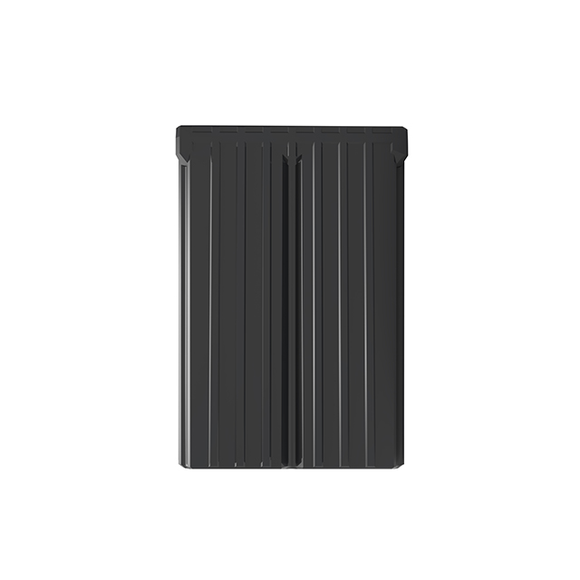

# Autoseeker - AT-8

El AT-8 es un rastreador animal 4G diseñado específicamente para despliegues en animales grandes y uso prolongado en campo. Cuenta con una batería recargable de gran capacidad de 20,000 mAh, una carcasa ABS resistente con clasificación IP67 y modos de reporte configurables; todo ello pensado para ofrecer seguimiento fiable y bajo mantenimiento en entornos agrícolas remotos. Además, incluye ayudas de recuperación como un buzzer audible y una iluminación integrada para localizar animales con rapidez cuando sea necesario.

Como dispositivo compatible con Plaspy, el AT-8 se integra en su cuenta de Plaspy para brindar visibilidad centralizada y control operativo de los activos animales. Al conectarlo con Plaspy, el rastreador envía historial de ubicaciones y actualizaciones de estado a una plataforma unificada donde usted puede monitorear posiciones en vivo, definir alertas de geocerca y ajustar la frecuencia de los reportes para equilibrar la cadencia de actualizaciones con la duración de la batería.

## Puntos clave

- Compatible con Plaspy para seguimiento centralizado en tiempo real y reproducción de historial entre dispositivos
- Conectividad 4G CAT-1 con fallback GSM para cobertura regional amplia
- Batería recargable de 20,000 mAh diseñada para mayor tiempo en espera y menor necesidad de visitas de mantenimiento
- Carcasa ABS con clasificación IP67 para resistencia al polvo y al agua en condiciones exteriores exigentes
- Tres modos de funcionamiento configurables para balancear frecuencia de reporte y duración de la batería
- Buzzer e iluminación integrados para facilitar la recuperación rápida en el campo

## Cómo funciona con Plaspy

Al conectar el AT-8 a Plaspy, las posiciones y el estado del dispositivo se envían a la plataforma para que usted y su equipo puedan monitorear a los animales en tiempo real y revisar sus desplazamientos históricos. Los modos de reporte configurables le permiten ajustar la frecuencia de envío de datos, alineando la cadencia de seguimiento con sus necesidades operativas y las limitaciones de batería dentro de Plaspy.

- Actualizaciones de ubicación en tiempo real y mapeo para el monitoreo en vivo de los animales
- Alertas de geocerca y notificaciones de incumplimiento para informar al personal sobre eventos de límite
- Reproducción de historial en Plaspy para analizar patrones de movimiento y comportamiento de pastoreo
- Informes de batería y estado del dispositivo para planificar recargas y mantenimiento
- Uso de las ayudas de recuperación reportadas por el dispositivo para encontrar animales rápidamente tras una alerta

## Casos de uso típicos

- Seguimiento de ganado a escala de rancho para vigilar la ubicación del rebaño en extensos pastizales
- Prevención de robo y recuperación rápida mediante alertas de geocerca y las señales audibles/visuales del dispositivo
- Monitoreo durante transporte: carga, tránsito y descarga de animales
- Optimización del pastoreo mediante reproducción de historial y análisis de movimiento
- Despliegues remotos donde la larga duración de la batería reduce la frecuencia de visitas de mantenimiento

## Por qué elegir este rastreador con Plaspy

El AT-8 está pensado para ofrecer telemetría confiable y de larga duración junto con funciones prácticas para la recuperación de animales. Su combinación de carcasa robusta, batería de alta capacidad y modos de reporte configurables lo convierte en una opción sensata para operaciones que requieren seguimiento continuo y bajo mantenimiento en ambientes exteriores exigentes. Integrado en Plaspy, el AT-8 aporta visibilidad de los activos animales dentro de un flujo de trabajo centralizado de monitoreo de flotas.

Si su despliegue incluye distintos tipos de activos, Plaspy puede consolidar los rastreadores AT-8 junto con otros dispositivos compatibles para que usted gestione la telemetría de animales y vehículos en la misma plataforma. El AT-8 con Plaspy es una opción práctica para ganaderos y administradores de ganado que buscan capacidades de seguimiento y alerta sencillas y escalables.

Learn more about Plaspy on the main website https://www.plaspy.com. Product specifications, availability, and manufacturer details can change over time; verify current specifications and documentation with the manufacturer at https://autoseekergps.com/ before procurement or deployment.
