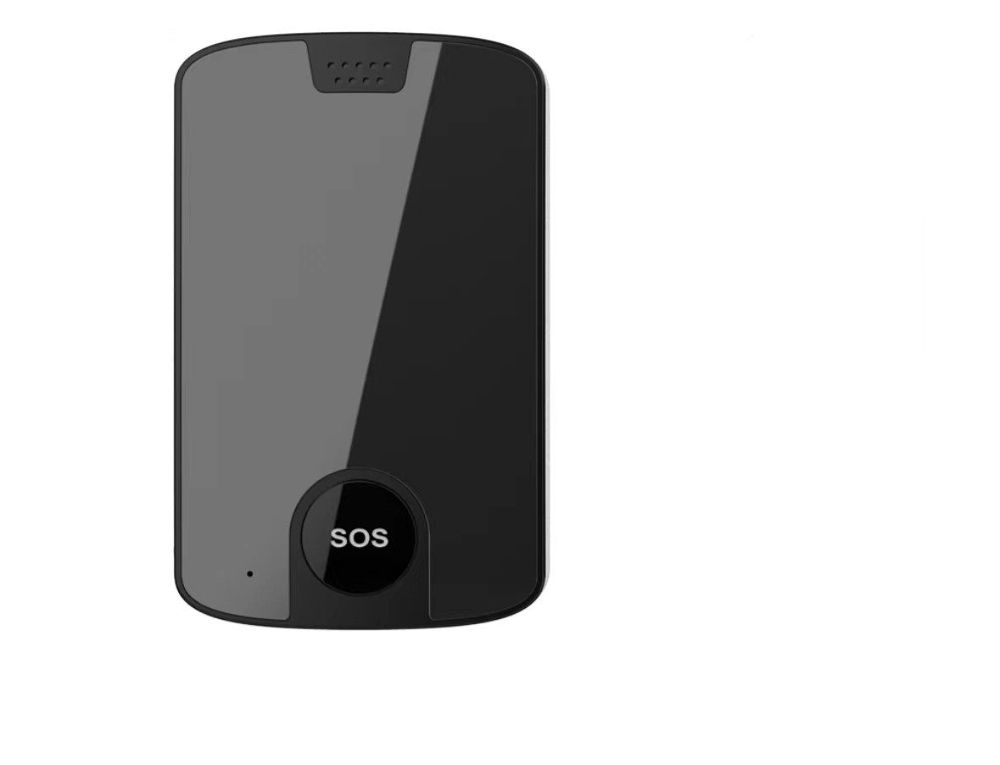

# Autoseeker - AT-9

El Autoseeker AT-9 es un rastreador GPS magnético inalámbrico 4G, diseñado para el seguimiento encubierto y la supervisión de activos de uso intensivo con larga duración. Con una carcasa impermeable IP68 y un potente imán integrado, el AT-9 permite montaje sin herramientas en superficies metálicas. Integra posicionamiento multimodal, conectividad celular, una batería recargable de alta capacidad y un conjunto de alarmas y funciones de comunicación para soportar seguimiento en tiempo real y monitoreo antirrobo de vehículos, contenedores, maquinaria de construcción y otros activos móviles de alto valor.

Como dispositivo compatible con Plaspy, el AT-9 puede alimentar ubicaciones y telemetría a Plaspy para una supervisión unificada de la flota y flujos de trabajo de seguridad. Su combinación de posicionamiento por respaldo, alertas de movimiento y manipulación, botón SOS y amplia autonomía en standby lo convierten en una opción práctica para organizaciones que desean consolidar la visibilidad de activos, la notificación de incidentes y los informes históricos en la plataforma Plaspy.

## Características principales

- Compatible con Plaspy para seguimiento en tiempo real e informes de telemetría en una plataforma de gestión centralizada
- Carcasa robusta IP68 y potente imán integrado para montaje discreto y sin herramientas en superficies metálicas
- Posicionamiento multimodal con GNSS y retrocesos por Wi‑Fi y LBS para mejorar la fiabilidad de la localización en distintos entornos
- Conectividad celular (4G LTE y GSM) para entregar actualizaciones continuas donde existan redes disponibles
- Batería recargable de larga duración, pensada para despliegues remotos y largos periodos en standby
- Suite de alarmas integrada que incluye alertas por movimiento, vibración y manipulación, además de SOS y voz bidireccional para respuesta en emergencias

## Cómo funciona con Plaspy

Al desplegarse, el AT-9 transmite coordenadas de ubicación y telemetría a través de redes celulares hacia Plaspy, donde los datos se normalizan y se presentan para monitoreo, alertas e informes. Plaspy consolida posiciones GNSS y fuentes de respaldo para mantener la conciencia situacional, y expone esa información mediante paneles, reportes e integraciones que apoyan la toma de decisiones operativas.

- Actualizaciones continuas de posición y fuentes de ubicación de respaldo para seguimiento confiable en condiciones de señal mixtas
- Alertas de movimiento, vibración y manipulación dirigidas a Plaspy para notificaciones rápidas y respuesta antirrobo
- Alertas de exceso de velocidad y desplazamiento utilizadas en control de flota y en la aplicación de reglas de geocercas
- Eventos del botón SOS e indicadores de voz bidireccional integrados en flujos de trabajo de incidentes para la respuesta en sitio
- Estado de batería y advertencias de batería baja visibles en Plaspy para mantener el mantenimiento y los despliegues a largo plazo

## Casos de uso típicos

- Seguimiento encubierto antirrobo de camiones, remolques y vehículos de servicio cuando se requiere fijación discreta
- Monitoreo de contenedores y carga en tránsito con protección impermeable y montaje magnético rápido
- Localización de maquinaria de construcción y equipos pesados con alertas por manipulación y desplazamiento
- Supervisión de activos auxiliares marinos para equipos impermeabilizados y unidades portátiles
- Despliegues remotos de larga duración que se benefician de gran autonomía en espera y opciones de recarga complementaria

## Por qué elegir este rastreador con Plaspy

El AT-9 combina durabilidad práctica con funciones de reporte que se adaptan a programas de seguridad de flotas y activos. Su carcasa resistente, montaje magnético y conjunto de alertas responden a necesidades operativas habituales para un rastreo discreto y resistente. Al conectarlo a Plaspy, esas capacidades del dispositivo se traducen en visibilidad centralizada, alertas automatizadas y análisis histórico de rutas que ayudan a los equipos a reducir pérdidas y mejorar los tiempos de respuesta.

Si desea evaluar el AT-9 para uso con Plaspy, el dispositivo es una opción sensata para organizaciones que necesitan seguimiento con larga autonomía, monitoreo antirrobo e integración con flujos de trabajo de incidentes. Conozca más sobre Plaspy en el sitio principal https://www.plaspy.com. Las especificaciones de producto, la disponibilidad y los datos del fabricante pueden cambiar con el tiempo; por favor verifique las especificaciones actuales y la documentación oficial en el sitio de Autoseeker https://autoseekergps.com/.
