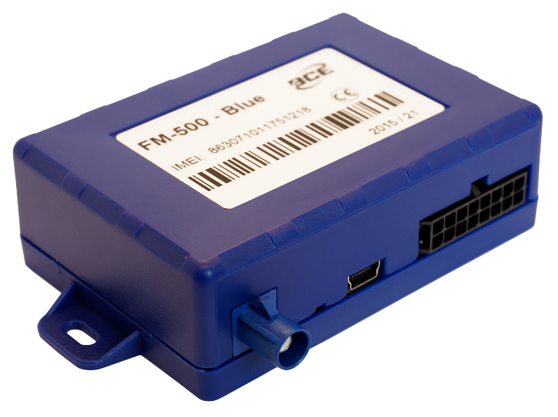

# BCE - FM-500 Blue

El BCE FM-500 Blue es un rastreador GPS compacto y versátil pensado para el seguimiento de objetos y vehículos. Obtiene datos de posición, velocidad y rumbo mediante GPS y GLONASS, y transmite la información a través de la red GSM. Dispone de entradas y salidas digitales y analógicas para conectar sensores y equipos externos, y puede leer información FMS CAN mediante el protocolo J1939, lo que lo hace adecuado para diversos escenarios de rastreo.

Como dispositivo compatible con Plaspy, el FM-500 Blue puede enviar su ubicación y datos del vehículo a la plataforma Plaspy para su monitoreo centralizado y generación de informes. Su configuración flexible y múltiples interfaces lo convierten en una opción práctica para organizaciones que desean combinar hardware de rastreo confiable con las herramientas de visibilidad, alertas y supervisión operativa de Plaspy.

## Características principales

- Posicionamiento por GPS y GLONASS con transmisión de datos por GSM para un reporte de ubicación fiable.
- Entradas y salidas digitales y analógicas para monitorear sensores externos y activar acciones remotas.
- Capacidad para leer datos FMS CAN en formato J1939 y soporte para interfaces de vehículo como OBDII y CAN.
- Opciones de configuración flexibles para adaptar el equipo a distintas necesidades y escenarios de implementación.
- Factor de forma compacto y liviano para instalaciones discretas y con mínimo impacto de espacio.
- Bajo consumo energético y batería de respaldo interna para mantener reportes de ubicación durante cortes de alimentación.
- Amplio rango de voltaje de operación y protección contra impulsos para robustez en entornos vehiculares.

## Cómo funciona con Plaspy

Al integrarse con Plaspy, el FM-500 Blue transmite datos de posición y eventos que Plaspy presenta en paneles, informes y vistas en tiempo real. Plaspy utiliza la información del dispositivo para mejorar la visibilidad de la flota y apoyar la toma de decisiones operativas, al tiempo que permite configurar alertas y obtener análisis históricos.

- Seguimiento en tiempo real de ubicación y movimiento mostrado en mapas y vistas en vivo de Plaspy.
- Integración de datos del vehículo desde FMS CAN y OBDII para un monitoreo consolidado de la flota.
- Detección de eventos y entradas digitales/analógicas mostrados como alertas o indicadores de estado en Plaspy.
- Uso de salidas para habilitar acciones de control remoto iniciadas desde flujos de trabajo de Plaspy cuando la función está disponible.
- Informes históricos de viajes y rutas para análisis operativo y revisión de desempeño.
- Alertas y notificaciones personalizables basadas en velocidad, ubicación, entradas u otras condiciones configuradas.

## Casos de uso típicos

- Rastreo de vehículos de flota y telemática básica para flotas comerciales y vehículos de servicio.
- Monitoreo de activos para equipos y objetos móviles que requieran visibilidad de posición y estado.
- Supervisión y control remoto de dispositivos o equipos auxiliares conectados mediante salidas.
- Recolección de datos vehiculares para planificación de mantenimiento y supervisión operativa cuando se requiere integración FMS CAN u OBDII.
- Despliegues que necesitan un rastreador compacto con batería de respaldo y bajo consumo en reposo.

## Por qué elegir este rastreador con Plaspy

El FM-500 Blue combina un perfil de hardware compacto con entradas, salidas y opciones de interfaz vehicular flexibles, lo que lo hace ideal para organizaciones que requieren un rastreador configurable. Su capacidad para reportar ubicación y datos del vehículo encaja con el enfoque de Plaspy en ofrecer visibilidad clara de la flota, alertas y herramientas de reporte. Para equipos que gestionan flotas mixtas o activos variados, el soporte de interfaces estándar del vehículo y su bajo consumo facilitan la integración en una solución de rastreo centrada en Plaspy.

Si necesita un rastreador que equilibre versatilidad y despliegue discreto y que entregue los datos que Plaspy requiere para el monitoreo y los flujos operativos, el BCE FM-500 Blue es una opción relevante. Para obtener más información sobre el uso de Plaspy con dispositivos como el FM-500 Blue, visite el sitio de Plaspy en https://www.plaspy.com. Las especificaciones del producto, la disponibilidad y los datos del fabricante pueden cambiar con el tiempo, por favor verifique las especificaciones actuales en el sitio del fabricante http://www.bce.en/.
