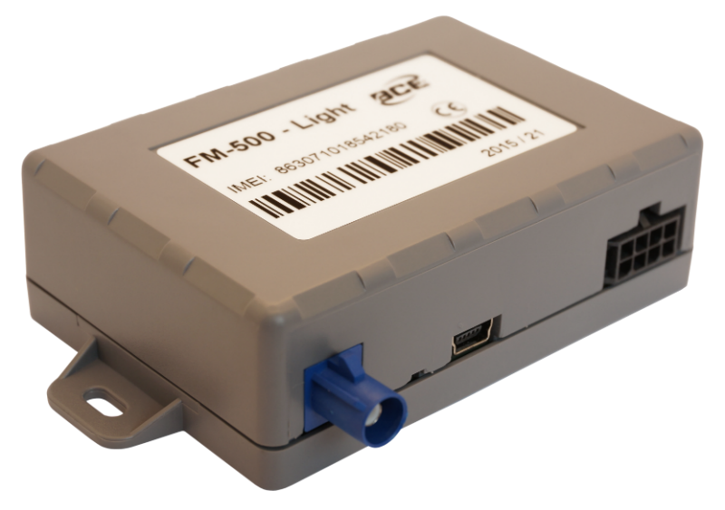

# BCE - FM-500 Light

El BCE FM-500 Light es un rastreador compacto diseñado para ofrecer información confiable de ubicación y movimiento para una amplia variedad de activos. Emplea posicionamiento GPS y GLONASS junto con transferencia de datos por GSM para reportar ubicación, velocidad, rumbo e información de eventos. El dispositivo incluye entradas digitales y analógicas, una interfaz 1-Wire para sensores externos y salidas para el control remoto de equipos conectados, permitiendo una configuración flexible según las necesidades de monitoreo.

Como dispositivo compatible con Plaspy, el FM-500 Light puede enviar sus datos de ubicación y estado a Plaspy para su monitoreo y generación de informes consolidados. Plaspy puede recibir las actualizaciones de posición, los registros de eventos y los estados de entradas/salidas del equipo para presentar esa información en paneles, alertas e informes históricos. Esta compatibilidad convierte al FM-500 Light en una opción práctica para empresas que desean combinar hardware probado con las funciones de gestión de flotas y activos de Plaspy.

## Aspectos principales

- Factor de forma compacto y ligero, apto para diversas aplicaciones de rastreo de objetos
- Posicionamiento GPS y GLONASS con opciones de adquisición asistida para obtener fijaciones más rápidas
- Transferencia de datos por GSM para enviar ubicación e información de eventos a una plataforma de seguimiento
- Múltiples entradas y una interfaz 1-Wire para conectar sensores y dispositivos externos
- Salidas disponibles para control remoto o señalización de equipos externos
- Memoria interna y batería de respaldo opcional para conservar eventos cuando la conectividad se interrumpe

## Cómo funciona con Plaspy

Al integrarse con Plaspy, el FM-500 Light forma parte de un entorno de seguimiento unificado donde los datos de ubicación, movimiento y eventos son visibles junto a los de otros dispositivos de su flota. Plaspy recibe las posiciones reportadas y los mensajes de estado del dispositivo, permitiendo que los equipos utilicen esa información para supervisión operativa e informes.

- Visualización en tiempo real e histórica de ubicaciones en mapas y líneas de tiempo dentro de Plaspy
- Alertas y notificaciones basadas en movimientos, entradas o condiciones de evento personalizadas
- Informes agregados sobre recorridos, distancia y conteo de eventos para revisiones operativas
- Indicadores visuales de estado para entradas digitales y analógicas capturadas por el rastreador
- Acciones de control remoto y monitoreo del estado de salidas presentadas en Plaspy cuando el dispositivo lo soporta

## Casos de uso típicos

- Seguimiento de activos portátiles y objetos de alto valor que requieren hardware compacto
- Monitoreo de vehículos pequeños o equipos donde el espacio y el peso son limitados
- Supervisión remota de estado mediante sensores conectados para detectar manipulación, puertas o señales de servicios
- Implementaciones de alquiler o de corto plazo donde la configuración flexible y la portabilidad son importantes
- Situaciones que se benefician del registro de eventos y el análisis posterior a incidentes

## Por qué elegir este rastreador con Plaspy

El FM-500 Light combina características de hardware prácticas con las capacidades de la plataforma Plaspy para ofrecer una solución de rastreo sencilla y efectiva. Su tamaño reducido, entradas versátiles y registro de eventos lo hacen adecuado para organizaciones que necesitan visibilidad funcional de activos sin grandes requerimientos de hardware. Para equipos que usan Plaspy, el FM-500 Light puede aportar datos de posición y eventos confiables a paneles, alertas e informes históricos que apoyan las operaciones diarias.

Si necesita un rastreador compacto que se integre con una plataforma de seguimiento completa, el FM-500 Light es una opción viable para evaluar junto con Plaspy. Las especificaciones aquí presentadas se basan en la información disponible del modelo; para los detalles técnicos y opciones de configuración más recientes consulte al fabricante. Para conocer más sobre cómo Plaspy puede trabajar con dispositivos compatibles visite https://www.plaspy.com. Las especificaciones de producto, disponibilidad y los datos del fabricante pueden cambiar con el tiempo, por favor verifique la información actual en el sitio oficial del fabricante http://www.bce.en/.
