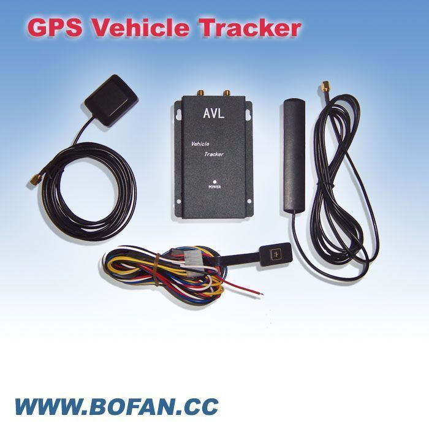

# Bofan - PT-300X

El Bofan PT-300X es un rastreador GPS compacto para vehículos, diseñado para ofrecer monitoreo de ubicación confiable y funciones básicas de alerta. Soporta rastreo por SMS y GPRS, permite configurar intervalos de reporte para construir historial de movimiento, y dispone de notificaciones prácticas como batería baja, exceso de velocidad y alarmas de geocerca. Además incluye un botón SOS para señalización de emergencias y admite la función de inmovilización mediante un relé externo para detener el vehículo cuando sea necesario.

Como dispositivo compatible con Plaspy, el PT-300X puede enviar sus actualizaciones de ubicación y alertas a la plataforma Plaspy para obtener una visión consolidada de la flota y reportes. Esa compatibilidad permite a encargados de flotas y administradores ver ubicaciones en tiempo real, revisar rutas históricas, recibir notificaciones de alarmas y combinar los reportes del dispositivo con las herramientas de monitoreo de Plaspy para mejorar la supervisión operativa.

## Principales ventajas

- Informes de ubicación en tiempo real vía SMS o GPRS para seguimiento continuo
- Reportes por intervalos configurables para reconstruir el historial de desplazamientos
- Alerta por exceso de velocidad para notificar cuando se supera un umbral establecido
- Control de geocercas para detectar entradas o salidas de zonas definidas
- Alerta de batería baja para ayudar a mantener la disponibilidad del equipo
- Botón SOS para notificar inmediatamente a contactos predefinidos
- Soporte para inmovilización mediante relé externo para detener el vehículo de forma remota

## Cómo se integra con Plaspy

El PT-300X envía actualizaciones periódicas de ubicación y alertas que Plaspy recoge y muestra en su plataforma. Plaspy organiza esos mensajes en vistas de mapa, registros de eventos y reportes para que los equipos puedan supervisar vehículos y reaccionar ante incidentes desde una única interfaz.

- Ubicación en vivo y posiciones recientes mostradas en los mapas de Plaspy
- Alertas como exceso de velocidad, violaciones de geocerca, batería baja y SOS presentadas como notificaciones y en el registro de eventos
- Reconstrucción de rutas históricas basada en los reportes por intervalo del rastreador para revisión de viajes y auditoría
- Paneles de monitoreo de flota para seguir la disponibilidad y la actividad reciente de los vehículos
- Herramientas de reporte que consolidan eventos y posiciones del dispositivo para cumplimiento o análisis operativo

## Casos de uso típicos

- Monitoreo de flotas comerciales para camionetas de reparto, vehículos de servicio y equipos de campo
- Seguimiento de vehículos de alquiler o leasing para mantener historial de ubicaciones y aplicar límites
- Supervisión de seguridad de activos de alto valor o sensibles que requieren geocercas y señales SOS
- Control de conducta de conductores donde las alertas por exceso de velocidad ayudan a aplicar políticas de manejo seguro
- Escenarios de respuesta ante robo donde la inmovilización remota añade una capa extra de protección

## Por qué elegir este rastreador con Plaspy

El PT-300X combina un conjunto práctico de funciones para rastreo vehicular con opciones de reporte sencillas, lo que lo hace adecuado para organizaciones que necesitan datos de ubicación confiables y alertas básicas. Al integrarse con Plaspy, las capacidades del dispositivo se incorporan a un entorno de monitoreo más amplio donde los administradores pueden correlacionar eventos, visualizar rutas y mantener registros operativos.

Aunque el PT-300X cubre las necesidades esenciales de seguimiento de flotas, Plaspy aumenta su valor al centralizar alertas y datos históricos para equipos que requieren supervisión consolidada. Para organizaciones que buscan un rastreador compacto que pueda ser monitoreado y reportado a través de Plaspy, el PT-300X ofrece un equilibrio entre simplicidad y control funcional.

Para obtener más información sobre cómo Plaspy puede trabajar con dispositivos como el Bofan PT-300X, visite el sitio de Plaspy en https://www.plaspy.com. Las especificaciones y la disponibilidad del producto pueden cambiar con el tiempo, por lo que le recomendamos verificar los detalles técnicos actuales y la información del fabricante en el sitio oficial de Bofan en https://www.bofancloud.com/.
