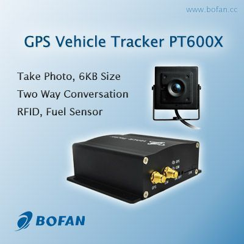

# Bofan - PT-600

El Bofan PT-600 es un rastreador vehicular GPS equipado con cámara, diseñado para flotas y operaciones de transporte que requieren evidencia visual junto con datos de ubicación. Integra captura de fotos y video con identificación de conductor mediante RFID, monitoreo de voz y comunicación bidireccional, además de supervisión de condiciones del vehículo como combustible y temperatura. El equipo almacena una gran cantidad de puntos de ruta de forma local y admite actualizaciones en tiempo real vía GPRS, así como solicitudes de ubicación por SMS, lo que lo hace apropiado para entornos con conectividad variable.

Como dispositivo compatible con Plaspy, el PT-600 puede incorporar sus funciones multimedia y de identificación a una plataforma centralizada de gestión de flotas. Al integrarse con Plaspy, los PT-600 ofrecen visibilidad de ubicación, alertas de eventos y reproducción de rutas almacenadas junto con imágenes e información de asignación de conductores. Esto convierte a este modelo en una opción práctica para organizaciones que buscan combinar seguimiento, evidencia visual y supervisión operativa dentro del sistema Plaspy.

## Aspectos Destacados

- Cámara integrada para fotos y video que facilita la verificación visual de eventos
- Identificación de conductor mediante RFID para vincular viajes a operadores específicos
- Monitoreo de voz y comunicación bidireccional para mejorar la conciencia situacional y la comunicación con el conductor
- Posicionamiento por doble satélite con seguimiento en tiempo real vía GPRS y soporte de solicitudes de ubicación por SMS
- Amplio conjunto de alarmas incluyendo SOS, exceso de velocidad y notificaciones de geocerca para seguridad
- Gran almacenamiento local de puntos de ruta para preservar el historial cuando la conectividad es limitada
- Entradas y salidas flexibles y entradas analógicas para adaptarse a necesidades de monitoreo y control de flota

## Cómo Funciona con Plaspy

Al conectarse a Plaspy, el PT-600 envía ubicación, alertas y evidencia multimedia a la plataforma para que los administradores de flota puedan supervisar vehículos y responder a eventos desde una única interfaz.

- Visualice la ubicación y el estado del vehículo en tiempo real sobre los mapas de Plaspy para supervisión operativa
- Reciba y gestione alertas como SOS, exceso de velocidad y notificaciones de geocerca a través del sistema de alertas de Plaspy
- Acceda a fotos y videos grabados vinculados a eventos o intervalos de tiempo para revisión de incidentes
- Asocie identificaciones RFID de conductores con perfiles de usuario en Plaspy para reportes por conductor y rendición de cuentas
- Reproduzca rutas históricas y revise puntos de ruta almacenados para análisis de viajes e informes
- Envíe comandos remotos autorizados, como corte de relé donde esté soportado, para ayudar en el control del vehículo

## Casos de Uso Típicos

- Operadores de flota que necesitan evidencia visual de entregas o incidentes junto al rastreo GPS
- Flotas de transporte escolar o de pasajeros que emplean RFID para verificar asignación de conductor y seguridad de los pasajeros
- Operaciones de transporte y logística que monitorean carga sensible a la temperatura y consumo de combustible
- Flotas enfocadas en seguridad que requieren alertas SOS, inmovilización remota y captura de medios
- Organizaciones que necesitan reproducción histórica de rutas e informes integrados para cumplimiento normativo

## Por Qué Elegir Este Rastreador con Plaspy

El PT-600 combina capacidades multimedia e identificación de conductores con funciones tradicionales de rastreo vehicular, lo que lo convierte en una opción versátil para flotas que requieren más que solo ubicación. En Plaspy, esas capacidades se traducen en registros de incidentes más claros, mayor responsabilidad de los conductores y datos operativos más completos para informes y auditorías. Su capacidad para conservar el historial de puntos de ruta y proporcionar imágenes o video cuando están disponibles ayuda a mantener continuidad incluso cuando las condiciones de red varían.

Si usted está evaluando hardware para integración con Plaspy, el PT-600 representa una opción equilibrada cuando la monitorización visual y la identificación del conductor forman parte de los requisitos. Como siempre, considere las necesidades específicas de monitoreo y control de su operación y confirme que el conjunto de funciones del dispositivo se alinee con sus políticas y flujos de trabajo.

Para obtener más información sobre cómo Plaspy puede trabajar con rastreadores compatibles, visite el sitio principal https://www.plaspy.com. Las especificaciones de producto, disponibilidad y detalles del fabricante pueden cambiar con el tiempo, por lo que le recomendamos verificar la información técnica actual en el sitio oficial de Bofan https://www.bofancloud.com/ antes de la compra o el despliegue.
