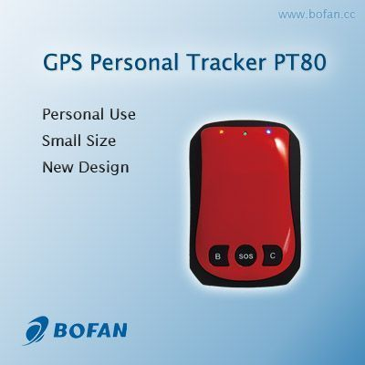

# Bofan - PT-80

El Bofan PT-80 es un rastreador GPS personal compacto diseñado para el monitoreo de ubicación de forma discreta y portátil. Con un tamaño reducido y diseño liviano, está pensado para la seguridad personal y el seguimiento de activos. Incluye antenas GSM y GPS integradas para el reporte de posición, teclas de marcación rápida para contactos preestablecidos, capacidad de monitoreo de voz, botón de pánico para alertas de emergencia, gestión de geovallas y una batería interna recargable con larga autonomía en espera y capacidad de registro de posiciones a bordo.

Como dispositivo compatible con Plaspy, el PT-80 puede integrarse en un flujo de trabajo de seguimiento centralizado para que ubicaciones, alertas e historial sean visibles junto a otras unidades. Plaspy puede procesar las posiciones y eventos reportados por el PT-80 para ofrecer visibilidad en el mapa, manejo consolidado de notificaciones, reproducción histórica y reportes operativos. Esa combinación hace que el PT-80 sea una opción adecuada para quienes requieren un rastreador portátil emparejado con una plataforma de gestión o monitoreo como Plaspy.

## Aspectos principales

- Diseño compacto y ligero para seguimiento discreto de personas o bienes portátiles
- Seguimiento en tiempo real mediante el servicio web y los reportes del dispositivo
- Botón de pánico y teclas de marcación rápida para alertar rápidamente a contactos predefinidos
- Gestión de geovallas con notificaciones de entrada y salida para límites virtuales
- Función de monitoreo de voz para escucha remota cuando el dispositivo lo soporta
- Sensor de movimiento interno y registro a bordo de más de 3,000 puntos cuando no hay datos en vivo

## Cómo funciona con Plaspy

Al utilizarse con Plaspy, las actualizaciones de ubicación y los eventos de alerta del PT-80 se integran en un entorno de monitoreo unificado. Plaspy consolida los reportes del dispositivo para ofrecer conciencia situacional continua e historial de eventos para operadores y administradores.

- Visualice posiciones en vivo del PT-80 en el mapa de Plaspy junto con otros activos rastreados
- Reciba y gestione alertas del dispositivo dentro de Plaspy, incluyendo pánico, geovalla, batería baja y exceso de velocidad
- Acceda a trayectos históricos y reproduzca los puntos registrados para revisar movimientos cuando GPRS o la conexión de datos fueron intermitentes
- Use los reportes de Plaspy para agregar eventos y generar resúmenes operativos para supervisión
- Combine el comportamiento de reporte por SMS/GPRS del dispositivo con el monitoreo de Plaspy para mantener visibilidad en condiciones de conectividad variables

## Casos de uso típicos

- Monitoreo de seguridad personal para niños, personas mayores o trabajadores en solitario
- Seguimiento de objetos valiosos y equipos portátiles que se mueven entre ubicaciones
- Despliegues temporales para personal de eventos, equipos de seguridad o trabajadores de campo
- Artículos en alquiler o activos compartidos que requieren ubicación básica y alertas de entrada/salida
- Seguimiento a corto plazo cuando la discreción del dispositivo y la larga autonomía en espera son prioritarias

## Por qué elegir este rastreador con Plaspy

El PT-80 es un rastreador personal sencillo cuyo tamaño compacto y funciones esenciales lo hacen ideal para organizaciones e individuos que necesitan reporte de ubicación portátil con características básicas de seguridad. Emparejado con Plaspy, las alertas y los datos de posición del dispositivo pueden centralizarse, monitorearse y registrarse para apoyar las operaciones diarias y la respuesta a incidentes sin añadir complejidad.

Dado que el PT-80 almacena puntos de ruta cuando el reporte en vivo no está disponible y ofrece varios tipos de alerta, complementa las capacidades de Plaspy en visibilidad, gestión de eventos y análisis histórico. Para flotas pequeñas, programas de seguridad personal o proyectos de rastreo de activos que priorizan la discreción y la monitorización simple, el PT-80 junto a Plaspy proporciona una solución práctica y fácil de gestionar.

Para obtener más información sobre cómo Plaspy soporta dispositivos como el Bofan PT-80, visite el sitio web de Plaspy en https://www.plaspy.com. Las especificaciones del producto, la disponibilidad y los datos del fabricante pueden cambiar con el tiempo, por lo que verifique las especificaciones actuales y la documentación oficial con el fabricante en https://www.bofancloud.com/ antes de la compra o el despliegue.
