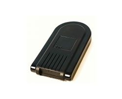

# Box - Box Tracker

El Box Tracker es un dispositivo compacto de rastreo vehicular diseñado para integradores de sistemas de terceros. A pesar de su tamaño reducido, ofrece un registro completo de los movimientos del vehículo mediante tecnología GPS moderna y está construido para funcionar de forma confiable en zonas con mala recepción y espacios cerrados. El equipo incorpora conectividad GSM, memoria interna para almacenamiento de datos, fuente de energía de respaldo y una carcasa plástica resistente que lo protege en el uso diario de flotas.

Como dispositivo compatible con Plaspy, el Box Tracker puede enviar datos de ubicación y eventos a Plaspy para el monitoreo y la supervisión operativa de la flota. Su enfoque orientado a la integración y sus capacidades de comunicación estándar lo hacen idóneo para transmitir posiciones y eventos básicos a Plaspy, de modo que los administradores de flota e integradores puedan usar la plataforma para visibilidad, alertas e informes sin necesidad de adaptaciones complejas.

## Puntos clave

- Diseño compacto y pensado para integración por terceros
- Registro GPS preciso con adquisición rápida de satélites y localización inicial fiable
- Conectividad GSM quadband completa y modos de comunicación comunes para transferencia de datos
- Memoria interna y energía de respaldo para preservar datos de rastreo durante interrupciones
- Dos entradas digitales y una entrada analógica para monitoreo básico de eventos o estado
- Carcasa plástica robusta con antenas dedicadas GPS y GSM para recepción consistente
- Ideal para seguimiento y localización, recuperación de vehículos y procesos de gestión de flotas

## Cómo funciona con Plaspy

Cuando se usa con Plaspy, el Box Tracker proporciona datos de ubicación y eventos que Plaspy ingiere para mostrar la actividad de los vehículos en tiempo real y de forma histórica. Plaspy puede utilizar esos datos para generar mapas, líneas de tiempo e informes operativos para que los equipos supervisen activos y respondan ante incidentes.

- Visibilidad de ubicaciones en tiempo real y casi en tiempo real en los mapas de Plaspy para conciencia operativa
- Reproducción de rutas históricas y registros de trayecto almacenados accesibles desde los informes de Plaspy
- Los eventos captados por las entradas del rastreador pueden convertirse en alertas o disparadores dentro de los flujos de trabajo de Plaspy
- Los datos almacenados en el dispositivo mientras está offline se suben cuando se restablece la conectividad y quedan disponibles en Plaspy
- Resúmenes a nivel de flota e informes exportables que incorporan datos del rastreador para análisis

## Casos de uso típicos

- Rastreo de flotas pequeñas y medianas que requieren rastreadores compactos
- Operaciones de recuperación de vehículos y seguimiento donde una localización inicial fiable es importante
- Proyectos de integración donde sistemas de terceros necesitan una fuente GPS fácil de desplegar
- Situaciones que requieren monitoreo básico de eventos digitales y analógicos junto con datos de ubicación
- Entornos con conectividad intermitente donde la memoria interna y la energía de respaldo ayudan a preservar los datos

## Por qué elegir este rastreador con Plaspy

El Box Tracker es una opción práctica para organizaciones que necesitan un equipo GPS pequeño y amigable para la integración con registro de posiciones fiable. Su diseño pone énfasis en un rendimiento GPS consistente en ubicaciones difíciles y en modos de comunicación sencillos, lo que facilita que integradores y equipos de flota ingresen datos útiles a Plaspy sin personalizaciones complejas.

Para equipos que evalúan rastreadores para usar con Plaspy, el Box Tracker es recomendable cuando el tamaño compacto, entradas de evento básicas y la retención de datos a bordo son prioridades. Para conocer más sobre cómo Plaspy puede utilizar los datos del rastreador para monitoreo, alertas e informes visite https://www.plaspy.com. Las especificaciones del producto y la disponibilidad pueden cambiar con el tiempo, por lo que confirme los detalles más recientes con el fabricante en http://www.boxtelematics.com/
