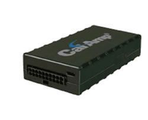

# CalmAmp - LMU-1000

El CalAmp LMU-1000 es una unidad de rastreo GPS de clase económica diseñada para ofrecer una gestión de activos rentable en los mercados de seguros y préstamos subprime. Proporciona funcionalidad de seguimiento y apoyo para la recuperación de vehículos en una carcasa plástica compacta y resistente. El equipo incorpora antenas GPS y GSM internas, una batería de respaldo que mantiene el reporte de ubicación ante cortes de energía y un modo de suspensión que conserva energía cuando el dispositivo está inactivo. No incluye capacidad de voz y está pensado para un uso de rastreo sencillo y confiable.

Como dispositivo compatible con Plaspy, el LMU-1000 puede integrarse en Plaspy para ofrecer visibilidad de ubicación y supervisión operativa de flotas y carteras de garantía. Su posicionamiento económico y las opciones configurables lo hacen adecuado para organizaciones que requieren funciones prácticas de seguimiento y recuperación sin complejidad de hardware. Unido a Plaspy, el LMU-1000 convierte datos de ubicación en monitoreo accionable, alertas e informes útiles para los flujos de trabajo empresariales.

## Puntos clave

- Rastreador de clase económica optimizado para despliegues sensibles al costo
- Configuración personalizable para ajustarse a requisitos de seguros y préstamos
- Capacidades de track and trace orientadas a flujos de recuperación de vehículos
- Batería de respaldo que mantiene el rastreo durante interrupciones de la alimentación principal
- Modo de suspensión para conservar energía cuando la unidad no está activa
- Antenas GPS y GSM internas que simplifican el factor de forma del dispositivo
- Carcasa plástica resistente y fabricación en EE. UU. para garantizar calidad constructiva

## Cómo funciona con Plaspy

Cuando se utiliza con Plaspy, el LMU-1000 actúa como un punto de reporte que envía información de ubicación y estado a un entorno centralizado de gestión de flotas. Plaspy puede aprovechar esos datos para ofrecer conciencia situacional, alertas e informes históricos que apoyen la recuperación y la supervisión de activos.

- Ofrece visibilidad de la ubicación en tiempo real o casi en tiempo real dentro de los paneles de Plaspy
- Soporta flujos de trabajo de alertas para eventos de recuperación y detección de pérdida de energía por parte del dispositivo
- Habilita reportes básicos y registros históricos para auditorías, reclamaciones y expedientes de préstamos
- Ayuda a los equipos operativos a monitorear activos y coordinar acciones de recuperación
- Conserva la energía del dispositivo mediante el modo de suspensión, permitiendo que Plaspy reciba actualizaciones cuando el equipo está activo

## Casos de uso típicos

- Monitoreo de carteras de seguros y coordinación de recuperaciones
- Rastreo y verificación de colaterales en préstamos subprime
- Seguimiento económico de activos para pequeñas flotas de vehículos
- Operaciones de recuperación de vehículos donde la continuidad del reporte de ubicación es importante
- Track and trace para flotas de vehículos de alquiler o con alta rotación

## Por qué elegir este rastreador junto con Plaspy

El LMU-1000 es una opción pragmática para organizaciones que necesitan rastreo de ubicación confiable sin costos de hardware premium. Su combinación de batería de respaldo, antenas internas y modo de suspensión lo hace apropiado para escenarios de seguros y préstamos donde mantener el rastreo durante interrupciones de energía y minimizar el tamaño del dispositivo son prioridades. Al ser configurable, puede adaptarse a necesidades operativas comunes y sigue siendo sencillo de desplegar junto con Plaspy.

En conjunto con Plaspy, el LMU-1000 ofrece una vía clara desde los datos de ubicación del dispositivo hasta la información operativa. Plaspy añade visibilidad, alertas e informes que permiten a los equipos actuar sobre la información que proporciona el rastreador, convirtiendo al LMU-1000 en un componente útil para programas de gestión de flotas y garantías con control de costos.

Para saber más sobre cómo Plaspy puede integrarse con rastreadores compatibles como el LMU-1000, visite https://www.plaspy.com. Las especificaciones del producto, la disponibilidad y los datos del fabricante pueden cambiar con el tiempo, por lo que le recomendamos verificar la información técnica actual en el sitio del fabricante http://www.calamp.com/.
