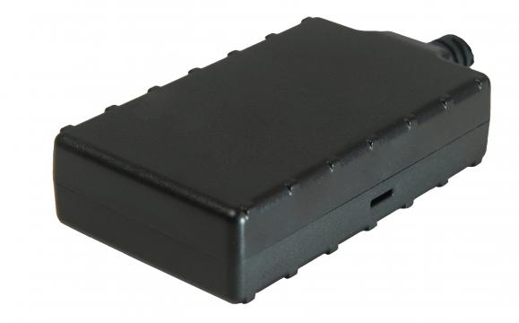

# CalmAmp - LMU-200

El rastreador GPS CalmAmp LMU-200 es una solución económica y completa para el seguimiento de vehículos. Diseñado para instalaciones encubiertas y confiables en automóviles, este dispositivo es ideal para aplicaciones como la recuperación de vehículos robados, financiamiento de vehículos y alquiler de automóviles.

La LMU-200 cuenta con un rendimiento superior en un tamaño compacto. Además, ofrece una batería interna opcional de 200mAh, modos de bajo consumo de energía ultra sueño y un acelerómetro de 3 ejes para detectar el movimiento. También cuenta con hasta cuatro entradas/salidas \(I/O\). Este rastreador utiliza la tecnología GPS de alta sensibilidad en redes celulares CDMA, lo que permite su instalación en cualquier vehículo móvil de 12/24 voltios. Además, cuenta con antenas internas tanto para la comunicación celular como para el GPS, lo que elimina la necesidad de antenas con cable y facilita su montaje en cualquier parte del vehículo.

La LMU-200 utiliza el motor de alertas PEG™ \(Programmable Event Generator\) de CalAmp, que permite supervisar las condiciones externas y establecer reglas basadas en excepciones definidas por el cliente. Esto brinda flexibilidad y personalización para adaptarse a los requisitos de cada aplicación. Además, el rastreador se puede configurar y actualizar de forma remota a través del sistema de mantenimiento y gestión Puls™ \(Programming, Updates, and Logistics System\) de CalAmp, lo que facilita su configuración y permite realizar actualizaciones automáticas posteriores a la instalación.

En resumen, el rastreador GPS CalmAmp LMU-200 es una solución confiable y versátil para el seguimiento de vehículos. Con su tamaño compacto, funciones avanzadas y capacidad de configuración remota, este dispositivo ofrece una excelente fiabilidad y facilidad de uso.

### Características destacadas:

- Rendimiento superior en un tamaño compacto
- Batería interna opcional de 200mAh
- Modos de bajo consumo de energía ultra sueño
- Acelerómetro de 3 ejes para detectar el movimiento
- Hasta cuatro entradas/salidas \(I/O\)
- Tecnología GPS de alta sensibilidad en redes celulares CDMA
- Antenas internas para comunicación celular y GPS
- Motor de alertas PEG™ para supervisar condiciones externas y establecer reglas basadas en excepciones
- Sistema de mantenimiento y gestión Puls™ para configuración y actualizaciones remotas

