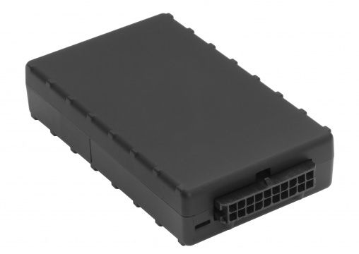

# CalmAmp - LMU-2600

El CalmAmp LMU-2600 es una unidad de seguimiento para flotas de alto rendimiento diseñada para localización automática de vehículos y aplicaciones de gestión de flotas. Integra un posicionamiento GPS sensible, un acelerómetro de 3 ejes para medir la conducta del conductor y los impactos en el vehículo, y un motor de procesamiento a bordo capaz. El dispositivo ofrece opciones flexibles de comunicaciones inalámbricas y antenas para adaptarse a distintos tipos de instalaciones y requerimientos operativos.

Como dispositivo compatible con Plaspy, el LMU-2600 puede enviar datos de ubicación, eventos y alertas a Plaspy para su monitoreo centralizado y generación de informes. Su motor de alertas programable y la capacidad de mantenimiento remoto lo hacen especialmente adecuado para despliegues donde la configuración a distancia, reglas basadas en excepciones y el monitoreo continuo del estado del equipo son críticos para las operaciones de la flota.

## Aspectos destacados

- Seguimiento de ubicación preciso, ideal para visibilidad de la flota y supervisión de rutas
- Acelerómetro de 3 ejes para detectar tendencias en la conducta del conductor y eventos de impacto
- Generador de Eventos Programable (PEG) para reglas de excepción y alertas definidas por el cliente
- Configuración y actualizaciones por aire mediante PULS para gestión remota y menor tiempo de inactividad
- Varias opciones de comunicación inalámbrica que permiten despliegues amplios
- Opciones de antena flexibles para distintos tipos de instalación en vehículos

## Cómo funciona con Plaspy

Al integrarse con Plaspy, el LMU-2600 suministra información de ubicación y eventos que Plaspy utiliza para ofrecer una vista unificada de la actividad de la flota, alertas y reportes históricos. Plaspy procesa los datos del rastreador para apoyar los flujos operativos y ayudar a los equipos a responder a excepciones.

- Visibilidad de la ubicación en tiempo real y reproducción histórica de posiciones en los paneles de Plaspy
- Eventos de conducta del conductor e impactos presentados como alertas para apoyar programas de seguridad y retroalimentación
- Reglas basadas en PEG traducidas a notificaciones y flujos de trabajo de excepciones en Plaspy
- Actualizaciones remotas de estado y configuración coordinadas con Plaspy para supervisión del ciclo de vida del dispositivo
- Informes consolidados que combinan eventos del LMU-2600 con métricas de desempeño de la flota

## Casos de uso típicos

- Seguimiento diario de flotas y visibilidad para despacho en operaciones con vehículos
- Monitoreo de seguridad del conductor y capacitación usando datos del acelerómetro
- Detección de incidentes e impactos para agilizar la respuesta y la investigación
- Informes operativos y análisis para mejorar la eficiencia de rutas y la utilización
- Gestión remota de dispositivos y actualizaciones de reglas en flotas distribuidas

## Por qué elegir este rastreador con Plaspy

El LMU-2600 combina un conjunto robusto de funciones a bordo con capacidad de servicio remoto, lo que lo convierte en una opción práctica para organizaciones que necesitan tanto un seguimiento fiable de vehículos como la posibilidad de ajustar reglas de conducta y alertas con el tiempo. Integrado con Plaspy, los datos del dispositivo forman parte de una visión operativa más amplia que facilita el monitoreo, la generación de informes y la automatización de flujos de trabajo sin intervención manual excesiva.

Para conocer más sobre Plaspy y cómo dispositivos compatibles como el CalmAmp LMU-2600 pueden apoyar sus operaciones de flota visite https://www.plaspy.com. Las especificaciones del producto, la disponibilidad y los detalles del fabricante pueden cambiar con el tiempo, por lo que le solicitamos verificar las especificaciones técnicas y opciones actuales con el fabricante en http://www.calamp.com/ antes de la compra o el despliegue.
