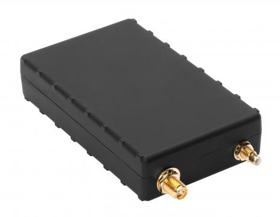

# CalmAmp - LMU-2700

La CalmAmp LMU-2700 es una unidad de seguimiento de flotas de última generación que ofrece tecnología avanzada para satisfacer las demandas de los clientes. Este dispositivo robusto es ideal para aplicaciones AVL y cuenta con comunicación inalámbrica GSM GPRS, CDMA 1xRTT o HSPA, junto con la tecnología GPS más sensible, todo en un paquete asequible.

La LMU-2700 ofrece flexibilidad en su instalación, ya que cuenta con opciones de antena interna o externa de GPS de alta sensibilidad, lo que permite que el dispositivo se monte prácticamente en cualquier lugar de manera fácil y económica. Además, cuenta con una batería de 1000 mAh integrada que permite el seguimiento a corto plazo o en caso de corte de corriente principal.

Una de las características destacadas de la LMU-2700 es su acelerómetro de 3 ejes, que permite medir el comportamiento del conductor, detectar frenadas bruscas, aceleraciones agresivas y los impactos del vehículo. Esto proporciona una mayor seguridad y control en la gestión de flotas.

La LMU-2700 también cuenta con el motor de alertas PEG™ \(Programmable Event Generator\) de CalAmp, que monitorea continuamente las condiciones del vehículo y responde instantáneamente a eventos predefinidos por el cliente. Esto permite personalizar las reglas de excepción y adaptar el dispositivo a las necesidades específicas de cada aplicación.

Además, la LMU-2700 aprovecha el sistema de gestión de dispositivos de CalAmp, PULS™ \(Programming, Updates, and Logistics System\), que permite la configuración y actualización del firmware sobre el aire. Esto facilita la instalación y el mantenimiento del dispositivo, y permite realizar actualizaciones automáticas posteriores a la instalación.

En resumen, la CalmAmp LMU-2700 es una opción confiable y versátil para la gestión de flotas, con características avanzadas como su acelerómetro de 3 ejes y el motor de alertas PEG™. Su flexibilidad en la instalación y su capacidad de actualización sobre el aire la convierten en una solución eficiente y rentable para cualquier aplicación AVL.

