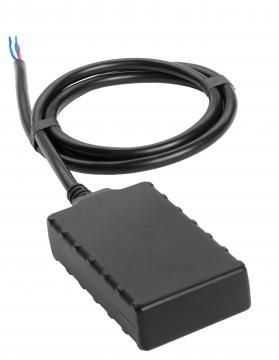

# CalmAmp - LMU-300

El CalmAmp LMU-300 es un rastreador GPS compacto y económico diseñado para una instalación discreta y confiable en vehículos. Está orientado a aplicaciones automotrices comunes como recuperación de vehículos robados, monitoreo para financiamiento vehicular y gestión de flotas de alquiler. El LMU-300 prioriza reportes de ubicación consistentes y un diseño práctico que se adapta a diversos despliegues móviles en vehículos.

Como dispositivo compatible con Plaspy, el LMU-300 puede enviar información de ubicación y estado del vehículo a Plaspy para monitoreo de flotas y supervisión operativa. Su motor de eventos incorporado y sus capacidades de gestión por aire lo convierten en una opción valiosa para organizaciones que requieren alertas programables, mantenimiento centralizado de dispositivos y visibilidad en flotas mixtas gestionadas mediante Plaspy.

## Aspectos destacados

- Factor de forma compacto y discreto, ideal para instalación en vehículos y despliegues de flota
- Diseñado para recuperación de vehículos robados, monitoreo de financiamiento y uso en flotas de alquiler
- El Generador de Eventos Programable PEG permite reglas personalizadas basadas en tiempo, movimiento, ubicación, geocercas e entradas
- Gestión por aire mediante PULS para actualizaciones de configuración, cambios en PEG y actualizaciones de firmware
- Opción rentable que combina funciones avanzadas con fiabilidad en campo
- Diseñado para ofrecer rendimiento GPS consistente en flujos de trabajo de rastreo y recuperación
- Elección práctica para flotas que requieren mantenimiento remoto y monitoreo del estado del dispositivo

## Cómo funciona con Plaspy

El LMU-300 se integra con Plaspy suministrando actualizaciones de ubicación y notificaciones de eventos que Plaspy muestra en paneles, alertas e informes. Plaspy puede aprovechar las reglas programables del dispositivo y las señales de gestión remota para correlacionar el estado del equipo con flujos operativos y métricas de desempeño de la flota.

- Visibilidad de ubicación en tiempo real o periódica para vehículos individuales y flotas completas
- Alertas basadas en eventos en Plaspy según condiciones PEG como movimiento, ubicación o umbrales personalizados
- Monitoreo de geocercas y notificaciones para apoyar estacionamientos seguros y límites de alquiler
- Seguimiento de salud y estado de dispositivos a nivel de flota apoyado por datos de gestión por aire del LMU-300
- Informes y reproducción histórica para análisis de rutas, utilización y revisión de incidentes

## Casos de uso típicos

- Recuperación y rastreo de vehículos robados para respaldar una respuesta rápida
- Monitoreo de vehículos en programas de financiamiento o como garantía de activos cuando se requiere visibilidad de ubicación
- Gestión de flotas de autos de alquiler, incluyendo control de entradas y salidas y cumplimiento de límites geográficos
- Rastreo general de flotas para informes de utilización, verificación de rutas y coordinación de despachos
- Monitoreo remoto del estado del vehículo e indicadores de mantenimiento del ciclo de vida

## Por qué elegir este rastreador con Plaspy

El LMU-300 es una opción práctica para organizaciones que buscan un equilibrio entre costo y flexibilidad. Su motor de eventos programable y sus capacidades de gestión por aire lo hacen adecuado para flotas que requieren alertas personalizadas y configuración centralizada. Al integrarlo con Plaspy, esas capacidades permiten convertir los eventos del dispositivo en alertas e informes accionables sin intervención manual extensiva.

Por ser compacto y pensado para uso vehicular, se adapta a una variedad de aplicaciones automotrices, desde recuperación hasta operaciones de alquiler. Si sus requisitos incluyen configuración remota, monitoreo basado en eventos y visibilidad centralizada de la flota, usar el LMU-300 con Plaspy puede simplificar la supervisión operativa manteniendo los costos previsibles.

Conozca más sobre Plaspy en el sitio principal https://www.plaspy.com. Las especificaciones del producto, la disponibilidad y los detalles del fabricante pueden cambiar con el tiempo, por lo que verifique las especificaciones y la documentación actuales con el fabricante en http://www.calamp.com/
