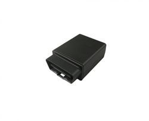

# CalmAmp - LMU-3000

El CalmAmp LMU-3000 es un dispositivo de rastreo vehicular compacto y compatible con OBD II, diseñado para una integración sencilla en vehículos. Combina una carcasa resistente con antenas internas GPS y GSM, soporta conectividad GSM quadband y métodos de transporte de datos habituales, ofreciendo una base confiable para el seguimiento continuo del vehículo y el acceso a diagnóstico cuando se requiere la interfaz OBD II.

Como dispositivo compatible con Plaspy, el LMU-3000 puede entregar la información de ubicación y eventos necesaria para la supervisión de flotas y la gestión operativa dentro de la plataforma Plaspy. Sus opciones configurables de actualización de posición y entradas predeterminadas para encendido y disparadores de eventos lo convierten en una opción práctica para equipos que necesitan visibilidad constante y reportes de eventos configurables a través de Plaspy.

## Características principales

- Diseño compatible con OBD II para vehículos que requieren acceso a la interfaz de diagnóstico
- Conectividad GSM quadband para amplia cobertura celular
- Soporta transmisión de datos por GPRS y UDP para comunicaciones flexibles
- Actualizaciones de posición configurables por tiempo o distancia para equilibrar precisión y uso de datos
- Entradas predeterminadas para encendido y disparadores internos para reportes basados en eventos
- Antenas GPS y GSM internas que simplifican la instalación y reducen hardware externo
- Función de modo de reposo para ahorrar energía cuando el vehículo no está activo

## Cómo funciona con Plaspy

Al integrarse con Plaspy, el LMU-3000 proporciona datos continuos de posición y eventos que Plaspy procesa para visualización, alertas e informes. Plaspy puede utilizar las actualizaciones configurables y los disparadores de eventos del dispositivo para mostrar el estado operativo en paneles y generar notificaciones automáticas para los gestores de flota.

- Rastreo de ubicación mostrado en los mapas de Plaspy con frecuencia de actualización configurable
- Reportes de eventos por encendido y disparadores internos para apoyar cambios de estado y detección de incidentes
- Registro histórico de rutas y actividad para informes y análisis dentro de Plaspy
- Alertas basadas en movimiento, inactividad o condiciones predeterminadas de evento gestionadas por Plaspy
- Visibilidad a nivel de flota para agrupar, filtrar y monitorear vehículos equipados con el LMU-3000

## Casos de uso típicos

- Programas de seguros automotrices que requieren presencia del vehículo y acceso básico a diagnósticos
- Monitoreo del comportamiento del conductor y programas de seguridad de flota utilizando datos OBD II cuando están disponibles
- Operaciones de alquiler de autos y arrendamiento que necesitan comprobaciones de ubicación y estado al regresar
- Recuperación de vehículos y aplicaciones de rastreo para activos robados o extraviados
- Gestión general de flotas comerciales que se benefician de la integración OBD II y disparadores de eventos

## Por qué elegir este rastreador con Plaspy

El LMU-3000 es una opción sensata para organizaciones que necesitan acceso a OBD II combinado con capacidades de rastreo convencionales. Su forma compacta, antenas internas y opciones de reporte configurables facilitan el despliegue en flotas mixtas, a la vez que proporcionan la información que Plaspy requiere para mantener la conciencia situacional y los informes operativos.

Para equipos que priorizan la compatibilidad con diagnósticos del vehículo y una comunicación celular confiable, el LMU-3000 se integra bien con Plaspy para ofrecer una solución equilibrada de rastreo, alertas y análisis históricos. La combinación atiende tanto tareas rutinarias de gestión de flotas como programas automotrices especializados sin añadir complejidad innecesaria.

Para conocer más sobre cómo Plaspy puede trabajar con rastreadores compatibles como el CalmAmp LMU-3000 visite https://www.plaspy.com. Las especificaciones del producto, disponibilidad y detalles del fabricante pueden cambiar con el tiempo, por lo que le recomendamos verificar la información técnica más reciente con el fabricante en http://www.calamp.com/.
