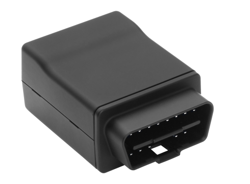

# CalmAmp - LMU-3200

El CalmAmp LMU-3200 es un rastreador GPS compacto pensado para diversas aplicaciones de telemática automotriz. Combina seguimiento de ubicación con acceso a la interfaz de diagnóstico del vehículo (OBD II) e incorpora un acelerómetro de 3 ejes para detectar eventos como frenadas bruscas, curvas pronunciadas y aceleraciones repentinas. Su tamaño reducido y las antenas internas facilitan una instalación discreta y sencilla en despliegues móviles.

Como dispositivo compatible con Plaspy, el LMU-3200 puede enviar la ubicación del vehículo, indicadores de diagnóstico y datos de eventos a los flujos de trabajo de gestión de flotas y activos. Plaspy aprovecha esta información para ofrecer visibilidad en tiempo real, alertas basadas en eventos e informes que ayudan a los equipos a supervisar operaciones y responder eficazmente a excepciones.

## Aspectos destacados

- Factor de forma compacto diseñado para implementaciones telemáticas en vehículos
- Acceso a diagnóstico del vehículo mediante la interfaz OBD II para telemetría más completa
- Acelerómetro de 3 ejes integrado para detectar frenadas duras, curvas y aceleraciones rápidas
- Antenas internas de celular y GPS optimizadas para simplificar la instalación
- Generador de Eventos Programable (PEG) para reglas y alertas personalizadas en el dispositivo
- Servicio y gestión remota a través de CalAmp PULS para configuración y actualizaciones OTA
- Opción práctica para programas de seguros, alquileres y monitoreo del comportamiento del conductor

## Cómo funciona con Plaspy

Cuando se integra con Plaspy, el LMU-3200 suministra a la plataforma datos de ubicación y eventos que pueden usarse para monitoreo de flotas, alertas e informes operativos. Plaspy procesa y visualiza la telemática entrante para que los equipos puedan actuar sobre movimientos y excepciones detectadas en los vehículos.

- Rastreo de ubicación en tiempo real y reproducción histórica de rutas en los paneles de Plaspy
- Gestión de eventos y alertas por comportamientos detectados por el acelerómetro, como frenadas bruscas
- Exposición de indicadores de diagnóstico OBD II en informes y vistas de mantenimiento de Plaspy
- Combinación de reglas PEG en el dispositivo con alertas de Plaspy para reducir ruido y enfocarse en excepciones
- Uso de los informes y análisis de Plaspy para vigilar tendencias de la flota y el desempeño de conductores

## Casos de uso típicos

- Programas de seguros automotrices que requieren datos de ubicación y comportamiento de conducción
- Gestión y entrenamiento de conductores para mejorar seguridad y rendimiento
- Flotas de alquiler y movilidad compartida que necesitan instalación rápida y telemetría confiable
- Operaciones de flota que buscan información de diagnóstico para planear el mantenimiento
- Servicios basados en uso y programas telemáticos que requieren alertas basadas en eventos

## Por qué elegir este rastreador con Plaspy

El LMU-3200 es una opción práctica para organizaciones que implementan telemática vehicular donde se valoran el hardware compacto, la lógica de eventos en el dispositivo y el acceso a diagnósticos del vehículo. Su motor de alertas programable y capacidades de gestión OTA simplifican la afinación del monitoreo sin intervenciones físicas frecuentes, mientras que el acelerómetro y los datos OBD II añaden contexto a la información de ubicación que Plaspy puede presentar en paneles y reportes.

Elegir el LMU-3200 para usar con Plaspy puede facilitar los despliegues de flota que necesitan un equilibrio entre acceso a diagnóstico vehicular, detección de eventos e instalación sencilla. Plaspy complementa al dispositivo convirtiendo su telemetría en visibilidad accionable, alertas y análisis para apoyar las operaciones diarias de la flota.

Learn more about Plaspy on the main website https://www.plaspy.com. Product specifications, availability, and manufacturer details can change over time, so please verify current specifications and support information on the official CalmAmp site http://www.calamp.com/.
