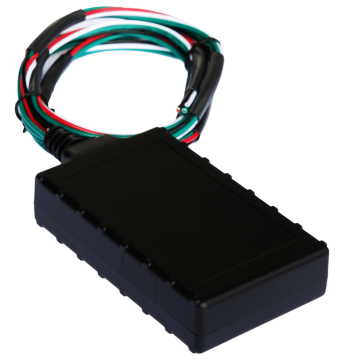

# CalmAmp - LMU-400

El CalmAmp LMU-400 es un dispositivo de rastreo vehicular compacto y rentable, diseñado para automóviles. Combina un rendimiento GPS sólido con un factor de forma reducido y una batería interna de respaldo para ofrecer localización confiable y funcionamiento continuo durante interrupciones de energía. El LMU-400 admite reglas de evento configurables e incluye características como detección de movimiento opcional, un zumbador integrado y un relé de corte de arranque para cubrir diversas necesidades de seguimiento automotriz.

Como dispositivo compatible con Plaspy, el LMU-400 se puede integrar en los flujos de monitoreo y rastreo de Plaspy para ofrecer visibilidad en tiempo real y supervisión operativa. Sus capacidades de gestión remota y el soporte para configuración por aire lo convierten en una opción práctica para flotas y proveedores de servicio que requieren administrar y actualizar equipos sin acceso físico constante.

## Características principales

- Factor de forma compacto, apto para instalaciones flexibles en vehículos de 12 o 24 voltios
- Batería interna de respaldo de 200 mAh para mantener la operación ante cortes de energía
- Rendimiento GPS robusto con antenas internas integradas para una instalación simplificada
- Acelerómetro de 3 ejes opcional para detección de movimiento y actividad
- Zumbador incorporado y relé de corte de arranque para mayor control y opciones de recuperación
- Motor de eventos PEG a bordo para reglas de alerta programables y monitoreo por excepciones
- Soporte para programación remota y gestión de firmware vía CalAmp PULS

## Cómo funciona con Plaspy

Al conectarse a Plaspy, el LMU-400 entrega información de ubicación y estado que la plataforma utiliza para mostrar mapas en vivo, rutas históricas y alertas basadas en eventos. Plaspy puede ingerir la telemetría del dispositivo y aplicar reglas a nivel de plataforma, reportes y paneles de control para que los operadores monitoreen la salud y el comportamiento de los vehículos de una flota. Las funciones de configuración remota y el motor de eventos programable del LMU-400 complementan a Plaspy al reducir la necesidad de visitas físicas al dispositivo y permitir ajustes consistentes en toda la flota.

- Visibilidad centralizada de ubicaciones en los paneles y vistas de mapa de Plaspy
- Rastreo en tiempo real e histórico para apoyar análisis de rutas y revisiones de incidentes
- Alertas basadas en eventos en Plaspy según movimiento, geocercas o entradas del dispositivo
- Informes de estado y salud de la flota basados en reportes y monitoreo remoto del dispositivo
- Gestión simplificada del equipo mediante configuración y actualizaciones por aire
- Integración con los reportes de Plaspy para respaldar cumplimiento y KPIs operativos

## Casos de uso típicos

- Recuperación de vehículos robados y flujos de trabajo de localización y recuperación
- Monitoreo de financiación vehicular y colaterales que requieren visibilidad continua
- Flotas de alquiler de autos que necesitan rastreo confiable y gestión de dispositivos sencilla
- Operaciones de flota que requieren dispositivos compactos con capacidad de actualización remota
- Despliegues de seguimiento automotriz diversificados con necesidades de alerta personalizadas

## Por qué elegir este rastreador con Plaspy

El LMU-400 es una opción práctica para organizaciones que usan Plaspy y requieren un rastreador pequeño y con funciones avanzadas y gestión remota. Su batería de respaldo interna y modos de bajo consumo ayudan a mantener los reportes durante cortes de energía, mientras que el motor de eventos PEG permite reglas en el dispositivo que reducen transmisiones innecesarias y respaldan flujos de trabajo basados en excepciones. La detección de movimiento opcional y las funciones de control integradas lo hacen adaptable a escenarios de recuperación y control operativo.

Combinar el LMU-400 con Plaspy proporciona a los operadores una solución conjunta para visibilidad, alertas y mantenimiento continuo de dispositivos sin intervenciones frecuentes en sitio. Si usted requiere hardware compacto, reglas programables y capacidad de actualización remota, este modelo es un candidato adecuado para evaluar e integrar con Plaspy.

Conozca más sobre Plaspy en el sitio principal https://www.plaspy.com. Las especificaciones y la disponibilidad del producto pueden cambiar con el tiempo, por lo que le recomendamos verificar los detalles actuales en el sitio del fabricante http://www.calamp.com/ antes de tomar decisiones de adquisición o despliegue.
