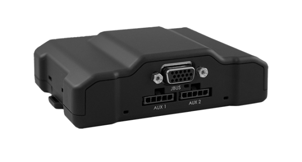

# CalmAmp - LMU-4200

El CalmAmp LMU-4200 es un rastreador GPS de primer nivel diseñado para la gestión empresarial de flotas y activos. Integra múltiples opciones de conectividad inalámbrica y un conjunto de interfaces vehiculares que ofrecen una base flexible y ampliable para el seguimiento, la supervisión y la detección de eventos. El modelo incorpora capacidades integradas como un acelerómetro de 3 ejes para detectar eventos bruscos, una interfaz opcional con la ECU para datos del motor y un sistema de entradas y salidas adaptable para ampliar accesorios.

Como dispositivo compatible con Plaspy, el LMU-4200 se integra en el entorno de gestión de flotas de Plaspy para proporcionar visibilidad de ubicación, alertas basadas en eventos e información de estado del dispositivo al equipo de operaciones. Su motor de eventos programable y las funciones de gestión remota por aire lo hacen ideal para flujos de trabajo empresariales donde la configuración a distancia, las reglas de excepción y la facilidad de mantenimiento son críticas.

## Puntos destacados

- Conectividad multimodal para comunicaciones confiables en distintos entornos
- E/S ampliable y soporte de accesorios para integraciones vehiculares personalizadas
- Acelerómetro de 3 ejes integrado para monitorear eventos de conducción como frenadas bruscas e impactos
- Interfaz opcional con la ECU para exponer información de rendimiento y estado del vehículo
- Motor de alertas programable a bordo para definir reglas basadas en excepciones
- Gestión remota por aire para simplificar actualizaciones de configuración y mantenimiento

## Cómo funciona con Plaspy

Al trabajar con Plaspy, el LMU-4200 forma parte de una plataforma unificada de monitoreo de flotas que centraliza ubicación, eventos y estado de los dispositivos. Plaspy puede mostrar datos posicionales y transformar los eventos a bordo en alertas y reportes accionables para los equipos operativos.

- Consolide las actualizaciones de ubicación y estado de las unidades LMU-4200 en los paneles de Plaspy
- Mapée y notifique eventos basados en el acelerómetro para ayudar a supervisar el comportamiento del conductor y la seguridad
- Utilice salidas de eventos programables para generar alertas personalizadas dentro de Plaspy ante excepciones
- Aproveche las capacidades de gestión remota por aire para coordinar configuraciones y actualizaciones junto con el inventario de dispositivos en Plaspy
- Incluya señales derivadas de la ECU y entradas de accesorios en los reportes de Plaspy para obtener información operativa

## Casos de uso típicos

- Flotas empresariales que requieren conectividad flexible y gestión remota
- Monitoreo de seguridad y comportamiento del conductor mediante detección de eventos con acelerómetro
- Rastreo de activos donde se necesitan accesorios ampliables para instalaciones personalizadas
- Diagnóstico remoto y monitoreo de condiciones cuando hay datos disponibles desde la ECU o accesorios
- Operaciones que demandan alertas programables y manejo de excepciones basado en reglas

## Por qué elegir este rastreador con Plaspy

El LMU-4200 es una opción atractiva para organizaciones que necesitan un rastreador configurable y de grado empresarial que pueda escalar con su despliegue. Su combinación de opciones de conectividad, posibilidad de expansión y lógica de eventos a bordo complementa las capacidades de monitoreo, alerta y reporte de Plaspy, ofreciendo visibilidad operativa sin necesidad de desarrollos personalizados extensos.

Dado que el LMU-4200 admite eventos programables y gestión remota de dispositivos, puede reducir el esfuerzo de servicio en campo y permitir que los equipos que usan Plaspy alineen el comportamiento del rastreador con las reglas del negocio. El uso específico de las funciones dependerá de la configuración de cada despliegue y de los accesorios seleccionados.

Para conocer más sobre cómo Plaspy puede trabajar con dispositivos CalmAmp, visite https://www.plaspy.com. Las especificaciones del producto y la disponibilidad pueden cambiar con el tiempo, por lo que le recomendamos verificar los detalles técnicos actuales y las opciones de accesorios en el sitio oficial del fabricante http://www.calamp.com/ antes de tomar decisiones de despliegue.
