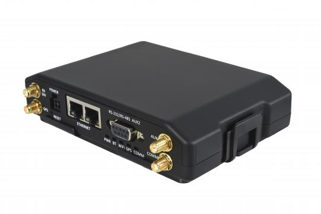

# CalmAmp - LMU-5530

El CalmAmp LMU-5530 es un rastreador GPS versátil y de alta velocidad diseñado para aplicaciones de banda ancha fijas y móviles. Combina seguimiento de ubicación con una plataforma adaptable que admite enrutamiento de banda ancha, funciones de gateway celular y un entorno operativo basado en Linux. El equipo incluye un motor de eventos programable integrado y una amplia variedad de interfaces para integrar hardware periférico y fuentes de datos.

Como dispositivo compatible con Plaspy, el LMU-5530 puede enviar información de ubicación y eventos a Plaspy para ofrecer visibilidad de la flota y supervisión operativa. Sus capacidades de alertas programables y la gestión por aire lo convierten en una opción práctica para clientes que desean un rastreador flexible que pueda ser monitoreado y administrado junto con otros dispositivos desde la plataforma Plaspy.

## Características principales

- Diseñado para uso en banda ancha de alta velocidad con capacidad de enrutamiento y funciones de gateway celular
- Generador de eventos programable para reglas y alertas definidas por el cliente
- Plataforma basada en Linux que soporta aplicaciones y scripts personalizados
- Múltiples interfaces físicas para integrar periféricos y sensores externos
- Gestión y mantenimiento por aire mediante herramientas del proveedor para actualizaciones remotas
- Pensado para despliegues mixtos fijos y móviles de banda ancha con posibilidad de expansión

## Cómo funciona con Plaspy

El LMU-5530 puede integrarse con Plaspy para centralizar la ubicación del dispositivo, su estado y la información de eventos en una vista única de gestión de flota. Plaspy ingiere los datos compatibles del dispositivo y los mapea a flujos comunes de monitoreo, alertas e informes, de modo que su equipo pueda gestionar las operaciones desde una sola plataforma.

- Centralice datos de ubicación y movimiento en Plaspy para visibilidad en tiempo real de la flota
- Publique las alertas y reglas de eventos generadas por el dispositivo en los canales de notificación de Plaspy
- Use los informes de Plaspy para analizar tendencias históricas de ubicación y eventos de las unidades LMU-5530
- Supervise indicadores de salud del dispositivo y estado operativo desde los paneles de Plaspy
- Correlacione eventos del LMU-5530 con la actividad de vehículos o activos para apoyar decisiones operativas

## Casos de uso típicos

- Seguimiento de flotas donde se requiere conectividad de banda ancha y funciones de gateway
- Monitoreo remoto de activos fijos que necesitan notificaciones de eventos programables
- Integraciones con terminales de datos móviles y periféricos para soluciones avanzadas en el vehículo
- Despliegues que se benefician de actualizaciones por aire y mantenimiento centralizado de dispositivos
- Instalaciones que requieren lógica personalizable para reglas y alertas basadas en excepciones

## Por qué elegir este rastreador con Plaspy

El LMU-5530 es una buena opción para organizaciones que necesitan un rastreador flexible con capacidad de banda ancha y lógica de eventos programable. Su plataforma Linux y su amplio conjunto de interfaces lo hacen apropiado para entornos donde las integraciones personalizadas y las aplicaciones en el dispositivo son importantes. En combinación con Plaspy, el equipo puede contribuir a una vista consolidada de activos, alertas más eficientes e informes operativos para flotas mixtas.

Dado que las ofertas de productos e integraciones de plataforma evolucionan, los equipos que evalúen el LMU-5530 para Plaspy deben considerar sus necesidades específicas de integración y administración, y validar las funciones frente a las capacidades actuales de Plaspy. Para obtener más información sobre cómo Plaspy puede trabajar con rastreadores compatibles visite https://www.plaspy.com. Las especificaciones del producto, la disponibilidad y la información del fabricante pueden cambiar con el tiempo, por lo que es recomendable verificar la información técnica actual en el sitio del fabricante http://www.calamp.com/.
