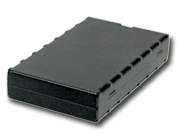

# CalmAmp - LMU-600

El CalmAmp LMU-600 es un dispositivo de rastreo vehicular económico y con amplias funciones, pensado para uso automotriz. Diseñado con un formato compacto y un desempeño GPS confiable, la serie LMU-600 cubre escenarios habituales como telemática para seguros, recuperación de vehículos robados, monitoreo de financiamiento y control de flotas de alquiler. Incluye batería interna de respaldo e entradas/salidas para funciones como bloqueo de arranque y botón de pánico, además de antenas internas celular y GPS para simplificar la instalación.

Como dispositivo compatible con Plaspy, el LMU-600 puede enviar posiciones y eventos a Plaspy para proporcionar visibilidad centralizada y control de la flota. Su motor de alertas integrado y el soporte para configuración por aire lo convierten en una opción práctica para despliegues donde la gestión continua de dispositivos, alertas por excepciones y actualizaciones automatizadas son importantes para las operaciones administradas en Plaspy.

## Características principales

- Equipo de rastreo vehicular económico y con todas las funciones necesarias para flotas a gran escala
- Tamaño compacto con sólido rendimiento GPS para reportes de ubicación confiables
- Batería interna de respaldo para mantener el rastreo básico cuando se corta la alimentación externa
- Entradas y salidas para control de accesorios y señalización de eventos como pánico y bloqueo de arranque
- Antenas internas celular y GPS para una instalación más sencilla y menos componentes externos
- Motor de alertas programable a bordo para monitoreo basado en eventos personalizados
- Soporte para configuración y actualizaciones por aire que facilitan el mantenimiento del equipo

## Cómo funciona con Plaspy

El LMU-600 puede aportar a Plaspy actualizaciones regulares de ubicación y eventos del dispositivo para que los gestores de flota puedan supervisar el estado y el historial de los vehículos en un solo lugar. Plaspy procesa los mensajes del dispositivo y los integra con las funcionalidades de la plataforma para uso operativo.

- Visualización en tiempo real e histórica dentro de Plaspy para revisión de rutas y seguimiento de activos
- Alertas de eventos y excepciones enviadas a Plaspy para notificaciones por geocerca, exceso de velocidad o activaciones por entradas
- Monitoreo de eventos de E/S como pulsaciones del botón de pánico o estado de accesorios externos, convertidos en alertas de la plataforma
- Informes agregados y análisis de la actividad vehicular para apoyar la toma de decisiones operativas
- Uso de reglas de alerta a nivel de dispositivo para reducir el ruido y mostrar solo las excepciones relevantes a los usuarios de Plaspy

## Casos de uso típicos

- Telemática para seguros automotrices y monitoreo por uso
- Recuperación de vehículos robados mediante reporte de ubicación persistente
- Seguimiento de vehículos por financiamiento y flujos de trabajo de recuperación
- Monitoreo de flotas de autos de alquiler y gestión de devoluciones
- Operaciones generales de flota para vehículos ligeros y pesados donde se prefieren instalaciones compactas

## Por qué elegir este rastreador con Plaspy

El LMU-600 es una opción práctica para organizaciones que buscan equilibrar control de costos con funciones telemáticas esenciales. Su diseño compacto, antenas internas y capacidad de generar alertas programables lo hacen adecuado para flotas mixtas donde la instalación sencilla y la gestión flexible de eventos son importantes. En conjunto con Plaspy, el LMU-600 aporta datos de ubicación confiables y alertas accionables hacia un flujo de trabajo centralizado de gestión de flotas.

Plaspy ofrece la capa de plataforma para visualizar los datos del dispositivo, configurar alertas y generar informes operativos, mientras que el LMU-600 proporciona la telemetría en vehículo y la generación de eventos. Juntos ofrecen una solución que soporta la gestión continua de dispositivos y el monitoreo por excepciones sin añadir complejidad innecesaria.

Aprenda más sobre Plaspy en el sitio principal https://www.plaspy.com. Las especificaciones del producto, la disponibilidad y los datos del fabricante pueden cambiar con el tiempo, por lo que le recomendamos verificar las especificaciones y capacidades actuales en la web del fabricante http://www.calamp.com/.
