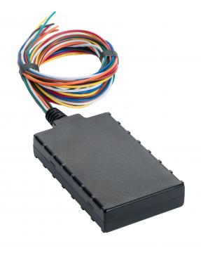

# CalmAmp - LMU-700

El CalmAmp LMU-700 es una unidad de rastreo vehicular compacta y versátil, diseñada para aplicaciones automotrices como recuperación de vehículos robados, monitoreo de financiamiento vehicular y gestión de flotas de alquiler. Está pensada para una instalación sencilla en vehículos de 12 o 24 voltios y ofrece un desempeño GPS de alta sensibilidad junto con antenas integradas y múltiples opciones de entradas y salidas para monitoreo y control básicos externos.

Como dispositivo compatible con Plaspy, el LMU-700 puede enviar ubicación, estado y mensajes de eventos a la plataforma Plaspy, de modo que las flotas y los operadores puedan supervisar los vehículos en tiempo real. Su motor de eventos programable a bordo y el soporte para mensajería celular permiten patrones de reporte flexibles que Plaspy puede visualizar, alertar y consolidar en informes operativos.

## Características principales

- Factor de forma compacto, adecuado para una instalación discreta en diversos tipos de vehículos
- Diseñado para sistemas de 12 V y 24 V, soportando casos de uso automotriz comunes
- Alta sensibilidad GPS para obtener posiciones fiables en entornos complicados
- Antenas internas de celular y GPS para instalación sin cableado externo
- Mensajería mejorada a través de enlaces celulares usando SMS o transporte tipo UDP
- Tres entradas y tres salidas para monitoreo y control sencillos de condiciones del vehículo
- Generador de eventos programable para detección de eventos en el dispositivo y soporte PULS para mantenimiento remoto

## Cómo funciona con Plaspy

Cuando lo empareje con Plaspy, el LMU-700 transmite datos de ubicación y eventos que Plaspy procesa para ofrecer visibilidad, alertas e informes históricos. Plaspy muestra la información del dispositivo en paneles y reportes, permitiendo a los administradores de flota reaccionar ante los eventos y actualizaciones de posición que genera el LMU-700.

- Visualización en tiempo real de la ubicación del vehículo y seguimiento en el mapa dentro de la plataforma Plaspy
- Gestión de eventos y alertas basada en los reportes del dispositivo y la configuración de reglas en Plaspy
- Reproducción histórica e informes de viajes, paradas y análisis operativos
- Paneles de monitoreo de flota que muestran el estado de las unidades y las comunicaciones recientes
- Monitoreo de geocercas y zonas vinculado a los mensajes de ubicación y eventos reportados
- Informes y vistas de datos exportables para equipos operativos y financieros

## Casos de uso típicos

- Recuperación de vehículos robados y monitoreo de seguridad vehicular
- Monitoreo de financiamiento vehicular y apoyo a procesos de recuperación
- Rastreo de flotas de alquiler y supervisión de la utilización
- Operaciones generales de flota para empresas pequeñas y medianas
- Monitoreo de activos donde se requiere un rastreo compacto en vehículo

## Por qué elegir este rastreador con Plaspy

El LMU-700 combina un tamaño físico reducido con un motor de eventos flexible y antenas integradas, lo que lo hace una opción práctica para organizaciones que necesitan reportes de ubicación confiables sin instalaciones complejas. Sus opciones de entradas y salidas y sus alertas programables lo adaptan a varios flujos de trabajo de flota, mientras que Plaspy proporciona la interfaz operativa para visualizar ubicaciones, gestionar alertas y generar informes.

Debido a que el LMU-700 puede enviar mensajes enriquecidos y eventos desde el mismo dispositivo, puede reducir el ruido y centrar las alertas de Plaspy en las condiciones que más importan a su operación. Si necesita un rastreador compacto y comprobado que se integre con una plataforma de flota moderna, el LMU-700 es un candidato sensato para evaluar junto con Plaspy.

Para más detalles sobre cómo este rastreador puede integrarse en su flujo de trabajo de flota, conozca Plaspy en el sitio principal https://www.plaspy.com. Las especificaciones del producto y los servicios del fabricante pueden cambiar con el tiempo, por lo que verifique la información actual del LMU-700 y la documentación oficial en el sitio de CalmAmp http://www.calamp.com/.
