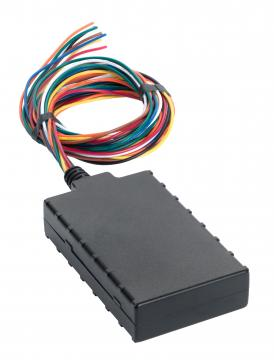

# CalmAmp - LMU-800

El CalmAmp LMU-800 es un dispositivo de rastreo vehicular compacto y económico, pensado para una instalación sencilla en automóviles. Diseñado para sistemas eléctricos móviles de 12 y 24 voltios, está orientado a aplicaciones como recuperación de vehículos robados, financiamiento vehicular y flotas de renta, donde la localización confiable y una fuente de energía de respaldo son fundamentales. El LMU-800 combina un tamaño reducido con buen desempeño GPS y funciones que buscan mantener la continuidad del rastreo incluso cuando se interrumpe la energía del vehículo.

Como modelo compatible con Plaspy, el LMU-800 puede enviar actualizaciones de ubicación e información de eventos a Plaspy para la supervisión de flotas y la gestión operativa. Su batería interna de respaldo, la capacidad de detección de movimiento y el generador de eventos programable lo convierten en una opción práctica para organizaciones que requieren visibilidad persistente y alertas basadas en reglas. Integrar el LMU-800 con Plaspy permite a los equipos aprovechar los eventos del dispositivo y los datos de posición en paneles, alertas y flujos de trabajo de informes.

## Aspectos clave

- Factor de forma compacto, ideal para instalación discreta y despliegues con espacio limitado
- Batería de respaldo interna de 200 mAh para mantener el reporte de ubicación durante cortes de energía del vehículo
- Compatible con sistemas eléctricos automotrices de 12 V y 24 V
- Acelerómetro de 3 ejes para detección de movimiento y activación de seguimiento por evento
- PEG generador de eventos programable para alertas y excepciones según condiciones configurables
- Capacidades PULS para gestión remota, incluida la configuración y actualización de firmware por aire
- Opción rentable dirigida a casos de uso en flotas y seguimiento de activos

## Cómo funciona con Plaspy

Al integrarse con Plaspy, el LMU-800 aporta datos de posición y eventos que Plaspy puede mostrar, analizar y utilizar en sus flujos operativos. Plaspy puede incorporar los eventos generados por el dispositivo y el historial de ubicaciones para mejorar la visibilidad de la flota y la toma de decisiones operativas.

- Visibilidad en tiempo real y historial de ubicaciones en mapas y vistas de línea de tiempo de Plaspy
- Alertas basadas en eventos en Plaspy activadas por condiciones del dispositivo como movimiento o pérdida de energía
- Informes consolidados y datos exportables para análisis de rendimiento y actividad de la flota
- Uso de reglas de excepción generadas por el dispositivo para reducir falsos positivos y focalizar la atención
- Menor carga de mantenimiento cuando la configuración remota y las actualizaciones de firmware están disponibles junto con la monitorización de la flota

## Casos de uso típicos

- Recuperación de vehículos robados donde el seguimiento de respaldo durante la pérdida de energía es crítico
- Monitoreo para financiamiento y recuperación de vehículos para mantener visibilidad continua de la ubicación
- Flotas de renta que requieren rastreadores compactos con reportes basados en movimiento
- Supervisión de vehículos de empresa para seguimiento operativo y reportes de utilización
- Cualquier programa de flotas o activos móviles que se beneficie de alertas programables y gestión remota de dispositivos

## Por qué elegir este rastreador con Plaspy

El LMU-800 combina un diseño de hardware práctico con funciones que responden a preocupaciones comunes de las flotas: batería de respaldo para continuidad, detección de movimiento para identificar actividad y un motor de alertas programable para reglas a medida. Estas capacidades se alinean bien con los flujos de trabajo de Plaspy, que priorizan alertas oportunas, precisión en la ubicación y supervisión eficiente de la flota.

Optar por el LMU-800 junto con Plaspy puede ayudar a reducir el mantenimiento en sitio gracias a las opciones de gestión remota y permitir una supervisión más precisa y basada en eventos para escenarios de recuperación, renta y financiamiento. Dado que las características del producto y la disponibilidad pueden cambiar, verifique las especificaciones y la compatibilidad más recientes en la documentación del fabricante antes de la compra. Para obtener más información sobre Plaspy y cómo puede funcionar con rastreadores compatibles como el LMU-800 visite https://www.plaspy.com y confirme los detalles técnicos actuales en el sitio del fabricante http://www.calamp.com/.
