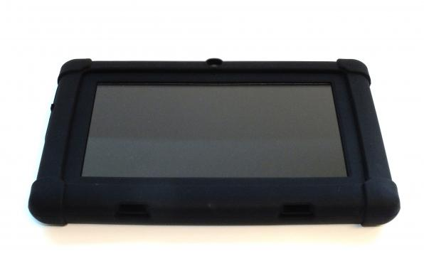

# CalmAmp - MDT-7

El CalmAmp MDT-7 es un terminal GPS versátil basado en un entorno Android abierto. Combina un formato compacto y resistente con una pantalla táctil de 7 pulgadas, cámaras frontal y trasera, memoria interna y soporte para micro SD. Con opciones de conectividad cableada e inalámbrica y un enfoque en la centralización de flujos de trabajo, el MDT-7 está pensado para transporte de larga distancia, flotas locales, entrega de activos y gestión de personal móvil.

Como dispositivo compatible con Plaspy, el MDT-7 puede transmitir ubicación, mensajería de conductores y datos capturados a la plataforma para visibilidad operativa e informes. Los mensajes y la información recogida se transportan a través de un dispositivo CalAmp LMU conectado, lo que permite que Plaspy muestre los flujos de trabajo del conductor, la asignación de envíos y los eventos junto con el rastreo del vehículo para una supervisión unificada de la flota.

## Aspectos más destacados

- Entorno Android abierto que admite aplicaciones personalizadas y licencias para necesidades específicas del mercado
- Diseño robusto y compacto apto para instalaciones en vehículos y despliegues móviles
- Gran pantalla táctil de 7 pulgadas para la interacción del conductor y acceso a flujos de trabajo
- Cámaras frontal y trasera, más memoria interna y soporte para micro SD para captura y almacenamiento de datos
- Funciones de centralización de procesos para reducir papeleo y optimizar la gestión de despachos y mensajería
- Opción de integrar navegación Magellan para guía de rutas y asistencia operativa

## Cómo funciona con Plaspy

El MDT-7 transmite mensajes operativos y datos capturados a través de un CalAmp LMU conectado, lo que permite a Plaspy ingerir y mostrar las salidas del dispositivo junto con los datos de ubicación de la flota. Plaspy puede utilizar esos insumos para mejorar la visibilidad, gestionar flujos de trabajo y generar informes operativos para los responsables de la flota.

- Visibilidad y mapeo en tiempo real de la ubicación de vehículos y activos dentro de la plataforma Plaspy
- Mensajería consolidada para conductores y flujos de despacho accesibles por los equipos de operaciones
- Captura y asociación de imágenes o datos de eventos desde el MDT-7 con viajes, paradas o incidentes
- Alertas e informes derivados de eventos del dispositivo y del estado de los flujos de trabajo para supervisión operativa
- Historial de actividad y datos almacenados disponibles en Plaspy para auditorías y análisis de rendimiento

## Casos de uso típicos

- Operaciones de transporte de larga distancia que requieren flujos de trabajo para conductores y guía de rutas en un terminal resistente
- Flotas locales de reparto que necesitan captura de comprobantes de entrega y una interacción sencilla para el conductor
- Despliegues de personal móvil donde la centralización del despacho y la mensajería reduce el papeleo
- Entrega y seguimiento de activos donde las cámaras a bordo y el almacenamiento respaldan las necesidades de documentación
- Flotas que buscan una plataforma ampliable para aplicaciones móviles específicas del negocio

## Por qué elegir este rastreador con Plaspy

El MDT-7 es una opción práctica para organizaciones que desean un terminal a bordo flexible con una pantalla amplia y la capacidad de ejecutar aplicaciones a medida. Su diseño enfatiza la centralización de flujos de trabajo y la captura de datos, lo que coincide con los objetivos de Plaspy de mejorar la visibilidad de la flota, reducir la carga administrativa y consolidar la información operativa.

Al estar basado en un entorno Android abierto y ser compatible con Plaspy, el MDT-7 permite combinar aplicaciones personalizadas o de terceros con la monitorización e informes de Plaspy para crear una solución operativa coherente. Esa combinación puede reducir el costo total de propiedad y permitir una expansión gradual de capacidades conforme evolucionen las necesidades del negocio.

Aprenda más sobre Plaspy y cómo dispositivos compatibles como el CalmAmp MDT-7 pueden utilizarse en operaciones de flota en https://www.plaspy.com. Las especificaciones del producto, la disponibilidad y los detalles del fabricante pueden cambiar con el tiempo, por lo que por favor verifique la información técnica y de soporte actual en el sitio del fabricante http://www.calamp.com/.
