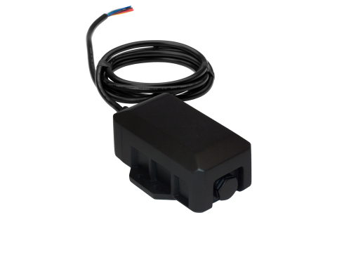

# CalmAmp - TTU-2840 XTREME

El CalmAmp TTU-2840 XTREME es una unidad de localización compacta y de alta relación costo-beneficio, pensada para activos que normalmente funcionan con sistemas de 12 o 24 V pero que pueden permanecer desconectados por periodos prolongados. Incorpora un paquete de baterías recargables internas y una batería interna de 5.3 Ah que garantizan comunicación y posicionamiento cuando no hay alimentación externa. El equipo ofrece desempeño GPS de alta sensibilidad y soporte para redes celulares modernas, además de un formato reducido y tres entradas y tres salidas configurables para integrarse de forma flexible a los flujos de trabajo del activo.

Como dispositivo compatible con Plaspy, el TTU-2840 XTREME es una opción adecuada para organizaciones que requieren visibilidad continua de activos dispersos o intermitentemente alimentados. Su motor de eventos programable y la posibilidad de mantenimiento remoto por aire facilitan la gestión desde plataformas de seguimiento y administración de flotas como Plaspy, permitiendo combinar inteligencia a nivel de dispositivo con alertas, reportes y control centralizado.

## Aspectos clave

- Paquete de baterías internas recargables con 5.3 Ah para seguimiento cuando la alimentación externa está desconectada
- Factor de forma compacto que se adapta a múltiples aplicaciones en vehículos y activos
- Alto rendimiento GPS pensado para reportes de localización confiables
- Tres entradas y tres salidas para integración flexible con señales y controles del activo
- Motor de eventos programable (PEG) incorporado para reglas y alertas personalizadas
- Capacidad de servicio remoto por aire mediante PULS para configuración y actualizaciones
- Soporte para conectividad celular contemporánea que ofrece amplia cobertura

## Cómo funciona con Plaspy

Cuando se integra con Plaspy, el TTU-2840 XTREME entrega datos de ubicación y eventos que Plaspy puede mostrar, notificar e incluir en reportes operativos. Usted puede aprovechar el motor local de reglas del equipo y su manejabilidad remota para reducir visitas de mantenimiento y alinear el comportamiento del dispositivo con sus procesos de negocio.

- Centralice la visibilidad en tiempo real e histórica de los activos vigilados por el TTU-2840 XTREME
- Publique eventos generados por PEG en Plaspy para que su equipo reciba alertas basadas en condiciones personalizadas
- Use los estados de entradas y salidas reportados por el dispositivo para disparar flujos operativos y notificaciones
- Incluya la telemetría del dispositivo en reportes de Plaspy para analizar utilización, patrones de movimiento y excepciones
- Aproveche las capacidades OTA del equipo para simplificar el mantenimiento en campo junto con la gestión de dispositivos desde Plaspy

## Casos típicos de uso

- Seguimiento de remolques, equipos y otros activos que se desconectan con frecuencia de la alimentación del vehículo
- Monitoreo de flotas de alquiler donde los activos pueden ser devueltos o permanecer inactivos por períodos
- Supervisión remota de activos en construcción, agricultura o maquinaria estacional
- Alertas por geocerca y por movimiento para protección de activos y control operativo
- Inventario y conciliación de ubicación de activos a largo plazo para operaciones logísticas

## Por qué elegir este rastreador con Plaspy

El TTU-2840 XTREME es una elección práctica para organizaciones que usan Plaspy cuando buscan un equilibrio entre hardware compacto, desempeño GPS confiable y autonomía frente a la falta de alimentación continua. Su batería recargable y el motor de eventos PEG permiten que los dispositivos sigan entregando telemetría significativa y alertas aun cuando los activos estén temporalmente fuera de línea, y la capacidad de servicio por PULS contribuye a mantener las unidades desplegadas actualizadas sin visitas frecuentes al sitio.

Combinado con Plaspy, este rastreador facilita la monitorización y el reporte centralizados y a la vez permite personalización a nivel de dispositivo. Si usted necesita visibilidad remota de activos con la posibilidad de definir lógica de eventos personalizada y minimizar el mantenimiento en campo, el TTU-2840 XTREME es una opción a considerar dentro de una solución gestionada por Plaspy.

Para obtener más información sobre Plaspy y cómo puede administrar dispositivos como el CalmAmp TTU-2840 XTREME visite https://www.plaspy.com. Product specifications and availability can change over time, so please verify current technical details and firmware options on the manufacturer site http://www.calamp.com/.
