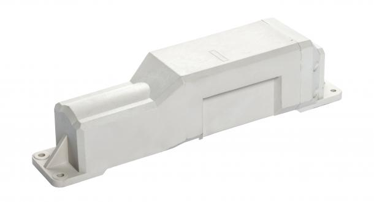

# CalmAmp - TTU-700

El CalmAmp TTU-700 es un rastreador de remolques alimentado por batería no recargable, diseñado para despliegues prolongados donde la baja necesidad de mantenimiento y la larga duración son prioritarias. Combina un formato compacto con una batería interna de 57 Ah y antenas integradas de celular y GPS, lo que permite montajes flexibles en remolques y otros activos sin requerir antenas cableadas adicionales.

Como dispositivo compatible con Plaspy, el TTU-700 puede enviar información de ubicación y eventos a Plaspy para proporcionar visibilidad a nivel de flota y supervisión operativa. Su soporte para mensajería celular estándar y reglas de eventos a bordo, junto con la gestión por aire de CalmAmp, lo convierten en una opción práctica cuando necesita seguimiento persistente de activos desplegados por periodos prolongados.

## Aspectos destacados

- Diseño alimentado por batería y no recargable pensado para despliegues prolongados con menor necesidad de mantenimiento.
- Batería interna de 57 Ah y tamaño compacto para montajes discretos y mayor vida útil en campo.
- Antenas integradas de celular y GPS que eliminan la necesidad de antenas externas cableadas y simplifican la instalación.
- Soporta múltiples familias de redes celulares y utiliza SMS o mensajería UDP para comunicaciones confiables.
- Motor de eventos programable a bordo PEG para generar alertas configurables basadas en tiempo, movimiento, ubicación y entradas.
- Gestión por aire con PULS para actualizaciones remotas de configuración, supervisión y mantenimiento de firmware.
- Diseñado para reducir el costo total de propiedad mejorando la fiabilidad en campo y la eficiencia energética.

## Cómo funciona con Plaspy

Al integrarse con Plaspy, el TTU-700 entrega datos de ubicación y eventos a la plataforma, donde pueden mostrarse, analizarse y accionarse dentro de los flujos de trabajo de gestión de flotas o activos. Plaspy ingiere los mensajes del dispositivo y expone el estado y los eventos para supervisión e informes.

- Visibilidad de ubicación en tiempo real y periódica en los paneles de Plaspy para remolques y activos de larga duración.
- Monitoreo de flota y alertas operativas basadas en reglas PEG, presentadas en Plaspy para manejo de excepciones.
- Notificaciones por geocerca y movimiento para detectar cambios de ubicación o desplazamientos no autorizados.
- Indicadores remotos del estado y salud del dispositivo en Plaspy para apoyar la planificación de mantenimiento.
- Uso de PULS para actualizaciones por aire y cambios de parámetros coordinados con los listados y reportes de Plaspy.

## Casos de uso típicos

- Rastreo a largo plazo de remolques para flotas que dejan activos estacionados o almacenados por largos periodos.
- Monitoreo de contenedores y equipos estáticos que requieren comprobaciones de ubicación ocasionales sin servicio frecuente.
- Activos en alquiler o leasing donde el bajo mantenimiento y el rastreo confiable aumentan la visibilidad operativa.
- Gestión de inventario en patios y depósitos donde los dispositivos montados de forma discreta reducen manipulaciones y cableado.
- Activos estacionales o intermitentes que necesitan mucha autonomía de batería entre intervenciones de servicio.

## Por qué elegir este rastreador con Plaspy

El TTU-700 es ideal para organizaciones que buscan una solución de rastreo de bajo mantenimiento para remolques y otros activos que permanecerán desplegados por largos periodos. Su batería interna y antenas integradas permiten opciones de instalación flexibles, mientras que PEG y PULS aportan la inteligencia a bordo y las capacidades de gestión remota que complementan naturalmente a una plataforma de flota como Plaspy.

Elegir el TTU-700 con Plaspy proporciona a los equipos operativos una combinación confiable de hardware de larga vida y una plataforma capaz de consolidar ubicaciones, alertas y estado de dispositivos en flujos de trabajo a nivel de flota. Para usuarios que priorizan un bajo costo de propiedad y despliegues sencillos en campo, este rastreador ofrece un equilibrio entre durabilidad y gestionabilidad remota.

Para obtener más información sobre Plaspy visite https://www.plaspy.com. Las especificaciones del producto, la disponibilidad y los detalles del fabricante pueden cambiar con el tiempo, por lo que verifique la información actual en el sitio oficial de CalmAmp http://www.calamp.com/.
