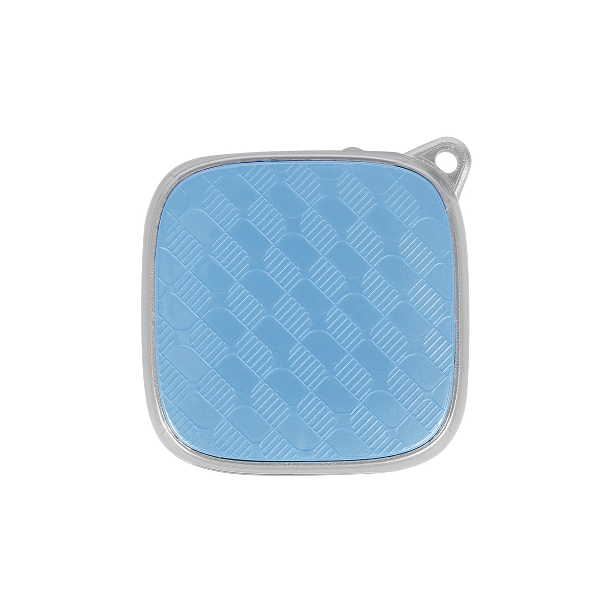

# CanTrack - G01

El G01 es un rastreador GPS compacto de Shenzhen CanTrack diseñado para la seguridad personal y la monitorización discreta de activos. Combina la localización por GPS con reporting por GSM para ofrecer actualizaciones de posición en tiempo real a servidores, además de respuestas rápidas por SMS con enlaces a Google Maps. Su formato reducido, batería de respaldo integrada y flujo de reporte sencillo lo hacen adecuado para rastrear objetos pequeños, bicicletas o personas cuando la prioridad es la simplicidad y la fiabilidad de la ubicación.

Como dispositivo compatible con Plaspy, el G01 se integra en los flujos de trabajo de Plaspy para proporcionar ubicación, velocidad y alertas de eventos sin una sobrecarga de configuración. Plaspy puede aprovechar el reporte GPRS del dispositivo para monitoreo en vivo e historial, mientras que las respuestas por SMS funcionan como un respaldo simple para la visualización inmediata de la posición. Para organizaciones que necesitan un rastreador sin complicaciones que alimente una plataforma de flotas o seguridad, el G01 es una opción práctica para evaluar junto con Plaspy.

## Puntos clave

- Diseño compacto y ligero, apropiado para colocación discreta y uso personal
- Seguimiento en tiempo real vía GPRS con respaldo por SMS para visualizaciones rápidas
- Versiones GSM cuatribanda para amplia cobertura geográfica y despliegue flexible
- Batería de respaldo incorporada para mantener reportes cuando se pierde la alimentación externa
- Posicionamiento híbrido GPS más LBS para mejorar la disponibilidad en zonas con señal débil
- Alertas de eventos, incluyendo alarma por exceso de velocidad y monitoreo de voz remoto para mayor conocimiento situacional

## Cómo funciona con Plaspy

La integración con Plaspy es sencilla: el G01 puede enviar ubicación y datos de eventos a los servidores de Plaspy mediante conexiones de datos o proporcionar respuestas por SMS con enlaces para acceso inmediato. Plaspy procesa los mensajes del dispositivo para mostrar la posición en vivo, almacenar historial y activar reglas y alertas según las señales de evento del rastreador. Esto permite a los operadores combinar la telemetría básica del G01 con las capacidades de mapeo, reportes y notificaciones de Plaspy.

- Actualizaciones de ubicación en vivo e informes periódicos de posición enviados a Plaspy para mapeo y monitoreo
- Respuestas de ubicación por SMS con enlaces a Google Maps para comprobaciones manuales rápidas cuando no hay datos
- Alertas basadas en eventos, como notificaciones por exceso de velocidad, integradas en las reglas y notificaciones de Plaspy
- Reproducción de rutas e historial almacenado en Plaspy para revisión y generación de reportes posteriores a un evento
- Soporte para monitoreo de voz remoto como parte de los flujos de trabajo de seguridad en Plaspy

## Casos de uso típicos

- Monitoreo de ubicación de niños y personas mayores y comprobaciones básicas de seguridad con capacidad de escucha remota
- Rastreo antirrobo para motocicletas, scooters y bicicletas con colocación discreta y apoyo en recuperación
- Monitoreo de flotas ligeras o activos en alquiler donde el historial de posición y las alertas sencillas son suficientes
- Seguimiento de trabajadores solitarios o personal en campo para comprobaciones básicas de bienestar y escucha en emergencias
- Rastrear equipos pequeños y activos portátiles durante transporte o almacenamiento para mayor visibilidad

## Por qué elegir este rastreador con Plaspy

El G01 es una buena alternativa cuando necesita un rastreo fiable y sin complicaciones que se integre con una plataforma moderna de monitoreo como Plaspy. Su combinación de reporte por GPRS y respaldo por SMS ofrece flexibilidad operativa: telemetría continua para supervisión en vivo y enlaces SMS simples para verificaciones inmediatas. La batería de respaldo incorporada y el posicionamiento híbrido lo hacen práctico para aplicaciones donde la discreción y la disponibilidad son más importantes que la telemetría avanzada.

Para equipos y operadores pequeños que desean un dispositivo compacto que se conecte a Plaspy para mapeo, alertas e historial, el G01 brinda las capacidades básicas que requieren la mayoría de los proyectos sin añadir complejidad. Si necesita funciones adicionales o personalizaciones a gran escala, revise las opciones de hardware o despliegue disponibles y discútalas con su equipo de implementación.

Para saber más sobre Plaspy y cómo puede usarse el G01 en sus flujos de trabajo de seguimiento visite https://www.plaspy.com. Las especificaciones y la disponibilidad de producto pueden cambiar con el tiempo, por lo que le recomendamos verificar los detalles actuales en el sitio del fabricante https://www.cantrackgps.com/ antes de tomar decisiones finales de compra.
