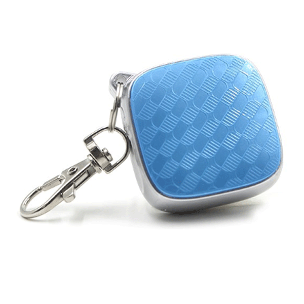

# CanTrack - G01 / G02

El CanTrack G01 / G02 es un rastreador GPS compacto diseñado para ofrecer monitoreo de ubicación confiable de vehículos y otros activos móviles. Integra módulos GPS y GSM para captar datos de posición y transmitirlos a través de la red celular. El dispositivo admite rastreo en tiempo real, reproducción de rutas históricas, alertas por geocerca, notificaciones SOS y avisos de batería baja; además cuenta con una batería recargable pequeña que facilita su instalación y colocación.

Como dispositivo compatible con Plaspy, el G01 / G02 puede enviar datos de ubicación y alarmas a Plaspy para su monitoreo centralizado y supervisión de flotas. Su capacidad para reportar actualizaciones de posición y generar alertas lo hace idóneo para integrarse con los paneles y herramientas de reporte de Plaspy, permitiendo a los operadores mantener visibilidad, revisar recorridos pasados y recibir notificaciones de eventos del rastreador junto con otros dispositivos.

## Características principales

- Seguimiento en tiempo real para visibilidad de ubicación actualizada
- Reproducción del historial de rutas para revisar desplazamientos pasados
- Alarma de geocerca que notifica cuando un objetivo sale de un área definida
- Alerta SOS para notificaciones de emergencia inmediatas
- Avisos de batería baja para mantener el seguimiento continuo
- Compatibilidad con Android, iOS y PC para mayor flexibilidad de monitoreo

## Cómo funciona con Plaspy

Cuando usted conecta el G01 / G02 a Plaspy, el dispositivo envía información de posición y alarmas que Plaspy muestra y almacena para uso operativo y generación de informes. Plaspy centraliza los datos del dispositivo para que gerentes de flota y administradores puedan vigilar el estado y responder a eventos desde una única plataforma.

- Visualización en el mapa de la ubicación en tiempo real dentro de los paneles de Plaspy
- Reproducción de historial y rutas usando los datos de posición registrados
- Eventos de geocerca reenviados como alertas dentro de Plaspy para la respuesta operativa
- Notificaciones SOS y de batería baja dirigidas a los canales de alerta de Plaspy
- Monitoreo y agrupamiento a nivel de flota para supervisión operativa y despacho
- Actualizaciones periódicas de posición disponibles para informes y auditoría en Plaspy

## Casos de uso típicos

- Seguimiento de flotas de vehículos para operaciones pequeñas y medianas
- Monitoreo de vehículos de alquiler y revisión del historial de ubicaciones
- Rastreo de activos portátiles y remolques
- Monitoreo remoto de personal o bienes de alto valor
- Verificación de rutas y auditoría de movimientos en logística

## Por qué elegir este rastreador con Plaspy

El CanTrack G01 / G02 es una opción práctica cuando usted necesita un rastreador de pequeño tamaño que cubra lo esencial en monitoreo de ubicación y notificación de eventos. Su conjunto de funciones coincide con los requisitos comunes de seguimiento de flotas y activos, y al integrarlo con Plaspy aporta visibilidad en tiempo real, alertas de eventos y datos históricos de movimiento a un entorno de gestión centralizado.

Debido a que el dispositivo reporta ubicaciones y alarmas que Plaspy puede procesar, las organizaciones que buscan capacidades de seguimiento y notificación sencillas pueden encontrar en el G01 / G02 un componente útil para su conjunto de herramientas de monitoreo. Tenga en cuenta que la descripción pública disponible se centra en las funciones básicas de rastreo y alerta, por lo que es recomendable revisar sus necesidades operativas y confirmar los detalles de compatibilidad durante la planificación.

Para obtener más información sobre Plaspy y cómo funciona con rastreadores compatibles visite https://www.plaspy.com. Las especificaciones del producto, la disponibilidad y los datos del fabricante pueden cambiar con el tiempo, por lo que le recomendamos verificar la información técnica vigente en el sitio oficial de CanTrack https://www.cantrackgps.com/ antes de comprar.
