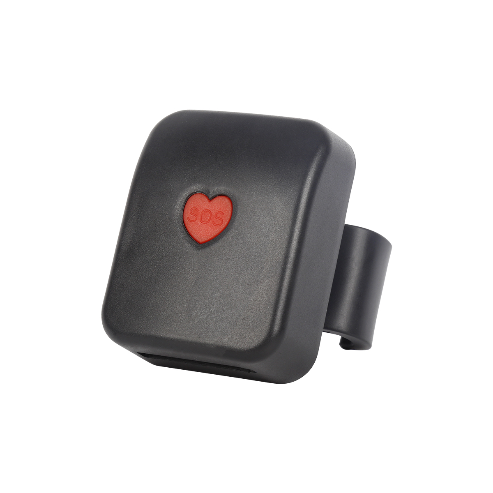

# CanTrack - G03

El CanTrack G03 es un rastreador GPS especializado diseñado específicamente para usuarios de sillas de ruedas. Con este dispositivo, los usuarios pueden monitorear fácilmente la ubicación y el historial de su silla de ruedas en cualquier momento. En caso de situaciones peligrosas, el G03 permite activar la alarma de SOS, notificando de inmediato a los números de teléfono preestablecidos para solicitar asistencia.

Una de las características destacadas del G03 es su capacidad de triple posicionamiento, que combina las tecnologías GPS, LBS y AGPS para proporcionar un seguimiento preciso y confiable de la ubicación. Esto garantiza que los usuarios siempre puedan tener un conocimiento preciso de la ubicación de la silla de ruedas.

El G03 también ofrece seguimiento en tiempo real a través de una plataforma o aplicación móvil, lo que permite a los usuarios monitorear la ubicación de la silla de ruedas en tiempo real. Además, el dispositivo admite la geovallado, lo que permite a los usuarios establecer límites virtuales y recibir alertas cada vez que la silla de ruedas ingrese o salga de estas áreas predefinidas.

Para garantizar un funcionamiento continuo, el G03 cuenta con una alarma de batería baja, que alerta a los usuarios cuando la batería del dispositivo está baja y necesita ser recargada. En caso de emergencias, se puede activar la alarma de SOS, notificando de inmediato a los contactos designados para solicitar asistencia inmediata.

El G03 también incluye un modo de suspensión inteligente, que ayuda a conservar la vida útil de la batería cuando el dispositivo no está en uso. Esta función es particularmente útil para los usuarios de sillas de ruedas que pueden no necesitar un seguimiento constante, pero aún desean tener la tranquilidad de saber que el dispositivo está listo para ser activado cuando sea necesario.

Además, el G03 permite a los usuarios acceder a la reproducción del historial de rastreo, proporcionando un registro detallado de los movimientos de la silla de ruedas durante un período de tiempo específico. Esta función puede ser útil para analizar patrones, identificar posibles problemas o simplemente realizar un seguimiento de las rutas pasadas.

En general, el CanTrack G03 es un rastreador GPS confiable y fácil de usar diseñado específicamente para usuarios de sillas de ruedas. Con sus características avanzadas y capacidades de posicionamiento precisas, brinda tranquilidad y seguridad mejorada para los usuarios de sillas de ruedas y sus seres queridos.

