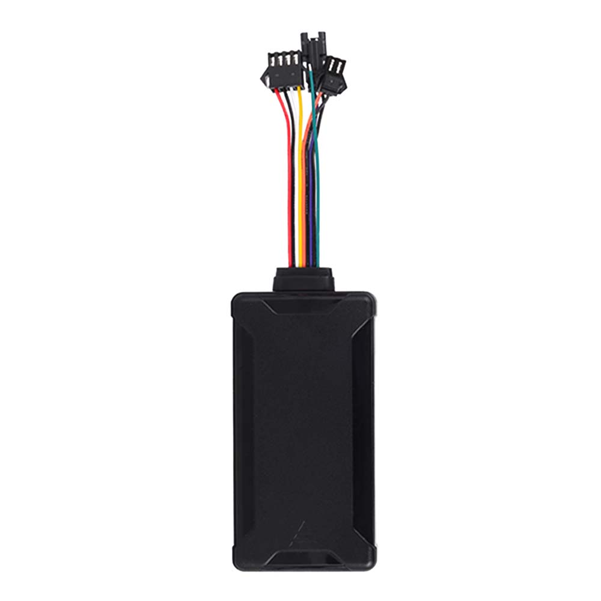

# CanTrack - G06L-4G

# G06L 4G LTE Vehicle GPS Tracker

El G06L es un rastreador GPS con cableado profesional de 4G LTE, diseñado para un seguimiento en tiempo real fiable y gestión de flotas compatible con Plaspy. Pensado para automóviles, camiones y vehículos comerciales, el G06L combina conectividad SIMCom LTE Cat 1 con respaldo GSM, un receptor GNSS de alta sensibilidad y un factor de forma compacto listo para vehículos, para ofrecer ubicación precisa, alertas oportunas y telemetría continua a plataformas y apps móviles habilitadas para Plaspy.

Ya sea que necesite protección antirrobo, información sobre el comportamiento del conductor o telemática escalable para una flota mixta, el G06L ofrece funciones prácticas —detección de ACC/encendido, alarmas de movimiento y SOS, respaldo ante corte de energía y almacenamiento local de datos— para que los usuarios de Plaspy obtengan informes de posición confiables y notificaciones basadas en eventos, incluso cuando las redes sean intermitentes.

## Aspectos destacados

- Rastreador 4G LTE compatible con Plaspy con respaldo GSM para seguimiento en tiempo real y gestión de flotas más resiliente.
- GNSS de alta sensibilidad \(66 canales, −165 dBm\) que ofrece una precisión de ubicación mejor que 5 m CEP para telemetría precisa.
- Vasta suite de alarmas: movimiento, encendido/apagado \(ACC\), SOS, exceso de velocidad, corte de energía y cambio de ángulo para protección antirrobo.
- Almacenamiento local de 2000 puntos que bloquea los datos de ubicación cuando se pierde la red; modos de sueño configurables y modo GPRS reducido para ahorrar energía y costos de datos.
- Batería de respaldo interna de 200 mAh Li‑Polymer garantiza informes de eventos durante la pérdida de energía y soporta informes de emergencia.
- Actualizaciones de firmware OTA y configuración mediante USB simplifican la gestión remota y la integración en los flujos de trabajo de Plaspy.
- Diseño compacto de grado vehicular \(aprox. 85 × 45 × 17 mm\) con rango amplio de tensión de entrada \(9–36 V DC\) para automóviles, camiones y vehículos comerciales.

## Cómo funciona con Plaspy

Al instalarse en un vehículo, el G06L reporta la posición GNSS y telemetría a través de su conexión LTE Cat 1 \(con respaldo GSM\) a servidores compatibles con Plaspy. Plaspy recibe actualizaciones de ubicación, eventos de alarma y telemetría básica, de modo que los gestores de flota y los operadores pueden ver mapas en vivo, recibir notificaciones push o por SMS y profundizar en las rutas históricas. El almacenamiento local del dispositivo, los intervalos de informe configurables y los modos de energía aseguran operación continua y un uso de datos eficiente para despliegues de flotas a largo plazo.

- Actualizaciones de ubicación y telemetría en tiempo real, entregadas por LTE/GPRS a los paneles de Plaspy y a las apps móviles.
- Detección de encendido/ACC y alarmas de movimiento para seguimiento basado en eventos y telemetría del comportamiento del conductor.
- Alarma de corte de energía respaldada por la batería interna; el dispositivo almacena hasta 2000 registros durante periodos sin conexión para su posterior carga.
- Inmovilizador remoto opcional \(desactivación remota de combustible y electricidad\) y soporte para controlador remoto para respuesta antirrobo.
- Actualizaciones de firmware OTA y configuración USB simplifican el mantenimiento y aseguran la compatibilidad con las actualizaciones de la plataforma Plaspy.

## Resumen técnico

| Conectividad | SIMCom LTE Cat 1 \(A7670 series\) with GSM fallback \(GPRS, TCP/IP\) |
| --- | --- |
| Bandas | LTE-FDD: B1/B2/B3/B4/B5/B7/B8/B28/B66; GSM: 850/900/1800/1900 MHz |
| Alimentación y batería | Tensión de entrada 9–36 VDC; batería de respaldo interna 200 mAh / 3.7 V Li‑Polymer; corriente en espera/funcionamiento 5–50 mA |
| Interfaces | Versiones de interfaz de alimentación de 8 pines \(o, opcional, 4 pines\); micro USB para flasheo de firmware y configuración; detección ACC/encendido y E/S digital configurable |
| GNSS | Receptor de alta sensibilidad de 66 canales, sensibilidad de seguimiento −165 dBm, precisión de posición \< 5 m CEP; TTFF \< 35 s \(frío\), \< 1 s \(caliente\) |
| Bluetooth | No especificado en la configuración estándar |
| Gestión remota | Actualizaciones de firmware OTA, configuración USB/GPRS/SMS y verificación remota del saldo de la SIM |
| Memoria y almacenamiento | Almacenamiento a bordo para hasta 2000 registros de ubicación cuando está offline |
| Dimensiones y entorno | Aprox. 85 × 45 × 17 mm; temperatura de operación −20°C a +70°C; formato para vehículos y activos |
| Módulo / chipset | SIMCom LTE Cat 1 \(A7670 series\) + AT6558R; GPRS Class 12 |

## Casos de uso

- Antirrobo y recuperación de vehículos: recibe alertas SOS y de corte de energía, desactiva de forma remota el suministro de energía del vehículo mediante la función de inmovilizador opcional, y rastrea la recuperación en los mapas de Plaspy.
- Seguimiento de flotas comerciales y telemática: ubicación continua, alertas de encendido y de velocidad ayudan a optimizar rutas, reducir tiempo de inactividad y mejorar la eficiencia de despacho.
- Monitoreo del comportamiento del conductor y cumplimiento: eventos ACC/encendido, alertas de movimiento y de cambio de ángulo alimentan la puntuación del conductor y las herramientas de investigación de incidentes.
- Operación con redes intermitentes: almacena hasta 2000 puntos cuando está offline y los sube cuando la conectividad se restablece, manteniendo el historial de rutas y eventos para facturación o cumplimiento.
- Instalaciones OEM/ODM: carcasa y opciones funcionales personalizables para cumplir requisitos específicos de instalación o montaje en la flota.

## Por qué elegir este rastreador con Plaspy

El G06L ofrece un equilibrio pragmático entre conectividad, precisión e entradas centradas en el vehículo, lo que lo convierte en una opción práctica para implementaciones compatibles con Plaspy. Su módem LTE Cat 1 con respaldo GSM garantiza un seguimiento y telemetría en tiempo real consistentes en áreas de cobertura mixtas, mientras que el receptor GNSS de alta sensibilidad proporciona una ubicación con precisión inferior a 5 m para una reconstrucción de rutas fiable. Salvaguardas integradas—alertas de corte de energía respaldadas por batería, almacenamiento local y modos de bajo consumo configurables—reducen la pérdida de datos y el tiempo de inactividad, y las actualizaciones OTA más la configuración USB simplifican despliegues a gran escala y el mantenimiento.

Para gestores de flota e integradores que usan Plaspy, el G06L admite las necesidades centrales de telemática: datos de rastreador GPS en tiempo real, eventos de encendido/ACC, gestión de alarmas y control opcional de inmovilizador, al tiempo que ofrece la extensibilidad necesaria para flujos de trabajo de monitorización de combustible o sensores Bluetooth mediante gateways e integraciones compatibles. Esa combinación de conectividad estable, interfaces prácticas para vehículos y gestión remota convierte al G06L en un componente fiable dentro de un ecosistema telemático habilitado por Plaspy.

