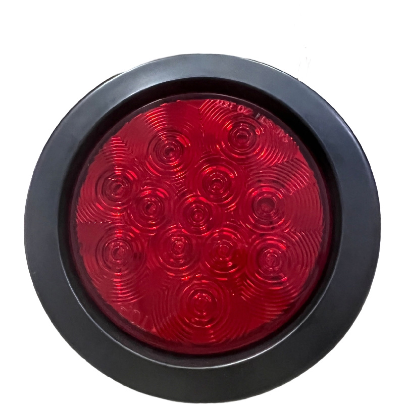

# CanTrack - G08L

El G08L es un rastreador GPS inteligente en una luz trasera de 4-inch, compatible con Plaspy, diseñado para reemplazar una luz trasera existente del vehículo preservando la funcionalidad de iluminación. Construido alrededor de un módulo LTE 4G Quectel BG95 \(Cat M1 / Cat NB2\) y múltiples bandas LTE-FDD, el G08L ofrece monitoreo encubierto en tiempo real y telemetría de flota de forma continua sin alterar la apariencia exterior del vehículo — una opción ideal para gestores de flotas, operadores de alquiler y proveedores logísticos que necesitan monitorización de ubicación duradera y discreta que se integra con Plaspy para paneles en vivo, alertas e informes.

El G08L combina posicionamiento GPS+BeiDou \(precisión típica por debajo de 5 m\), un sensor G integrado para comportamiento de conducción y detección de accidentes, una batería interna recargable y una resistencia al agua IP67 en un compacto formato de luz trasera. Su instalación de reemplazo facilita el despliegue y reduce el riesgo de manipulación. Con geocercas configurables, detección de conducción brusca, alarma de choque, modos de energía inteligentes y actualizaciones de firmware OTA, el G08L proporciona telemetría confiable y datos de ubicación en tiempo real que Plaspy puede procesar para respaldar la gestión de flotas, monitorización anti-robo y análisis operativos.

## Aspectos clave

- Diseño discreto de luz trasera: reemplaza la luz trasera original para un rastreo GPS discreto y monitorización continua.
- Compatible con Plaspy para seguimiento en tiempo real y gestión de flotas a través de LTE Cat M1 / Cat NB2 con múltiples bandas LTE-FDD.
- GNSS de alta precisión: posicionamiento GPS L1 + BeiDou con precisión típica &lt;5 m y precisión de velocidad &lt;0.1 m/s.
- Gestión de comportamiento de conducción y seguridad: sensor G integrado que soporta detección de aceleración y desaceleración bruscas y alarmas de choque.
- Opciones de alimentación de larga duración: batería interna recargable de 3.7 V / 5000 mAh con modos de energía inteligentes; compatible con banco de energía externo opcional de 16000 mAh.
- Construcción duradera y resistente a la intemperie: resistencia al agua IP67 y rango operativo adecuado para instalaciones en vehículos.
- Mantenimiento remoto: actualizaciones de firmware OTA y modos de funcionamiento/espera de bajo consumo para despliegues a largo plazo.

## Cómo funciona con Plaspy

El G08L envía telemetría GNSS, de movimiento y de estado a través de su conexión LTE Cat M1 / NB2 a servicios de backend. Cuando se integra con Plaspy, el dispositivo entrega actualizaciones de ubicación continuas, alarmas basadas en eventos y telemetría para que puedas monitorizar rutas, detectar incidentes y automatizar alertas. Plaspy procesa los datos en mapas en tiempo real, notificaciones de geocerca, informes de comportamiento del conductor y paneles de control a nivel de flota para la toma de decisiones operativas.

- Actualizaciones de ubicación y telemetría en tiempo real \(posición GNSS, velocidad, marca temporal\).
- Informes de eventos de conducción: detección de aceleración y desaceleración bruscas y eventos de alarma de choque derivados del G-sensor.
- Estado de la batería y energía: nivel de batería interna y estado de energía del dispositivo para monitorización remota y planificación de mantenimiento.
- Eventos de geocerca y conformidad de rutas configurables en Plaspy para alertas y generación de informes.
- Soporte de actualizaciones de firmware OTA para coordinar el mantenimiento remoto del dispositivo a través de Plaspy o herramientas del proveedor.
- Las interfaces de encendido/inmovilizador, monitoreo de combustible o sensores Bluetooth no se especifican en el resumen del producto; verifique las necesidades de integración específicas del vehículo con el proveedor cuando sea necesario.

## Resumen técnico

| Conectividad | Módulo Quectel BG95 — LTE Cat M1 / Cat NB2 junto con conectividad LTE-FDD |
| --- | --- |
| Bandas | B1/B2/B3/B4/B5/B8/B12/B13/B14/B18/B19/B20/B25/B26/B27/B28/B66/B71/B85 \(múltiples bandas LTE-FDD\) |
| Alimentación y Batería | Entrada DC 9–36 V \(1 A\). Corriente de funcionamiento típica ~120 mA; en espera ~0.5 mA. Batería interna recargable 3.7 V / 5000 mAh. Banco de energía externo opcional de 16000 mAh compatible. |
| Interfaces | Sensor G incorporado para detección de movimiento y golpes. El formato de luz trasera reemplaza al conjunto original. Interfaces I/O externas \(entrada de encendido, inmovilizador, entradas analógicas de combustible o puertos de sensores Bluetooth\) no especificadas en los datos proporcionados — consulte al proveedor para interfaces específicas del vehículo. |
| GNSS | Subsistema GNSS de Quectel que soporta GPS L1 \(1575.42 MHz\) y BeiDou \(1561.098 MHz\); sensibilidad ~ -162 dBm; precisión &lt;5 m; precisión de velocidad &lt;0.1 m/s. Arranque en frío ≤32 s, arranque en caliente ≤3 s. |
| Bluetooth | No especificado en la descripción del producto. |
| Gestión remota | Actualizaciones de firmware OTA compatibles; monitorización remota vía uplink de datos a plataformas en la nube como Plaspy. |
| Forma física y entorno | Tamaño 109.5 × 61.3 mm; conjunto de luz trasera de 4-inch; resistencia al agua IP67. Rango de temperatura de funcionamiento -10 °C a 65 °C; almacenamiento -25 °C a 80 °C. |
| Certificaciones | Certificado por la FCC. |

## Casos de uso

- Seguimiento de flotas comerciales: rastreador GPS discreto e integrado para furgonetas de reparto, camiones de caja y flotas de servicios, para mejorar la visibilidad de rutas y la asignación de tareas.
- Protección de alquiler y activos: instalación encubierta reduce la manipulación y facilita la recuperación rápida y monitorización anti-robo mediante alertas de Plaspy.
- Seguridad del conductor y gestión de incidentes: detección de conducción brusca basada en el sensor G y alarmas de choque alimentan los flujos de incidentes de Plaspy para una respuesta y análisis más rápidos.
- Despliegues a largo plazo: modos de energía inteligentes, batería interna recargable y actualizaciones OTA reducen el mantenimiento in situ para activos de flota estacionales o de larga duración.
- Logística y cumplimiento: seguimiento en tiempo real y geocercas ayudan a asegurar el cumplimiento de rutas, el respeto a horarios y la generación de pruebas de presencia.

## Por qué elegir este rastreador con Plaspy

El G08L combina el rastreo en tiempo real compatible con Plaspy y telemetría de flota con un diseño práctico de luz trasera a prueba de manipulación. Su combinación de conectividad celular LTE Cat M1/NB2 con Quectel BG95, GNSS de doble constelación, eventos robustos del sensor G y durabilidad IP67 ofrece datos de ubicación y comportamiento fiables que Plaspy convierte en insights accionables para la gestión de flotas, monitorización anti-robo y programas de seguridad. El soporte de firmware OTA y la gestión inteligente de energía reducen la carga operativa para despliegues a gran escala. Si necesita integraciones específicas del vehículo, como detección de encendido, control de inmovilizador, monitoreo de combustible o soporte para sensores Bluetooth, confirme la disponibilidad de interfaces con su proveedor para que Plaspy y el G08L se combinen para entregar la telemetría y el control exactos que su flota necesita.

