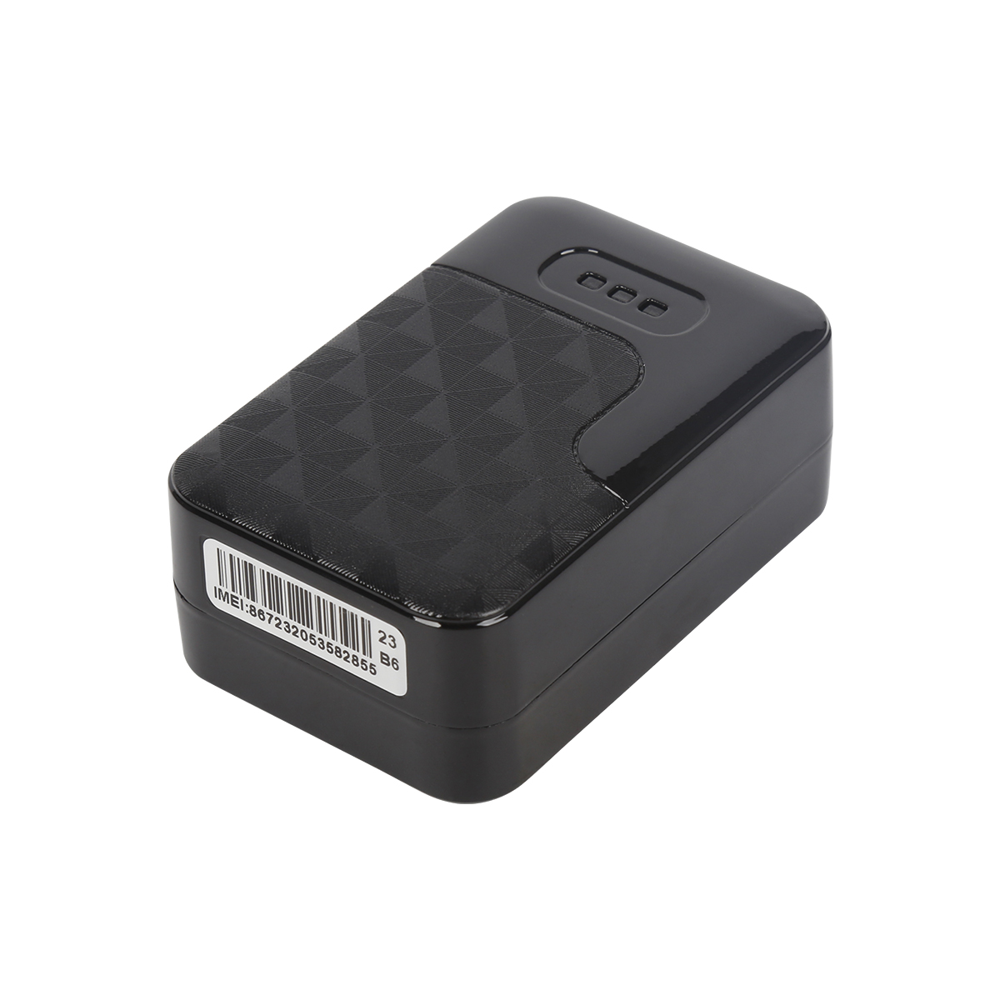

# CanTrack - G200

El CanTrack G200 (L) Magnet GPS Tracker es un dispositivo compacto con imán diseñado para la gestión del rastreo de vehículos y activos. Emplea satélites GPS y conectividad GSM GPRS junto con antenas integradas para ofrecer informes de ubicación, seguimiento en tiempo real, múltiples opciones de posicionamiento como LBS y memoria interna para almacenar datos en zonas con señal limitada. El equipo incluye modos de ahorro de energía, alertas anti-manipulación, notificaciones por exceso de velocidad y geocercas, lo que lo hace adecuado para el monitoreo discreto de vehículos y bienes de valor.

Como dispositivo compatible con Plaspy, el G200 se integra naturalmente con las funciones centrales de visibilidad de flota y monitoreo de activos. Su amplia autonomía en espera y los modos de seguimiento seleccionables permiten a los usuarios de Plaspy equilibrar la frecuencia de reporte y la duración de la batería en despliegues a largo plazo, mientras que las alertas del dispositivo y la memoria ayudan a mantener completos los registros de seguimiento. Plaspy puede presentar ubicación, alertas y datos históricos del G200 junto con otros dispositivos para ofrecer una supervisión operativa unificada.

## Aspectos destacados

- Montaje magnético para colocación discreta y fácil reubicación
- Seguimiento en tiempo real más modo de ahorro de energía para operación prolongada
- Autonomía en espera ultralarga de hasta 45 días con una sola carga para uso a largo plazo
- Múltiples opciones de posicionamiento, incluyendo GPS y LBS, para mejor cobertura
- Alarma anti-manipulación y alertas por exceso de velocidad para apoyar la seguridad y el control operativo
- Memoria interna para preservar el historial de ubicaciones cuando la señal se interrumpe

## Cómo funciona con Plaspy

Al integrarse con Plaspy, el CanTrack G200 proporciona datos de ubicación y eventos que Plaspy muestra mediante mapas, alertas e informes para apoyar la gestión de flotas y activos. Los usuarios de Plaspy pueden usar los datos del equipo para monitorear movimientos, recibir notificaciones y revisar rutas históricas en una sola plataforma.

- Mostrar la ubicación en tiempo real del G200 en los mapas de Plaspy para visibilidad de la flota
- Configurar zonas de geocerca en Plaspy y recibir alertas de entrada y salida desde el dispositivo
- Visualizar alertas por exceso de velocidad y anti-manipulación en Plaspy para respuesta operativa y de seguridad
- Acceder a recorridos históricos y a los datos almacenados del G200 en Plaspy para revisión de rutas y generación de informes
- Aprovechar las características de ahorro de energía y la autonomía en espera para ajustar el comportamiento de reporte en activos de largo plazo

## Casos de uso típicos

- Monitoreo a largo plazo de vehículos o remolques donde la autonomía extendida es crucial
- Rastreo discreto de activos valiosos que requieren montaje magnético y ocultamiento
- Despliegues remotos de activos que, por señal intermitente, necesitan almacenamiento de datos a bordo
- Operaciones de flota que requieren geocercas y control de exceso de velocidad para gestión operativa
- Flujos de trabajo de seguridad que dependen de alertas anti-manipulación y notificaciones de eventos

## Por qué elegir este rastreador con Plaspy

El CanTrack G200 es una opción práctica para organizaciones que necesitan un rastreador pequeño y magnetizado con modos de seguimiento flexibles y larga autonomía en espera. Su combinación de reportes en tiempo real, opciones de ahorro de energía, alertas anti-manipulación y memoria interna se alinea bien con las capacidades de Plaspy para monitoreo, alertas e informes históricos. Para equipos que gestionan flotas mixtas o una variedad de activos, incorporar el G200 en Plaspy permite un seguimiento unificado junto con otros tipos de dispositivos.

Si desea saber más sobre cómo Plaspy puede presentar y gestionar datos de dispositivos CanTrack, visite https://www.plaspy.com para explorar las funciones de la plataforma. Las especificaciones del producto, la disponibilidad y los detalles del fabricante pueden cambiar con el tiempo, por lo que le recomendamos verificar las especificaciones actuales del G200 en el sitio del fabricante https://www.cantrackgps.com/.
