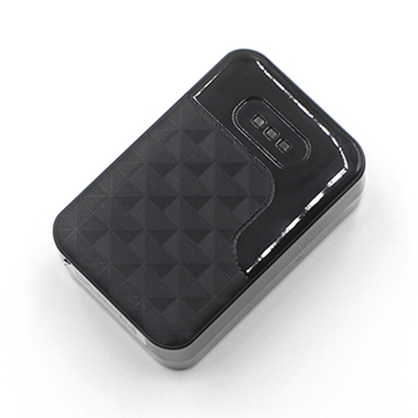

# CanTrack - G200

Rastreador GPS con imán G200

- Tamaño: 76,1 \* 50 \* 30,2 mm
- Sin instalación con Voice Listen
- Batería recargable de 6000 mah
- Tiempo en espera: 7-30 días depende de las actividades
- Alarma anti-manipulación si quita el GPS del Metal
- Seguimiento múltiple GPS / LBS
- Ahorro de energía / Tiempo real / Modo de suspensión profunda
- Diseño de imán potente y fuerte
- Seguimiento en tiempo real por SMS / Plataforma
- Alarma de velocidad / geovalla
- Alarma de vibración
- Admite almacenamiento de memoria cuando se pierde GSM

**Parámetros**

| **Red** | GSM / GPRS / GPS |
| --- | --- |
| **Banda** | 850/900/1800/1900 Mhz |
| **Chip de GPS** | Ublox7020 |
| **Módulo GSM** | MT6261 |
| **Precisión** | 5m |
| **No instalación** | Potente diseño de imán |

