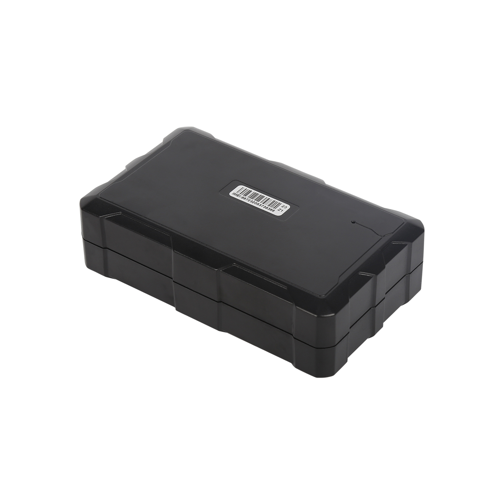

# CanTrack - G200NY

El G200NY es un rastreador GPS 4G robusto diseñado para el seguimiento ganadero a largo plazo y la gestión remota de hatos. Combina posicionamiento GNSS multiconstelación con posicionamiento asistido y conmutación por caída celular para ofrecer reportes de ubicación confiables en áreas abiertas, zonas de cobertura marginal y rutas de pastoreo estacionales. Su carcasa y el diseño de la batería lo hacen apto para despliegues prolongados en exterior donde la autonomía y la durabilidad son clave.

Como dispositivo compatible con Plaspy, el G200NY puede transmitir datos de ubicación y eventos hacia la plataforma Plaspy para su monitorización centralizada y supervisión operativa. Esta compatibilidad permite a operadores de rancho e investigadores utilizar los paneles, alertas y herramientas de Plaspy para rastrear animales, recibir notificaciones de SOS o movimiento, y gestionar dispositivos de forma remota, escalando la telemetría desde un solo hat o hasta despliegues empresariales.

## Aspectos destacados

- Diseñado para uso ganadero y en exteriores con carcasa ABS retardante al fuego y clasificación IK10, además de protección IP67 contra agua y polvo.
- Gran autonomía gracias a una batería de alta capacidad de 30000 mAh con rendimiento de espera prolongado bajo intervalos de reporte típicos.
- Posicionamiento GNSS multiconstelación que incluye GPS y Beidou, además de posicionamiento asistido y fallback LBS para mejorar la cobertura.
- Conectividad celular 4G con retroceso a 2G para amplio alcance de red y reportes confiables en áreas remotas.
- Configuración remota y capacidad de actualizaciones OTA de firmware para simplificar la gestión de dispositivos y reducir visitas de campo.
- Diseñado para un amplio rango de temperaturas operativas y con un formato compacto adecuado para montaje en collar o arnés.

## Cómo funciona con Plaspy

Al integrarse con Plaspy, el G200NY envía actualizaciones periódicas de ubicación y estado que Plaspy ingiere y presenta mediante paneles, alertas y herramientas de reporte. Plaspy centraliza el flujo de datos del dispositivo para ayudar a los equipos a mantener conciencia situacional en áreas extensas y durante despliegues prolongados.

- Visualización de ubicación en tiempo real y reproducción histórica de rutas para animales individuales o grupos.
- Alertas de geocerca y detección de movimiento reenviadas a Plaspy para notificación inmediata y registros de eventos archivables.
- Informes de eventos SOS y pánico integrados en los flujos de alerta de Plaspy para atención rápida.
- Perfiles de reporte configurables para balancear la frecuencia de seguimiento y la vida de la batería, gestionables desde la interfaz de Plaspy.
- Coordinación de actualizaciones OTA y configuración remota vía Plaspy para mantener los dispositivos actualizados y disminuir la carga de mantenimiento.

## Casos de uso típicos

- Gestión ganadera empresarial para rastrear movimientos del rebaño, patrones de pastoreo e historial de ubicaciones en grandes propiedades.
- Monitoreo de ranchos para animales vulnerables o de alto valor con alertas de movimiento e informes SOS.
- Prevención de robo y recuperación rápida usando flujos de ubicación en tiempo real para localizar animales o equipos de campo.
- Investigación de campo y estudios de migración que requieren larga autonomía y seguimiento GNSS continuo.
- Gestión remota de pasturas para reducir inspecciones manuales combinando geocercas y alertas de movimiento.

## Por qué elegir este rastreador con Plaspy

El G200NY es una opción enfocada para organizaciones que requieren un seguimiento duradero y de larga autonomía en entornos exteriores exigentes. Su combinación de posicionamiento multiconstelación, fallback celular y gran capacidad de batería reduce la necesidad de mantenimiento frecuente mientras entrega reportes de ubicación consistentes que Plaspy puede centralizar y procesar.

En conjunto con Plaspy, el G200NY forma parte de una solución de seguimiento escalable que ofrece visibilidad, alertas y gestión remota de dispositivos, desde ranchos pequeños hasta despliegues empresariales. Para obtener más información sobre Plaspy y los flujos de trabajo compatibles con dispositivos visite https://www.plaspy.com. Las especificaciones del producto y los detalles del fabricante pueden cambiar, por lo que se recomienda verificar la información técnica y la disponibilidad más reciente con la documentación oficial del fabricante en https://www.cantrackgps.com/.
