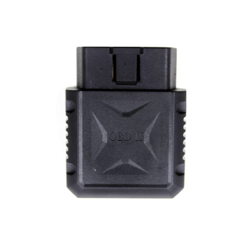

# CanTrack - G500

El rastreador GPS CanTrack G500 es un dispositivo basado en la red GSM/GPRS y el sistema de posicionamiento satelital GPS. Con su capacidad de posicionamiento en tiempo real y monitoreo remoto, este rastreador es ideal para el seguimiento y la seguridad de vehículos, flotas comerciales y activos móviles.

El CanTrack G500 ofrece varias funciones avanzadas, como la alarma de movimiento, la alarma de encendido/apagado del motor y la notificación de alarma a través de mensajes de texto. Estas características permiten a los propietarios recibir alertas instantáneas en sus teléfonos móviles en caso de cualquier actividad sospechosa o robo.

Además, este rastreador GPS también cuenta con una función de geocerca, que permite a los usuarios establecer límites geográficos virtuales para sus vehículos o activos. Si el rastreador sale de la zona predefinida, se enviará una notificación al propietario, lo que facilita el control y la seguridad de los activos en todo momento.

El CanTrack G500 es fácil de instalar y utilizar, y se puede acceder a su plataforma de seguimiento a través de una aplicación móvil o un portal web. Con su diseño compacto y duradero, este rastreador GPS es resistente a las condiciones climáticas adversas y puede soportar vibraciones y golpes.

Características destacadas:

- Posicionamiento en tiempo real
- Monitoreo remoto
- Alarma de movimiento
- Alarma de encendido/apagado del motor
- Notificación de alarma a través de mensajes de texto
- Función de geocerca
- Fácil instalación y uso
- Resistente a condiciones climáticas adversas

