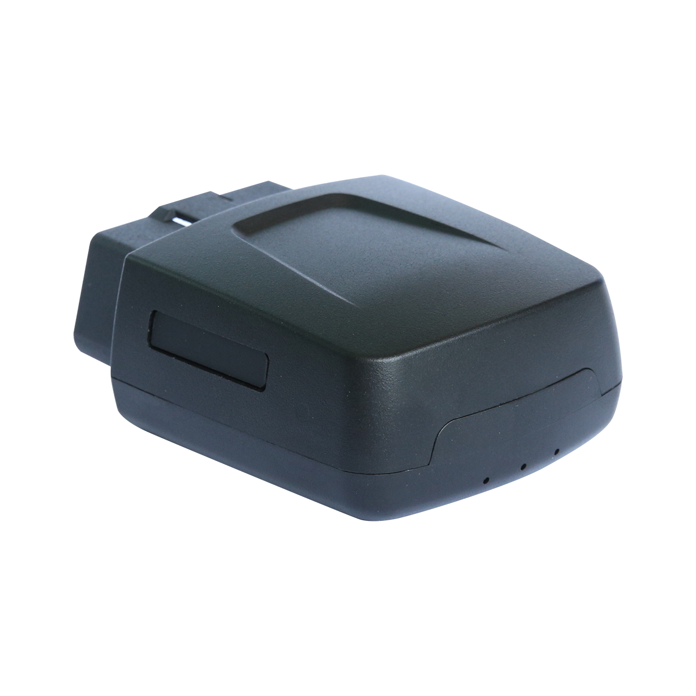

# CanTrack - G500L

El CanTrack G500L es un rastreador GPS OBD 4G de alcance global, diseñado para una instalación rápida tipo plug and play en el conector OBD II del vehículo. Dirigido a administradores de flotas y propietarios de vehículos, el G500L ofrece actualizaciones continuas de ubicación y telemetría a nivel OBD, como consumo de combustible, lecturas de temperatura y reporte de códigos de diagnóstico. Su enfoque de posicionamiento híbrido combina GNSS con métodos asistidos para ofrecer fijaciones confiables aptas para el seguimiento operativo.

Como dispositivo compatible con Plaspy desde el primer momento, el G500L transmite la ubicación, la telemetría y las alertas directamente a los paneles de Plaspy. Esta compatibilidad facilita el despliegue rápido en flotas, proporciona visibilidad inmediata a los equipos de monitoreo y permite usar los flujos de trabajo de Plaspy para alertas, reportes y supervisión operativa sin configuraciones complejas.

## Características principales

- Instalación plug and play en OBD II para despliegues rápidos en flotas.
- Compatible con Plaspy para seguimiento en vivo e ingestión de telemetría en paneles de flota.
- Posicionamiento híbrido para fijaciones más rápidas y precisión consistente en la ubicación.
- Lectura remota de parámetros OBD como consumo de combustible, temperatura y códigos de diagnóstico.
- Comunicación 4G de grado industrial con cobertura global y enlaces de datos confiables.
- Alarma antimanipulación integrada para detectar y reportar intentos de extracción no autorizada.
- Capacidad de reporte de respaldo para mantener registros breves durante interrupciones de energía.

## Cómo funciona con Plaspy

Al instalarse, el G500L lee los parámetros compatibles del vehículo junto con la telemetría GNSS y transmite esas señales a través de su enlace celular a Plaspy. Plaspy ingiere las transmisiones entrantes para generar mapas en vivo, vistas de telemetría y alertas basadas en eventos que ayudan a los equipos a monitorear la salud del vehículo y su ubicación en tiempo real.

- Actualizaciones en tiempo real de ubicación y telemetría transmitidas a Plaspy para monitoreo en vivo.
- Parámetros OBD del vehículo, como consumo de combustible, temperatura y códigos de diagnóstico, disponibles en los reportes de Plaspy.
- Estados relacionados con el encendido y los viajes para segmentación de recorridos, detección de inactividad y activación de eventos dentro de Plaspy.
- Alertas contra robo y antimanipulación entregadas a Plaspy para activar flujos de notificación inmediatos.
- Estado de reporte de respaldo visible en Plaspy para que las breves interrupciones de energía sean detectables por los operadores.

## Casos de uso típicos

- Gestión de flotas con seguimiento en vivo, historial de viajes, monitoreo de combustible y telemática operativa.
- Diagnóstico remoto de vehículos para planificar mantenimiento preventivo y reducir tiempos de inactividad.
- Monitoreo antirrobo y detección de manipulación para notificaciones rápidas de incidentes.
- Programas de eficiencia de combustible y capacitación de conductores basados en reportes continuos de consumo.
- Despliegue rápido para flotas de alquiler, programas temporales de vehículos o necesidades de monitoreo a corto plazo.

## Por qué elegir este rastreador con Plaspy

El G500L es una opción práctica para organizaciones que requieren telemetría a nivel OBD junto con un despliegue sencillo y reporte continuo de ubicación. Su factor de forma plug and play y su amplio soporte de comunicación reducen la complejidad de implementación a la vez que suministran los datos que Plaspy necesita para ofrecer insights operativos, alertas y reportes históricos.

En combinación con Plaspy, el G500L respalda flujos de trabajo rutinarios de flota como análisis de viajes, monitoreo de combustible, alertas de diagnóstico y detección de manipulación sin requerir integraciones extensas. Para equipos que priorizan la rapidez de despliegue y la ingesta confiable de telemetría en una plataforma de gestión de flotas, este rastreador constituye una opción equilibrada.

Para saber más sobre cómo el G500L puede trabajar con Plaspy visite https://www.plaspy.com. Las especificaciones del producto, la disponibilidad y los datos del fabricante pueden cambiar con el tiempo, por lo que verifique la información técnica y la documentación actuales con el fabricante en https://www.cantrackgps.com/ antes de finalizar compras o despliegues.
